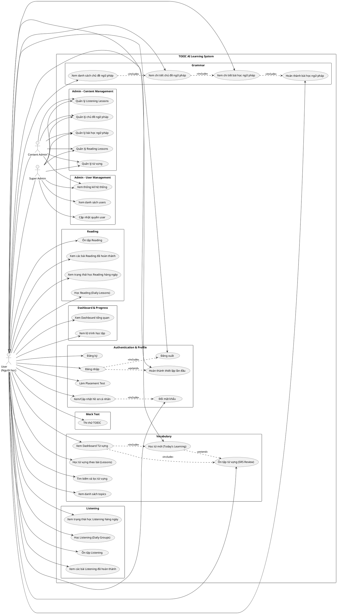

# 01 - USE CASE DIAGRAM

## 1. XÁC ĐỊNH ACTOR

### 1.1. User (Người học/ Người dùng)
- **Tên Actor:** User / Learner
- **Vai trò:** Người học TOEIC, sử dụng hệ thống để học và luyện tập
- **Chức năng chính:** Đăng ký, đăng nhập, học từ vựng, listening, reading, grammar, thi thử, theo dõi tiến độ
- **Nguồn chứng minh trong code:**
  - Prisma schema: `UserRole` enum có giá trị `USER` (mặc định)
  - `apps/api/src/auth/auth.controller.ts`: Đăng ký, đăng nhập user thường
  - `apps/api/src/profile/profile.controller.ts`: Quản lý profile user
  - Frontend pages: `/login`, `/register`, `/dashboard`, `/dashboard/vocabulary`, `/dashboard/courses`, v.v.

### 1.2. Content Admin
- **Tên Actor:** Content Admin
- **Vai trò:** Quản trị viên nội dung, quản lý tài liệu học tập
- **Chức năng chính:** Quản lý từ vựng, ngữ pháp, listening lessons, reading lessons
- **Nguồn chứng minh trong code:**
  - Prisma schema: `UserRole` enum có giá trị `CONTENT_ADMIN`
  - `apps/api/src/admin/admin.controller.ts`: Các endpoint admin với decorator `@Roles(UserRole.CONTENT_ADMIN)`
  - Frontend: `/content-admin` layout và các trang con

### 1.3. Super Admin
- **Tên Actor:** Super Admin
- **Vai trò:** Quản trị viên hệ thống, có toàn quyền
- **Chức năng chính:** Quản lý user, phân quyền, quản lý tất cả nội dung, xem thống kê
- **Nguồn chứng minh trong code:**
  - Prisma schema: `UserRole` enum có giá trị `SUPER_ADMIN`
  - `apps/api/src/admin/admin.controller.ts`: Endpoint `/admin/users` với decorator `@Roles(UserRole.SUPER_ADMIN)`
  - Frontend: `/admin` layout

---

## 2. LIỆT KÊ TOÀN BỘ USE CASE

### 2.1. Authentication

#### UC-01: Đăng ký tài khoản
- **Tên Use Case:** Đăng ký tài khoản
- **Actor:** User (không đăng nhập)
- **Mục đích:** Tạo tài khoản mới để sử dụng hệ thống
- **Điều kiện bắt đầu:** User truy cập trang đăng ký
- **Luồng chính:**
  1. User nhập họ tên, email, mật khẩu
  2. System kiểm tra email đã tồn tại chưa
  3. Nếu email chưa tồn tại, system tạo User mới và UserProfile với `firstLoginCompleted = false`
  4. System thông báo đăng ký thành công
- **Luồng thay thế:**
  - Email đã tồn tại: System thông báo "Email đã tồn tại"
- **Kết quả:** User được tạo thành công
- **API/Service/Page liên quan:**
  - `POST /auth/register` - `apps/api/src/auth/auth.controller.ts`
  - `AuthService.register()` - `apps/api/src/auth/auth.service.ts`
  - `/register` - `apps/web/app/register/page.tsx`

#### UC-02: Đăng nhập
- **Tên Use Case:** Đăng nhập
- **Actor:** User (không đăng nhập)
- **Mục đích:** Truy cập hệ thống với tài khoản đã có
- **Điều kiện bắt đầu:** User đã có tài khoản
- **Luồng chính:**
  1. User nhập email, mật khẩu
  2. System kiểm tra tài khoản và mật khẩu
  3. Nếu đúng, system tạo JWT token
  4. System trả về accessToken và thông tin user
  5. Frontend lưu token và user info vào localStorage
  6. Redirect theo role: Admin → `/admin`, First login → `/onboarding`, User thường → `/dashboard`
- **Luồng thay thế:**
  - Email không tồn tại: System thông báo "Không tìm thấy tài khoản"
  - Mật khẩu sai: System thông báo "Sai mật khẩu"
- **Kết quả:** User đăng nhập thành công và được redirect
- **API/Service/Page liên quan:**
  - `POST /auth/login` - `apps/api/src/auth/auth.controller.ts`
  - `AuthService.login()` - `apps/api/src/auth/auth.service.ts`
  - `/login` - `apps/web/app/login/page.tsx`

#### UC-03: Đăng xuất
- **Tên Use Case:** Đăng xuất
- **Actor:** User (đã đăng nhập)
- **Mục đích:** Thoát khỏi hệ thống
- **Điều kiện bắt đầu:** User đang đăng nhập
- **Luồng chính:**
  1. User click đăng xuất
  2. Frontend xóa accessToken và user info khỏi localStorage
  3. Redirect về trang login
- **Kết quả:** User được đăng xuất
- **API/Service/Page liên quan:** Frontend logic (không có API endpoint riêng)

---

### 2.2. Profile & Onboarding

#### UC-04: Hoàn thành thiết lập lần đầu (First Login Setup)
- **Tên Use Case:** Hoàn thành thiết lập lần đầu
- **Actor:** User (đã đăng nhập, lần đầu)
- **Mục đích:** Thiết lập mục tiêu học tập TOEIC
- **Điều kiện bắt đầu:** User vừa đăng ký hoặc `firstLoginCompleted = false`
- **Luồng chính:**
  1. User nhập điểm hiện tại, điểm mục tiêu, ngày thi, thời gian học mỗi ngày
  2. System cập nhật UserProfile
  3. System set `firstLoginCompleted = true`
  4. Redirect về dashboard
- **Kết quả:** UserProfile được cập nhật
- **API/Service/Page liên quan:**
  - `POST /profile/complete-first-login` - `apps/api/src/profile/profile.controller.ts`
  - `ProfileService.completeFirstLogin()` - `apps/api/src/profile/profile.service.ts`
  - `/onboarding/setup` - `apps/web/app/onboarding/setup/page.tsx`

#### UC-05: Làm Placement Test (Xếp trình độ)
- **Tên Use Case:** Làm Placement Test
- **Actor:** User (đã đăng nhập)
- **Mục đích:** Xác định trình độ TOEIC hiện tại
- **Điều kiện bắt đầu:** User đang ở trang onboarding
- **Luồng chính:**
  1. User truy cập trang placement test
  2. System lấy dữ liệu test từ database (hoặc fallback JSON)
  3. User làm test (7 parts, 200 câu hỏi)
  4. [CHƯA XÁC ĐỊNH - không tìm thấy API nộp placement test]
- **Kết quả:** [CHƯA XÁC ĐỊNH - không tìm thấy logic lưu kết quả placement test]
- **API/Service/Page liên quan:**
  - `GET /placement-test` - `apps/api/src/placement-test/placement-test.controller.ts`
  - `/onboarding/placement-test` - `apps/web/app/onboarding/placement-test/page.tsx`

#### UC-06: Xem và cập nhật hồ sơ cá nhân
- **Tên Use Case:** Xem và cập nhật hồ sơ cá nhân
- **Actor:** User (đã đăng nhập)
- **Mục đích:** Xem và chỉnh sửa thông tin cá nhân, mục tiêu học tập
- **Điều kiện bắt đầu:** User đang đăng nhập
- **Luồng chính:**
  1. User truy cập trang profile
  2. System hiển thị thông tin profile hiện tại
  3. User chỉnh sửa thông tin (avatar, phone, birthday, gender, address, bio, currentScore, targetScore, examDate, dailyStudyTime, các setting notification)
  4. System cập nhật UserProfile
- **Kết quả:** UserProfile được cập nhật
- **API/Service/Page liên quan:**
  - `GET /profile/me` - `apps/api/src/profile/profile.controller.ts`
  - `PUT /profile/me` - `apps/api/src/profile/profile.controller.ts`
  - `ProfileService.getProfile()` - `apps/api/src/profile/profile.service.ts`
  - `ProfileService.updateProfile()` - `apps/api/src/profile/profile.service.ts`
  - `/dashboard/profile` - `apps/web/app/dashboard/profile/page.tsx`

#### UC-07: Đổi mật khẩu
- **Tên Use Case:** Đổi mật khẩu
- **Actor:** User (đã đăng nhập)
- **Mục đích:** Thay đổi mật khẩu tài khoản
- **Điều kiện bắt đầu:** User đang đăng nhập
- **Luồng chính:**
  1. User nhập mật khẩu cũ, mật khẩu mới
  2. System kiểm tra mật khẩu cũ
  3. Nếu đúng, system hash mật khẩu mới và cập nhật
- **Luồng thay thế:**
  - Mật khẩu cũ sai: System thông báo "Mật khẩu hiện tại không đúng"
- **Kết quả:** Mật khẩu được cập nhật
- **API/Service/Page liên quan:**
  - `PUT /profile/change-password` - `apps/api/src/profile/profile.controller.ts`
  - `ProfileService.changePassword()` - `apps/api/src/profile/profile.service.ts`

---

### 2.3. Vocabulary (Từ vựng)

#### UC-08: Xem Dashboard Từ vựng
- **Tên Use Case:** Xem Dashboard Từ vựng
- **Actor:** User (đã đăng nhập)
- **Mục đích:** Xem thống kê học từ vựng (total, learned, learning, review, mastered)
- **Điều kiện bắt đầu:** User đang đăng nhập
- **Luồng chính:**
  1. User truy cập trang vocabulary dashboard
  2. System tính toán stage dựa trên currentScore
  3. System đếm các từ theo trạng thái (NEW, LEARNING, REVIEW, MASTERED)
  4. System hiển thị thống kê
- **Kết quả:** Hiển thị dashboard từ vựng
- **API/Service/Page liên quan:**
  - `GET /vocabulary/dashboard` - `apps/api/src/vocabulary/vocabulary.controller.ts`
  - `VocabularyService.getDashboard()` - `apps/api/src/vocabulary/vocabulary.service.ts`
  - `/dashboard/vocabulary` - `apps/web/app/dashboard/vocabulary/page.tsx`

#### UC-09: Học từ mới (Today's Learning)
- **Tên Use Case:** Học từ mới
- **Actor:** User (đã đăng nhập)
- **Mục đích:** Học từ vựng mới theo stage và daily goal
- **Điều kiện bắt đầu:** User chưa đạt daily goal (20 từ/ngày)
- **Luồng chính:**
  1. User click "Học từ mới"
  2. System kiểm tra từ cần ôn tập (nextReview <= now)
  3. Nếu có từ cần ôn, system ưu tiên trả về từ ôn tập
  4. Nếu không, system lấy từ mới chưa học theo stage
  5. User học từng từ (xem nghĩa, nghe phát âm, xem ví dụ)
  6. User đánh dấu đã học từ
  7. System tạo/cập nhật UserVocabularyProgress với status = LEARNING, reviewLevel = 1, nextReview = +30 phút
- **Luồng thay thế:**
  - Đã đạt daily goal: System trả về mode = DONE_TODAY
  - Không còn từ mới: System trả về mode = PRACTICE với từ để luyện tập
- **Kết quả:** Tiến độ học từ vựng được cập nhật
- **API/Service/Page liên quan:**
  - `GET /vocabulary/today` - `apps/api/src/vocabulary/vocabulary.controller.ts`
  - `VocabularyService.today()` - `apps/api/src/vocabulary/vocabulary.service.ts`
  - `POST /vocabulary/learn` - `apps/api/src/vocabulary/vocabulary.controller.ts`
  - `VocabularyService.learn()` - `apps/api/src/vocabulary/vocabulary.service.ts`
  - Component: `TodayLearning` - `apps/web/components/vocabulary/TodayLearning.tsx`

#### UC-10: Ôn tập từ vựng (SRS Review)
- **Tên Use Case:** Ôn tập từ vựng (SRS Review)
- **Actor:** User (đã đăng nhập)
- **Mục đích:** Ôn tập từ vựng theo thuật toán Spaced Repetition
- **Điều kiện bắt đầu:** Có từ cần ôn tập (nextReview <= now)
- **Luồng chính:**
  1. User truy cập trang review
  2. System hiển thị các từ cần ôn tập theo review level
  3. User chọn từ để ôn
  4. System hiển thị từ, user đánh giá nhớ/quên
  5. System cập nhật reviewLevel và nextReview theo thuật toán SRS:
     - Level 1 → 2: +3 giờ
     - Level 2 → 3: +10 giờ
     - Level 3 → 4: +24 giờ
     - Level 4 → 5: +3 ngày
     - Level 5 → 6: +5 ngày
     - Level 6 → 7: +20 ngày
     - Level 7 → 8: MASTERED
- **Kết quả:** Tiến độ ôn tập được cập nhật
- **API/Service/Page liên quan:**
  - `GET /vocabulary/srs` - `apps/api/src/vocabulary/vocabulary.controller.ts`
  - `VocabularyService.getSrsStatus()` - `apps/api/src/vocabulary/vocabulary.service.ts`
  - `GET /vocabulary/review-levels` - `apps/api/src/vocabulary/vocabulary.controller.ts`
  - `GET /vocabulary/review-words/:level` - `apps/api/src/vocabulary/vocabulary.controller.ts`
  - `POST /vocabulary/review` - `apps/api/src/vocabulary/vocabulary.controller.ts`
  - `VocabularyService.review()` - `apps/api/src/vocabulary/vocabulary.service.ts`
  - `/dashboard/review` - `apps/web/app/dashboard/review/page.tsx`
  - Components: `ReviewLevelGrid`, `ReviewSession`

#### UC-11: Học từ vựng theo bài (Lessons)
- **Tên Use Case:** Học từ vựng theo bài
- **Actor:** User (đã đăng nhập)
- **Mục đích:** Học từ vựng theo bài học có cấu trúc (mỗi bài 20 từ)
- **Điều kiện bắt đầu:** User đang đăng nhập
- **Luồng chính:**
  1. User truy cập trang vocabulary lessons
  2. System hiển thị danh sách bài học theo stage
  3. User chọn bài học
  4. System hiển thị các từ trong bài với trạng thái (NEW, LEARNING, REVIEW, MASTERED)
  5. User học từng từ
  6. System cập nhật tiến độ bài học
- **Kết quả:** Tiến độ bài học được cập nhật
- **API/Service/Page liên quan:**
  - `GET /vocabulary/lessons` - `apps/api/src/vocabulary/vocabulary.controller.ts`
  - `VocabularyService.getLessons()` - `apps/api/src/vocabulary/vocabulary.service.ts`
  - `GET /vocabulary/lessons/:lesson` - `apps/api/src/vocabulary/vocabulary.controller.ts`
  - `VocabularyService.getLessonWords()` - `apps/api/src/vocabulary/vocabulary.service.ts`
  - Components: `LessonGrid`, `LessonLearning`

#### UC-12: Tìm kiếm và lọc từ vựng
- **Tên Use Case:** Tìm kiếm và lọc từ vựng
- **Actor:** User (đã đăng nhập)
- **Mục đích:** Tìm kiếm từ vựng theo từ khóa, topic, stage
- **Điều kiện bắt đầu:** User đang đăng nhập
- **Luồng chính:**
  1. User nhập từ khóa hoặc chọn bộ lọc (stage, topic)
  2. System tìm kiếm và phân trang kết quả
  3. System hiển thị danh sách từ vựng với tiến độ học
- **Kết quả:** Hiển thị danh sách từ vựng theo bộ lọc
- **API/Service/Page liên quan:**
  - `GET /vocabulary/filtered` - `apps/api/src/vocabulary/vocabulary.controller.ts`
  - `VocabularyService.getWordsFiltered()` - `apps/api/src/vocabulary/vocabulary.service.ts`
  - Components: `VocabularyFilter`, `VocabularyGrid`, `VocabularyCard`

#### UC-13: Xem danh sách topics
- **Tên Use Case:** Xem danh sách topics
- **Actor:** User (đã đăng nhập)
- **Mục đích:** Xem các chủ đề từ vựng có sẵn
- **Điều kiện bắt đầu:** User đang đăng nhập
- **Luồng chính:**
  1. User truy cập trang vocabulary
  2. System hiển thị danh sách topics với số lượng từ mỗi topic
- **Kết quả:** Hiển thị danh sách topics
- **API/Service/Page liên quan:**
  - `GET /vocabulary/topics` - `apps/api/src/vocabulary/vocabulary.controller.ts`
  - `VocabularyService.getTopics()` - `apps/api/src/vocabulary/vocabulary.service.ts`
  - Component: `TopicList`

---

### 2.4. Listening (Nghe)

#### UC-14: Xem trạng thái học Listening hàng ngày
- **Tên Use Case:** Xem trạng thái học Listening hàng ngày
- **Actor:** User (đã đăng nhập)
- **Mục đích:** Xem phần nào cần học hôm nay (ngày lẻ: Part 1,2; ngày chẵn: Part 3,4)
- **Điều kiện bắt đầu:** User đang đăng nhập
- **Luồng chính:**
  1. User truy cập trang listening
  2. System xác định ngày lẻ/chẵn
  3. System tính stage dựa trên currentScore
  4. System xác định parts cần học hôm nay
  5. System đếm số bài đã hoàn thành hôm nay
- **Kết quả:** Hiển thị trạng thái học listening
- **API/Service/Page liên quan:**
  - `GET /listening/daily-status` - `apps/api/src/listening/listening.controller.ts`
  - `ListeningService.getDailyStatus()` - `apps/api/src/listening/listening.service.ts`
  - `/dashboard/courses/listening` - `apps/web/app/dashboard/courses/listening/page.tsx`

#### UC-15: Học Listening (Daily Groups)
- **Tên Use Case:** Học Listening (Daily Groups)
- **Actor:** User (đã đăng nhập)
- **Mục đích:** Học listening theo part được phân bổ hàng ngày
- **Điều kiện bắt đầu:** User chưa đạt daily goal (2 groups/ngày)
- **Luồng chính:**
  1. User truy cập trang listening learn
  2. System lấy lesson theo stage và part
  3. System lấy group đầu tiên của lesson chưa hoàn thành
  4. System hiển thị group với audio, questions, options
  5. User nghe audio và trả lời câu hỏi
  6. User nộp bài
  7. System tính điểm và cập nhật user_listening_progress và user_listening_group_progress
- **Kết quả:** Tiến độ học listening được cập nhật
- **API/Service/Page liên quan:**
  - `GET /listening/daily-groups` - `apps/api/src/listening/listening.controller.ts`
  - `ListeningService.getDailyGroups()` - `apps/api/src/listening/listening.service.ts`
  - `POST /listening/submit-group` - `apps/api/src/listening/listening.controller.ts`
  - `ListeningService.submitGroup()` - `apps/api/src/listening/listening.service.ts`
  - `/dashboard/courses/listening/learn` - `apps/web/app/dashboard/courses/listening/learn/page.tsx`

#### UC-16: Ôn tập Listening
- **Tên Use Case:** Ôn tập Listening
- **Actor:** User (đã đăng nhập)
- **Mục đích:** Ôn tập các bài listening đã hoàn thành
- **Điều kiện bắt đầu:** User đã hoàn thành ít nhất một bài listening
- **Luồng chính:**
  1. User truy cập trang listening review
  2. System lấy các group đã hoàn thành gần nhất theo từng part
  3. System hiển thị để user ôn tập lại
- **Kết quả:** Hiển thị bài listening để ôn tập
- **API/Service/Page liên quan:**
  - `GET /listening/review-groups` - `apps/api/src/listening/listening.controller.ts`
  - `ListeningService.getReviewGroups()` - `apps/api/src/listening/listening.service.ts`
  - `GET /listening/review/lesson/:lessonId` - `apps/api/src/listening/listening.controller.ts`
  - `ListeningService.getLessonReview()` - `apps/api/src/listening/listening.service.ts`
  - `/dashboard/courses/listening/review` - `apps/web/app/dashboard/courses/listening/review/page.tsx`

#### UC-17: Xem các bài Listening đã hoàn thành
- **Tên Use Case:** Xem các bài Listening đã hoàn thành
- **Actor:** User (đã đăng nhập)
- **Mục đích:** Xem lịch sử học listening
- **Điều kiện bắt đầu:** User đã hoàn thành ít nhất một bài listening
- **Luồng chính:**
  1. User truy cập trang listening
  2. System hiển thị danh sách các bài đã hoàn thành với thông tin (title, part, totalQuestions, lastStudied)
- **Kết quả:** Hiển thị lịch sử học listening
- **API/Service/Page liên quan:**
  - `GET /listening/completed-lessons` - `apps/api/src/listening/listening.controller.ts`
  - `ListeningService.getCompletedLessons()` - `apps/api/src/listening/listening.service.ts`

---

### 2.5. Reading (Đọc)

#### UC-18: Xem trạng thái học Reading hàng ngày
- **Tên Use Case:** Xem trạng thái học Reading hàng ngày
- **Actor:** User (đã đăng nhập)
- **Mục đích:** Xem phần nào cần học hôm nay (ngày lẻ: Part 5,6; ngày chẵn: Part 7)
- **Điều kiện bắt đầu:** User đang đăng nhập
- **Luồng chính:**
  1. User truy cập trang reading
  2. System xác định ngày lẻ/chẵn
  3. System tính stage dựa trên currentScore
  4. System xác định parts cần học hôm nay
  5. System đếm số bài đã hoàn thành hôm nay
- **Kết quả:** Hiển thị trạng thái học reading
- **API/Service/Page liên quan:**
  - `GET /reading/daily-status` - `apps/api/src/reading/reading.controller.ts`
  - `ReadingService.getDailyStatus()` - `apps/api/src/reading/reading.service.ts`
  - `/dashboard/courses/reading` - `apps/web/app/dashboard/courses/reading/page.tsx`

#### UC-19: Học Reading (Daily Lessons)
- **Tên Use Case:** Học Reading (Daily Lessons)
- **Actor:** User (đã đăng nhập)
- **Mục đích:** Học reading theo part được phân bổ hàng ngày
- **Điều kiện bắt đầu:** User chưa đạt daily goal (1 group/ngày)
- **Luồng chính:**
  1. User truy cập trang reading learn
  2. System lấy group đầu tiên theo part chưa hoàn thành
  3. System hiển thị group với passage, questions, options
  4. User đọc passage và trả lời câu hỏi
  5. User nộp bài
  6. System tính điểm và cập nhật user_reading_progress
- **Kết quả:** Tiến độ học reading được cập nhật
- **API/Service/Page liên quan:**
  - `GET /reading/daily-lessons` - `apps/api/src/reading/reading.controller.ts`
  - `ReadingService.getDailyLessons()` - `apps/api/src/reading/reading.service.ts`
  - `POST /reading/submit-lesson` - `apps/api/src/reading/reading.controller.ts`
  - `ReadingService.submitLesson()` - `apps/api/src/reading/reading.service.ts`
  - `/dashboard/courses/reading/learn` - `apps/web/app/dashboard/courses/reading/learn/page.tsx`

#### UC-20: Ôn tập Reading
- **Tên Use Case:** Ôn tập Reading
- **Actor:** User (đã đăng nhập)
- **Mục đích:** Ôn tập các bài reading đã hoàn thành
- **Điều kiện bắt đầu:** User đã hoàn thành ít nhất một bài reading
- **Luồng chính:**
  1. User truy cập trang reading review
  2. System lấy các bài đã hoàn thành gần nhất theo từng part
  3. System hiển thị để user ôn tập lại
- **Kết quả:** Hiển thị bài reading để ôn tập
- **API/Service/Page liên quan:**
  - `GET /reading/review-lessons` - `apps/api/src/reading/reading.controller.ts`
  - `ReadingService.getReviewLessons()` - `apps/api/src/reading/reading.service.ts`
  - `/dashboard/courses/reading/review` - `apps/web/app/dashboard/courses/reading/review/page.tsx`

#### UC-21: Xem các bài Reading đã hoàn thành
- **Tên Use Case:** Xem các bài Reading đã hoàn thành
- **Actor:** User (đã đăng nhập)
- **Mục đích:** Xem lịch sử học reading
- **Điều kiện bắt đầu:** User đã hoàn thành ít nhất một bài reading
- **Luồng chính:**
  1. User truy cập trang reading
  2. System hiển thị danh sách các bài đã hoàn thành với thông tin (title, part, totalQuestions, lastStudied, best_score)
- **Kết quả:** Hiển thị lịch sử học reading
- **API/Service/Page liên quan:**
  - `GET /reading/completed-lessons` - `apps/api/src/reading/reading.controller.ts`
  - `ReadingService.getCompletedLessons()` - `apps/api/src/reading/reading.service.ts`

---

### 2.6. Grammar (Ngữ pháp)

#### UC-22: Xem danh sách chủ đề ngữ pháp
- **Tên Use Case:** Xem danh sách chủ đề ngữ pháp
- **Actor:** User (đã đăng nhập)
- **Mục đích:** Xem các chủ đề ngữ pháp theo stage
- **Điều kiện bắt đầu:** User đang đăng nhập
- **Luồng chính:**
  1. User truy cập trang grammar
  2. System hiển thị danh sách categories theo stage với tiến độ (totalLessons, completedLessons, progress)
- **Kết quả:** Hiển thị danh sách chủ đề ngữ pháp
- **API/Service/Page liên quan:**
  - `GET /grammar/categories` - `apps/api/src/grammar/grammar.controller.ts`
  - `GrammarService.getCategories()` - `apps/api/src/grammar/grammar.service.ts`
  - `/dashboard/courses/grammar/[id]` - `apps/web/app/dashboard/courses/grammar/[id]/page.tsx`

#### UC-23: Xem chi tiết chủ đề ngữ pháp
- **Tên Use Case:** Xem chi tiết chủ đề ngữ pháp
- **Actor:** User (đã đăng nhập)
- **Mục đích:** Xem các bài học trong một chủ đề ngữ pháp
- **Điều kiện bắt đầu:** User đang đăng nhập
- **Luồng chính:**
  1. User chọn một chủ đề ngữ pháp
  2. System hiển thị danh sách bài học trong chủ đề với trạng thái hoàn thành
- **Kết quả:** Hiển thị chi tiết chủ đề ngữ pháp
- **API/Service/Page liên quan:**
  - `GET /grammar/categories/:id` - `apps/api/src/grammar/grammar.controller.ts`
  - `GrammarService.getCategory()` - `apps/api/src/grammar/grammar.service.ts`

#### UC-24: Xem chi tiết bài học ngữ pháp
- **Tên Use Case:** Xem chi tiết bài học ngữ pháp
- **Actor:** User (đã đăng nhập)
- **Mục đích:** Đọc nội dung bài học ngữ pháp
- **Điều kiện bắt đầu:** User đang đăng nhập
- **Luồng chính:**
  1. User chọn một bài học ngữ pháp
  2. System hiển thị nội dung bài học và tiến độ của user
- **Kết quả:** Hiển thị nội dung bài học ngữ pháp
- **API/Service/Page liên quan:**
  - `GET /grammar/lessons/:id` - `apps/api/src/grammar/grammar.controller.ts`
  - `GrammarService.getLesson()` - `apps/api/src/grammar/grammar.service.ts`
  - `/dashboard/courses/grammar/[id]/lessons/[lessonId]` - `apps/web/app/dashboard/courses/grammar/[id]/lessons/[lessonId]/page.tsx`

#### UC-25: Hoàn thành bài học ngữ pháp
- **Tên Use Case:** Hoàn thành bài học ngữ pháp
- **Actor:** User (đã đăng nhập)
- **Mục đích:** Đánh dấu hoàn thành bài học ngữ pháp và lưu điểm
- **Điều kiện bắt đầu:** User đang đăng nhập
- **Luồng chính:**
  1. User làm bài tập ngữ pháp liên quan đến bài học
  2. User nộp bài với điểm số
  3. System cập nhật UserGrammarProgress với completed = true và score
- **Kết quả:** Tiến độ học ngữ pháp được cập nhật
- **API/Service/Page liên quan:**
  - `POST /grammar/lessons/:id/complete` - `apps/api/src/grammar/grammar.controller.ts`
  - `GrammarService.completeLesson()` - `apps/api/src/grammar/grammar.service.ts`

---

### 2.7. Mock Test (Thi thử)

#### UC-26: Thi thử TOEIC
- **Tên Use Case:** Thi thử TOEIC
- **Actor:** User (đã đăng nhập)
- **Mục đích:** Làm bài thi thử TOEIC đầy đủ
- **Điều kiện bắt đầu:** User đang đăng nhập
- **Luồng chính:**
  1. User truy cập trang mock test
  2. [CHƯA XÁC ĐỊNH - không tìm thấy API endpoint cho mock test]
  3. User làm bài thi (7 parts, 200 câu hỏi)
  4. [CHƯA XÁC ĐỊNH - không tìm thấy API nộp mock test]
- **Kết quả:** [CHƯA XÁC ĐỊNH]
- **API/Service/Page liên quan:**
  - `/dashboard/mock-test` - `apps/web/app/dashboard/mock-test/page.tsx`
  - [CHƯA XÁC ĐỊNH - không tìm thấy backend API]

---

### 2.8. Dashboard & Progress

#### UC-27: Xem Dashboard tổng quan
- **Tên Use Case:** Xem Dashboard tổng quan
- **Actor:** User (đã đăng nhập)
- **Mục đích:** Xem tổng quan tiến độ học tập (điểm hiện tại, mục tiêu, chặng, thời gian học, các truy cập nhanh)
- **Điều kiện bắt đầu:** User đang đăng nhập
- **Luồng chính:**
  1. User truy cập trang dashboard
  2. System hiển thị thông tin user từ localStorage
  3. System hiển thị các card thống kê (điểm hiện tại, mục tiêu, chặng, thời gian học)
  4. System hiển thị tiến độ đến mục tiêu
  5. System hiển thị các truy cập nhanh (học từ vựng, luyện listening, thi thử, xem lộ trình)
  6. System hiển thị bài học gần đây
- **Kết quả:** Hiển thị dashboard tổng quan
- **API/Service/Page liên quan:**
  - `/dashboard` - `apps/web/app/dashboard/page.tsx`
  - Dữ liệu từ localStorage (không gọi API)

#### UC-28: Xem lộ trình học tập
- **Tên Use Case:** Xem lộ trình học tập
- **Actor:** User (đã đăng nhập)
- **Mục đích:** Xem lộ trình học tập theo các chặng (stage)
- **Điều kiện bắt đầu:** User đang đăng nhập
- **Luồng chính:**
  1. User truy cập trang roadmap
  2. System hiển thị lộ trình theo 5 chặng (Stage 1-5)
- **Kết quả:** Hiển thị lộ trình học tập
- **API/Service/Page liên quan:**
  - `/dashboard/roadmap` - `apps/web/app/dashboard/roadmap/page.tsx`
  - [CHƯA XÁC ĐỊNH - không tìm thấy API endpoint]

---

### 2.9. Admin - User Management

#### UC-29: Xem thống kê hệ thống
- **Tên Use Case:** Xem thống kê hệ thống
- **Actor:** Super Admin, Content Admin
- **Mục đích:** Xem thống kê tổng quan (số user, số từ vựng, số bài ngữ pháp, số đề thi)
- **Điều kiện bắt đầu:** Admin đang đăng nhập
- **Luồng chính:**
  1. Admin truy cập trang admin
  2. System hiển thị thống kê hệ thống
- **Kết quả:** Hiển thị thống kê hệ thống
- **API/Service/Page liên quan:**
  - `GET /admin/stats` - `apps/api/src/admin/admin.controller.ts`
  - `/admin` - `apps/web/app/admin/page.tsx`

#### UC-30: Xem danh sách users
- **Tên Use Case:** Xem danh sách users
- **Actor:** Super Admin
- **Mục đích:** Xem danh sách tất cả users với thông tin cơ bản
- **Điều kiện bắt đầu:** Super Admin đang đăng nhập
- **Luồng chính:**
  1. Super Admin truy cập trang users
  2. System hiển thị danh sách users (id, fullName, email, role, currentScore, targetScore)
- **Kết quả:** Hiển thị danh sách users
- **API/Service/Page liên quan:**
  - `GET /admin/users` - `apps/api/src/admin/admin.controller.ts`
  - `/admin/users` - `apps/web/app/admin/users/page.tsx`

#### UC-31: Cập nhật quyền user
- **Tên Use Case:** Cập nhật quyền user
- **Actor:** Super Admin
- **Mục đích:** Thay đổi role của user (USER, CONTENT_ADMIN, SUPER_ADMIN)
- **Điều kiện bắt đầu:** Super Admin đang đăng nhập
- **Luồng chính:**
  1. Super Admin chọn user
  2. Super Admin chọn role mới
  3. System cập nhật role của user
- **Kết quả:** Role của user được cập nhật
- **API/Service/Page liên quan:**
  - `PATCH /admin/users/:id/role` - `apps/api/src/admin/admin.controller.ts`

---

### 2.10. Admin - Vocabulary Management

#### UC-32: Quản lý từ vựng (Xem, Thêm, Sửa, Xóa)
- **Tên Use Case:** Quản lý từ vựng
- **Actor:** Super Admin, Content Admin
- **Mục đích:** Quản lý toàn bộ từ vựng trong hệ thống
- **Điều kiện bắt đầu:** Admin đang đăng nhập
- **Luồng chính:**
  1. Admin truy cập trang vocabulary admin
  2. System hiển thị danh sách từ vựng với phân trang
  3. Admin có thể tìm kiếm, lọc theo stage, topic
  4. Admin có thể thêm từ vựng mới
  5. Admin có thể sửa từ vựng
  6. Admin có thể xóa từ vựng (cả tiến độ học của user)
- **Kết quả:** Từ vựng được quản lý
- **API/Service/Page liên quan:**
  - `GET /admin/vocabulary` - `apps/api/src/admin/admin.controller.ts`
  - `POST /admin/vocabulary` - `apps/api/src/admin/admin.controller.ts`
  - `PATCH /admin/vocabulary/:id` - `apps/api/src/admin/admin.controller.ts`
  - `DELETE /admin/vocabulary/:id` - `apps/api/src/admin/admin.controller.ts`
  - `/content-admin/vocabulary` - `apps/web/app/content-admin/vocabulary/page.tsx`

---

### 2.11. Admin - Grammar Management

#### UC-33: Quản lý chủ đề ngữ pháp (Categories)
- **Tên Use Case:** Quản lý chủ đề ngữ pháp
- **Actor:** Super Admin, Content Admin
- **Mục đích:** Quản lý các chủ đề ngữ pháp
- **Điều kiện bắt đầu:** Admin đang đăng nhập
- **Luồng chính:**
  1. Admin truy cập trang grammar categories
  2. System hiển thị danh sách categories với phân trang
  3. Admin có thể tìm kiếm, lọc theo stage
  4. Admin có thể thêm category mới
  5. Admin có thể sửa category
  6. Admin có thể xóa category (chỉ khi không có lesson)
- **Kết quả:** Categories được quản lý
- **API/Service/Page liên quan:**
  - `GET /admin/grammar/categories` - `apps/api/src/admin/admin.controller.ts`
  - `POST /admin/grammar/categories` - `apps/api/src/admin/admin.controller.ts`
  - `PATCH /admin/grammar/categories/:id` - `apps/api/src/admin/admin.controller.ts`
  - `DELETE /admin/grammar/categories/:id` - `apps/api/src/admin/admin.controller.ts`
  - `/content-admin/grammar/categories` - `apps/web/app/content-admin/grammar/categories/page.tsx`

#### UC-34: Quản lý bài học ngữ pháp (Lessons)
- **Tên Use Case:** Quản lý bài học ngữ pháp
- **Actor:** Super Admin, Content Admin
- **Mục đích:** Quản lý các bài học ngữ pháp
- **Điều kiện bắt đầu:** Admin đang đăng nhập
- **Luồng chính:**
  1. Admin truy cập trang grammar lessons
  2. System hiển thị danh sách lessons với phân trang
  3. Admin có thể tìm kiếm, lọc theo category
  4. Admin có thể thêm lesson mới
  5. Admin có thể sửa lesson
  6. Admin có thể xóa lesson
- **Kết quả:** Lessons được quản lý
- **API/Service/Page liên quan:**
  - `GET /admin/grammar/lessons` - `apps/api/src/admin/admin.controller.ts`
  - `GET /admin/grammar/lessons/:id` - `apps/api/src/admin/admin.controller.ts`
  - `POST /admin/grammar/lessons` - `apps/api/src/admin/admin.controller.ts`
  - `PATCH /admin/grammar/lessons/:id` - `apps/api/src/admin/admin.controller.ts`
  - `DELETE /admin/grammar/lessons/:id` - `apps/api/src/admin/admin.controller.ts`
  - `/content-admin/grammar/lessons` - `apps/web/app/content-admin/grammar/lessons/page.tsx`

---

### 2.12. Admin - Listening & Reading Management

#### UC-35: Quản lý Listening Lessons
- **Tên Use Case:** Quản lý Listening Lessons
- **Actor:** Super Admin, Content Admin
- **Mục đích:** Quản lý các bài học listening
- **Điều kiện bắt đầu:** Admin đang đăng nhập
- **Luồng chính:**
  1. Admin truy cập trang listening admin
  2. System hiển thị danh sách listening lessons
  3. Admin có thể xem chi tiết lesson
- **Kết quả:** Listening lessons được quản lý
- **API/Service/Page liên quan:**
  - [CHƯA XÁC ĐỊNH - không tìm thấy API endpoint admin cho listening]
  - `/content-admin/listening` - `apps/web/app/content-admin/listening/page.tsx`
  - `/content-admin/listening/lessons/[id]` - `apps/web/app/content-admin/listening/lessons/[id]/page.tsx`

#### UC-36: Quản lý Reading Lessons
- **Tên Use Case:** Quản lý Reading Lessons
- **Actor:** Super Admin, Content Admin
- **Mục đích:** Quản lý các bài học reading
- **Điều kiện bắt đầu:** Admin đang đăng nhập
- **Luồng chính:**
  1. Admin truy cập trang reading admin
  2. System hiển thị danh sách reading lessons
  3. Admin có thể xem chi tiết lesson
- **Kết quả:** Reading lessons được quản lý
- **API/Service/Page liên quan:**
  - [CHƯA XÁC ĐỊNH - không tìm thấy API endpoint admin cho reading]
  - `/content-admin/reading` - `apps/web/app/content-admin/reading/page.tsx`
  - `/content-admin/reading/lessons/[id]` - `apps/web/app/content-admin/reading/lessons/[id]/page.tsx`

---

## 3. QUAN HỆ USE CASE

### 3.1. Include Relationships
- **UC-02 (Đăng nhập) <<include>> UC-03 (Đăng xuất):** Đăng xuất là một phần của luồng đăng nhập (user phải đăng nhập trước khi đăng xuất)
- **UC-06 (Xem và cập nhật hồ sơ) <<include>> UC-07 (Đổi mật khẩu):** Đổi mật khẩu là một phần của quản lý hồ sơ
- **UC-08 (Xem Dashboard Từ vựng) <<include>> UC-09 (Học từ mới):** Học từ mới là một phần của workflow học từ vựng
- **UC-08 (Xem Dashboard Từ vựng) <<include>> UC-10 (Ôn tập từ vựng):** Ôn tập là một phần của workflow học từ vựng
- **UC-22 (Xem danh sách chủ đề ngữ pháp) <<include>> UC-23 (Xem chi tiết chủ đề):** Xem chi tiết là một phần của việc duyệt danh sách
- **UC-23 (Xem chi tiết chủ đề) <<include>> UC-24 (Xem chi tiết bài học):** Xem bài học là một phần của việc xem chủ đề
- **UC-24 (Xem chi tiết bài học) <<include>> UC-25 (Hoàn thành bài học):** Hoàn thành bài học là một phần của việc học bài

### 3.2. Extend Relationships
- **UC-02 (Đăng nhập) <<extend>> UC-04 (Hoàn thành thiết lập lần đầu):** Nếu là lần đầu đăng nhập, system extend flow với onboarding
- **UC-02 (Đăng nhập) <<extend>> UC-05 (Làm Placement Test):** [CHƯA XÁC ĐỊNH - không rõ placement test có bắt buộc không]
- **UC-09 (Học từ mới) <<extend>> UC-10 (Ôn tập từ vựng):** Nếu có từ cần ôn tập, extend flow với ôn tập thay vì học từ mới

### 3.3. Generalization Relationships
- **User (Actor) là generalization của:** Content Admin, Super Admin
- **Learning Activities (Use Case Group) bao gồm:** UC-09 (Học từ mới), UC-10 (Ôn tập), UC-15 (Học Listening), UC-19 (Học Reading), UC-25 (Hoàn thành bài học ngữ pháp)
- **Review Activities (Use Case Group) bao gồm:** UC-10 (Ôn tập từ vựng), UC-16 (Ôn tập Listening), UC-20 (Ôn tập Reading)

---

## 4. HƯỚNG DẪN BỐ TRÍ SƠ ĐỒ

### 4.1. Vị trí Actor
- **Bên trái:** User (người học) - Actor chính và phổ biến nhất
- **Bên phải:** Content Admin, Super Admin - Các actor quản trị

### 4.2. Nhóm Use Case
**Nhóm Authentication & Profile:**
- Đăng ký, Đăng nhập, Đăng xuất
- Hoàn thành thiết lập lần đầu, Làm Placement Test
- Xem/Cập nhật hồ sơ, Đổi mật khẩu

**Nhóm Vocabulary:**
- Xem Dashboard Từ vựng
- Học từ mới, Ôn tập (SRS)
- Học theo bài (Lessons)
- Tìm kiếm/Lọc, Xem topics

**Nhóm Listening:**
- Xem trạng thái hàng ngày
- Học Listening (Daily Groups)
- Ôn tập Listening
- Xem bài đã hoàn thành

**Nhóm Reading:**
- Xem trạng thái hàng ngày
- Học Reading (Daily Lessons)
- Ôn tập Reading
- Xem bài đã hoàn thành

**Nhóm Grammar:**
- Xem danh sách chủ đề
- Xem chi tiết chủ đề/bài học
- Hoàn thành bài học

**Nhóm Mock Test:**
- Thi thử TOEIC

**Nhóm Dashboard & Progress:**
- Xem Dashboard tổng quan
- Xem lộ trình học tập

**Nhóm Admin - User Management:**
- Xem thống kê hệ thống
- Xem danh sách users
- Cập nhật quyền user

**Nhóm Admin - Content Management:**
- Quản lý từ vựng
- Quản lý ngữ pháp (categories, lessons)
- Quản lý listening lessons
- Quản lý reading lessons

### 4.3. Boundary của hệ thống
- **System Boundary:** TOEIC AI Learning System
- Tất cả use case nằm trong boundary này
- Actors nằm bên ngoài boundary

### 4.4. Cách nhóm các chức năng
- Sử dụng package/grouping để nhóm các use case liên quan
- Package "Authentication & Profile" cho các use case liên quan đến tài khoản
- Package "Learning" cho các use case học tập (vocabulary, listening, reading, grammar)
- Package "Admin" cho các use case quản trị
- Package "Dashboard" cho các use case theo dõi tiến độ

---

## 5. MÃ SƠ ĐỒ (PLANTUML)

---

## 6. GHI CHÚ VÀ CÁC VẤN ĐỀ CHƯA XÁC ĐỊNH

### 6.1. Chưa xác định được logic
- **UC-05 (Làm Placement Test):** Không tìm thấy API endpoint để nộp kết quả placement test và cập nhật currentScore của user
- **UC-26 (Thi thử TOEIC):** Không tìm thấy API endpoint cho mock test (lấy đề thi, nộp bài, chấm điểm, lưu kết quả)
- **UC-28 (Xem lộ trình học tập):** Không tìm thấy API endpoint, có thể chỉ là UI tĩnh
- **UC-35 (Quản lý Listening Lessons):** Frontend có nhưng không tìm thấy API endpoint admin
- **UC-36 (Quản lý Reading Lessons):** Frontend có nhưng không tìm thấy API endpoint admin

### 6.2. Cần kiểm tra thêm
- Kiểm tra xem có API endpoint nào cho mock test trong các module chưa được phân tích
- Kiểm tra logic nộp placement test và cập nhật currentScore
- Kiểm tra xem admin endpoints cho listening và reading có tồn tại ở đâu

### 6.3. Sự khác biệt giữa code và database
- Prisma schema pull từ database khớp với schema hiện tại
- Database có 22 models, tất cả đều được reflect trong Prisma schema
- Không có sự khác biệt đáng kể giữa schema và database thực tế
