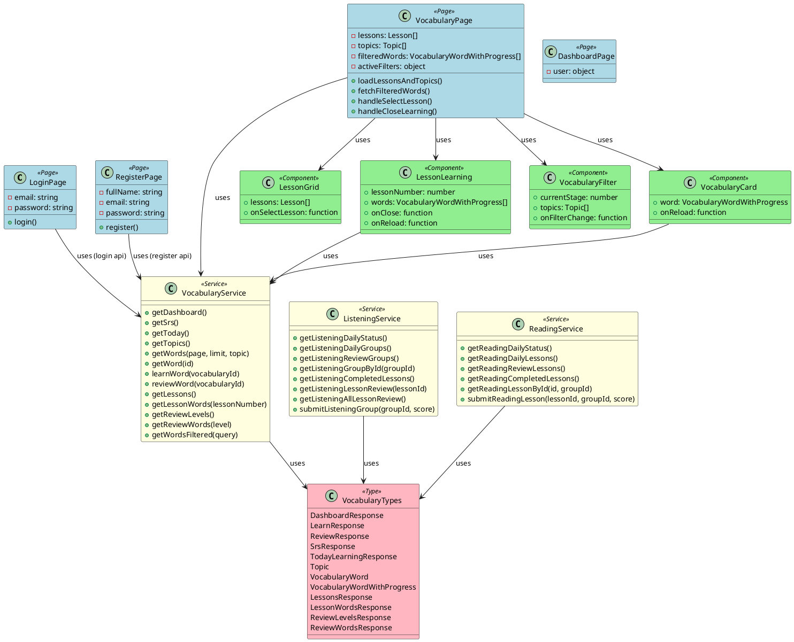

# 02 - CLASS DIAGRAM

## 1. TỔNG QUAN KIẾN TRÚC HỆ THỐNG

Hệ thống TOEIC AI được xây dựng theo kiến trúc **Client-Server** với:
- **Frontend:** Next.js (React) - giao diện người dùng
- **Backend:** NestJS (TypeScript) - API server
- **Database:** PostgreSQL - lưu trữ dữ liệu
- **ORM:** Prisma - mapping database

---

## 2. BACKEND CLASSES (NESTJS)

### 2.1. Layer Architecture

```
┌─────────────────────────────────────────┐
│         Controllers Layer               │
│  (Xử lý HTTP requests/responses)        │
└─────────────────────────────────────────┘
                    ↓
┌─────────────────────────────────────────┐
│          Services Layer                 │
│       (Xử lý logic nghiệp vụ)           │
└─────────────────────────────────────────┘
                    ↓
┌─────────────────────────────────────────┐
│          Guards Layer                   │
│  (Authentication & Authorization)       │
└─────────────────────────────────────────┘
                    ↓
┌─────────────────────────────────────────┐
│         DTOs Layer                      │
│    (Data Transfer Objects)             │
└─────────────────────────────────────────┘
                    ↓
┌─────────────────────────────────────────┐
│        PrismaService Layer              │
│         (Database Access)              │
└─────────────────────────────────────────┘
                    ↓
┌─────────────────────────────────────────┐
│         PostgreSQL Database             │
└─────────────────────────────────────────┘
```

---

### 2.2. Controllers Layer

#### AuthController
- **Layer:** Controller
- **Trách nhiệm:** Xử lý các request liên quan đến authentication (đăng ký, đăng nhập)
- **Attributes:** Không có
- **Methods:**
  - `register(body: {fullName, email, password})` - Đăng ký user mới
  - `login(body: {email, password})` - Đăng nhập
  - `getMe(req: Request)` - Lấy thông tin user hiện tại
- **Quan hệ:**
  - Association → AuthService (sử dụng)
  - Association → JwtAuthGuard (sử dụng)
- **File source:** `apps/api/src/auth/auth.controller.ts`

#### ProfileController
- **Layer:** Controller
- **Trách nhiệm:** Xử lý các request liên quan đến profile user
- **Attributes:** Không có
- **Methods:**
  - `completeFirstLogin(body: {userId, currentScore, targetScore, examDate, dailyStudyTime})` - Hoàn thành thiết lập lần đầu
  - `getProfile(req: Request)` - Lấy thông tin profile
  - `updateProfile(req: Request, body: any)` - Cập nhật profile
  - `changePassword(req: Request, body: {oldPassword, newPassword})` - Đổi mật khẩu
- **Quan hệ:**
  - Association → ProfileService (sử dụng)
  - Association → JwtAuthGuard (sử dụng)
- **File source:** `apps/api/src/profile/profile.controller.ts`

#### VocabularyController
- **Layer:** Controller
- **Trách nhiệm:** Xử lý các request liên quan đến từ vựng
- **Attributes:** Không có
- **Methods:**
  - `health()` - Health check
  - `dashboard(req: Request)` - Lấy dashboard từ vựng
  - `srs(req: Request)` - Lấy trạng thái SRS
  - `topics()` - Lấy danh sách topics
  - `today(req: Request)` - Lấy từ vựng học hôm nay
  - `lessons(req: Request)` - Lấy danh sách bài học
  - `getLessonWords(req: Request, lessonId: number)` - Lấy từ vựng trong bài học
  - `getReviewLevels(req: Request)` - Lấy các level ôn tập
  - `getReviewWords(req: Request, level: number)` - Lấy từ cần ôn theo level
  - `getFiltered(req: Request, query: object)` - Tìm kiếm/lọc từ vựng
  - `findAll(query: object)` - Lấy danh sách từ vựng
  - `findOne(id: number)` - Lấy chi tiết từ vựng
  - `learn(req: Request, dto: LearnDto)` - Lưu tiến độ học từ
  - `review(req: Request, dto: ReviewDto)` - Lưu tiến độ ôn tập
- **Quan hệ:**
  - Association → VocabularyService (sử dụng)
  - Association → JwtAuthGuard (sử dụng)
  - Association → LearnDto (sử dụng)
  - Association → ReviewDto (sử dụng)
- **File source:** `apps/api/src/vocabulary/vocabulary.controller.ts`

#### ListeningController
- **Layer:** Controller
- **Trách nhiệm:** Xử lý các request liên quan đến listening
- **Attributes:** Không có
- **Methods:**
  - `getDailyStatus(req: Request)` - Lấy trạng thái học listening hàng ngày
  - `getDailyGroups(req: Request)` - Lấy các group học hôm nay
  - `getReviewGroups(req: Request)` - Lấy các group ôn tập
  - `getCompletedLessons(req: Request)` - Lấy các bài đã hoàn thành
  - `getLessonReview(req: Request, lessonId: string)` - Lấy chi tiết bài để ôn
  - `getAllLessonReview(req: Request)` - Lấy tất cả bài để ôn
  - `getGroupById(id: string)` - Lấy group theo ID
  - `submitGroup(req: Request, groupId: number, score: number)` - Nộp bài listening
- **Quan hệ:**
  - Association → ListeningService (sử dụng)
  - Association → JwtAuthGuard (sử dụng)
- **File source:** `apps/api/src/listening/listening.controller.ts`

#### ReadingController
- **Layer:** Controller
- **Trách nhiệm:** Xử lý các request liên quan đến reading
- **Attributes:** Không có
- **Methods:**
  - `getDailyStatus(req: Request)` - Lấy trạng thái học reading hàng ngày
  - `getDailyLessons(req: Request)` - Lấy các bài học hôm nay
  - `getReviewLessons(req: Request)` - Lấy các bài ôn tập
  - `getCompletedLessons(req: Request)` - Lấy các bài đã hoàn thành
  - `getLessonById(id: string, groupId?: string)` - Lấy chi tiết bài học
  - `submitLesson(req: Request, lessonId: number, groupId: number, score: number)` - Nộp bài reading
- **Quan hệ:**
  - Association → ReadingService (sử dụng)
  - Association → JwtAuthGuard (sử dụng)
- **File source:** `apps/api/src/reading/reading.controller.ts`

#### GrammarController
- **Layer:** Controller
- **Trách nhiệm:** Xử lý các request liên quan đến ngữ pháp
- **Attributes:** Không có
- **Methods:**
  - `getCategories(req: Request)` - Lấy danh sách chủ đề ngữ pháp
  - `getCategory(req: Request, id: number)` - Lấy chi tiết chủ đề
  - `getLesson(req: Request, id: number)` - Lấy chi tiết bài học
  - `completeLesson(req: Request, id: number, dto: CompleteLessonDto)` - Hoàn thành bài học
- **Quan hệ:**
  - Association → GrammarService (sử dụng)
  - Association → JwtAuthGuard (sử dụng)
  - Association → CompleteLessonDto (sử dụng)
- **File source:** `apps/api/src/grammar/grammar.controller.ts`

#### AdminController
- **Layer:** Controller
- **Trách nhiệm:** Xử lý các request liên quan đến admin
- **Attributes:** Không có
- **Methods:**
  - `test()` - Test quyền truy cập admin
  - `getStats()` - Lấy thống kê hệ thống
  - `getUsers()` - Lấy danh sách users (Super Admin only)
  - `updateUserRole(id: string, body: {role})` - Cập nhật quyền user (Super Admin only)
  - `getVocabulary(query: object)` - Lấy danh sách từ vựng
  - `createVocabulary(body: object)` - Tạo từ vựng mới
  - `updateVocabulary(id: string, body: object)` - Cập nhật từ vựng
  - `deleteVocabulary(id: string)` - Xóa từ vựng
  - `getGrammarCategories(query: object)` - Lấy danh sách categories ngữ pháp
  - `createGrammarCategory(body: object)` - Tạo category mới
  - `updateGrammarCategory(id: string, body: object)` - Cập nhật category
  - `deleteGrammarCategory(id: string)` - Xóa category
  - `getGrammarLessons(query: object)` - Lấy danh sách bài học ngữ pháp
  - `getGrammarLesson(id: string)` - Lấy chi tiết bài học
  - `createGrammarLesson(body: object)` - Tạo bài học mới
  - `updateGrammarLesson(id: string, body: object)` - Cập nhật bài học
  - `deleteGrammarLesson(id: string)` - Xóa bài học
- **Quan hệ:**
  - Association → PrismaService (sử dụng trực tiếp)
  - Association → JwtAuthGuard (sử dụng)
  - Association → RolesGuard (sử dụng)
  - Association → Roles decorator (sử dụng)
- **File source:** `apps/api/src/admin/admin.controller.ts`

#### PlacementTestController
- **Layer:** Controller
- **Trách nhiệm:** Xử lý request lấy placement test
- **Attributes:** Không có
- **Methods:**
  - `getPlacementTest()` - Lấy dữ liệu placement test
- **Quan hệ:**
  - Association → PrismaClient (sử dụng trực tiếp qua $queryRaw)
- **File source:** `apps/api/src/placement-test/placement-test.controller.ts`

---

### 2.3. Services Layer

#### AuthService
- **Layer:** Service
- **Trách nhiệm:** Xử lý logic nghiệp vụ authentication
- **Attributes:**
  - `prisma: PrismaService` (private readonly)
  - `jwtService: JwtService` (private readonly)
- **Methods:**
  - `register(fullName: string, email: string, password: string)` - Đăng ký user
  - `login(email: string, password: string)` - Đăng nhập
- **Quan hệ:**
  - Dependency → PrismaService (inject)
  - Dependency → JwtService (inject)
  - Association → User (Prisma model - tạo/đọc)
  - Association → UserProfile (Prisma model - tạo)
- **File source:** `apps/api/src/auth/auth.service.ts`

#### ProfileService
- **Layer:** Service
- **Trách nhiệm:** Xử lý logic nghiệp vụ profile
- **Attributes:**
  - `prisma: PrismaService` (private readonly)
- **Methods:**
  - `completeFirstLogin(userId: number, currentScore: number, targetScore: number, examDate: string, dailyStudyTime?: number)` - Hoàn thành onboarding
  - `getProfile(userId: number)` - Lấy thông tin profile
  - `updateProfile(userId: number, data: any)` - Cập nhật profile
  - `changePassword(userId: number, data: any)` - Đổi mật khẩu
- **Quan hệ:**
  - Dependency → PrismaService (inject)
  - Association → User (Prisma model - đọc/cập nhật)
  - Association → UserProfile (Prisma model - đọc/cập nhật)
- **File source:** `apps/api/src/profile/profile.service.ts`

#### VocabularyService
- **Layer:** Service
- **Trách nhiệm:** Xử lý logic nghiệp vụ từ vựng (bao gồm SRS algorithm)
- **Attributes:**
  - `prisma: PrismaService` (private readonly)
- **Methods:**
  - `getProfile(userId: number)` - Helper: Lấy profile user
  - `getStage(score: number)` - Helper: Tính stage từ điểm
  - `getStreak(userId: number)` - Helper: Tính chuỗi ngày học liên tiếp
  - `healthCheck()` - Health check
  - `getDashboard(userId: number)` - Lấy dashboard từ vựng
  - `getTopics()` - Lấy danh sách topics
  - `getWords(page: number, limit: number, topic?: string)` - Lấy danh sách từ vựng
  - `getWord(id: number)` - Lấy chi tiết từ vựng
  - `today(userId: number)` - Lấy từ vựng học hôm nay
  - `learnWords(userId: number)` - Alias cho today()
  - `learn(dto: LearnDto)` - Lưu tiến độ học từ
  - `review(dto: ReviewDto)` - Lưu tiến độ ôn tập (SRS)
  - `getSrsStatus(userId: number)` - Lấy trạng thái SRS
  - `getLessons(userId: number)` - Lấy danh sách bài học
  - `getLessonWords(userId: number, lessonNumber: number)` - Lấy từ vựng trong bài học
  - `getReviewLevels(userId: number)` - Lấy các level ôn tập
- **Quan hệ:**
  - Dependency → PrismaService (inject)
  - Association → UserProfile (Prisma model - đọc)
  - Association → Vocabulary (Prisma model - đọc)
  - Association → UserVocabularyProgress (Prisma model - đọc/tạo/cập nhật)
  - Association → LearnDto (sử dụng)
  - Association → ReviewDto (sử dụng)
- **File source:** `apps/api/src/vocabulary/vocabulary.service.ts`

#### ListeningService
- **Layer:** Service
- **Trách nhiệm:** Xử lý logic nghiệp vụ listening
- **Attributes:**
  - `prisma: PrismaService` (private readonly)
- **Methods:**
  - `getUserStage(userId: number)` - Helper: Tính stage từ điểm
  - `getDailyStatus(userId: number)` - Lấy trạng thái học hàng ngày
  - `getDailyGroups(userId: number)` - Lấy các group học hôm nay
  - `getReviewGroups(userId: number)` - Lấy các group ôn tập
  - `getCompletedLessons(userId: number)` - Lấy các bài đã hoàn thành
  - `getLessonReview(userId: number, lessonId: number)` - Lấy chi tiết bài để ôn
  - `getAllLessonReview(userId: number)` - Lấy tất cả bài để ôn
  - `getGroupById(groupId: number)` - Lấy group theo ID
  - `submitGroup(userId: number, groupId: number, score: number)` - Nộp bài listening
- **Quan hệ:**
  - Dependency → PrismaService (inject)
  - Association → UserProfile (Prisma model - đọc)
  - Association → listening_lessons (Prisma model - đọc)
  - Association → listening_lesson_groups (Prisma model - đọc)
  - Association → listening_lesson_questions (Prisma model - đọc)
  - Association → listening_lesson_options (Prisma model - đọc)
  - Association → user_listening_progress (Prisma model - đọc/tạo/cập nhật)
  - Association → user_listening_group_progress (Prisma model - đọc/tạo/cập nhật)
- **File source:** `apps/api/src/listening/listening.service.ts`

#### ReadingService
- **Layer:** Service
- **Trách nhiệm:** Xử lý logic nghiệp vụ reading
- **Attributes:**
  - `prisma: PrismaService` (private readonly)
- **Methods:**
  - `getUserStage(userId: number)` - Helper: Tính stage từ điểm
  - `getDailyStatus(userId: number)` - Lấy trạng thái học hàng ngày
  - `getDailyLessons(userId: number)` - Lấy các bài học hôm nay
  - `getReviewLessons(userId: number)` - Lấy các bài ôn tập
  - `getCompletedLessons(userId: number)` - Lấy các bài đã hoàn thành
  - `getLessonById(lessonId: number, groupId?: number)` - Lấy chi tiết bài học
  - `submitLesson(userId: number, lessonId: number, groupId: number, score: number)` - Nộp bài reading
- **Quan hệ:**
  - Dependency → PrismaService (inject)
  - Association → UserProfile (Prisma model - đọc)
  - Association → reading_lessons (Prisma model - đọc)
  - Association → reading_lesson_groups (Prisma model - đọc)
  - Association → reading_questions (Prisma model - đọc)
  - Association → reading_options (Prisma model - đọc)
  - Association → user_reading_progress (Prisma model - đọc/tạo/cập nhật)
- **File source:** `apps/api/src/reading/reading.service.ts`

#### GrammarService
- **Layer:** Service
- **Trách nhiệm:** Xử lý logic nghiệp vụ ngữ pháp
- **Attributes:**
  - `prisma: PrismaService` (private readonly)
- **Methods:**
  - `getCategories(userId: number)` - Lấy danh sách chủ đề ngữ pháp
  - `getCategory(categoryId: number, userId: number)` - Lấy chi tiết chủ đề
  - `getLesson(lessonId: number, userId: number)` - Lấy chi tiết bài học
  - `completeLesson(lessonId: number, userId: number, dto: CompleteLessonDto)` - Hoàn thành bài học
- **Quan hệ:**
  - Dependency → PrismaService (inject)
  - Association → GrammarCategory (Prisma model - đọc)
  - Association → GrammarLesson (Prisma model - đọc)
  - Association → UserGrammarProgress (Prisma model - đọc/tạo/cập nhật)
  - Association → CompleteLessonDto (sử dụng)
- **File source:** `apps/api/src/grammar/grammar.service.ts`

---

### 2.4. Guards Layer

#### JwtAuthGuard
- **Layer:** Guard
- **Trách nhiệm:** Kiểm tra authentication bằng JWT token
- **Attributes:** Không có
- **Methods:** Không có (kế thừa từ AuthGuard của passport-jwt)
- **Quan hệ:**
  - Inheritance → AuthGuard (passport-jwt)
  - Association → JwtStrategy (sử dụng gián tiếp)
- **File source:** `apps/api/src/auth/jwt-auth.guard.ts`

#### RolesGuard
- **Layer:** Guard
- **Trách nhiệm:** Kiểm tra authorization dựa trên role
- **Attributes:**
  - `reflector: Reflector` (private readonly)
- **Methods:**
  - `canActivate(context: ExecutionContext)` - Kiểm tra quyền truy cập
- **Quan hệ:**
  - Dependency → Reflector (inject)
  - Association → Roles decorator (sử dụng)
  - Association → UserRole enum (sử dụng)
- **File source:** `apps/api/src/auth/roles.guard.ts`

---

### 2.5. Strategies Layer

#### JwtStrategy
- **Layer:** Strategy
- **Trách nhiệm:** Xác thực JWT token và extract user info
- **Attributes:** Không có
- **Methods:**
  - `validate(payload: any)` - Validate token và trả về user info
- **Quan hệ:**
  - Inheritance → PassportStrategy (NestJS)
  - Association → JWT Strategy (passport-jwt)
- **File source:** `apps/api/src/auth/jwt.strategy.ts`

---

### 2.6. DTOs Layer

#### LearnDto
- **Layer:** DTO
- **Trách nhiệm:** Transfer data cho request học từ vựng
- **Attributes:**
  - `userId?: number` - ID user (được set từ request)
  - `vocabularyId: number` - ID từ vựng
- **Methods:** Không có
- **Quan hệ:** Không có
- **File source:** `apps/api/src/vocabulary/dto/learn.dto.ts`

#### ReviewDto
- **Layer:** DTO
- **Trách nhiệm:** Transfer data cho request ôn tập từ vựng
- **Attributes:**
  - `userId?: number` - ID user (được set từ request)
  - `vocabularyId: number` - ID từ vựng
- **Methods:** Không có
- **Quan hệ:** Không có
- **File source:** `apps/api/src/vocabulary/dto/review.dto.ts`

#### CompleteLessonDto
- **Layer:** DTO
- **Trách nhiệm:** Transfer data cho request hoàn thành bài học ngữ pháp
- **Attributes:**
  - `score: number` - Điểm số (0-100)
- **Methods:** Không có
- **Quan hệ:** Không có
- **File source:** `apps/api/src/grammar/dto/complete-lesson.dto.ts`

#### UpdateUserRoleDto
- **Layer:** DTO
- **Trách nhiệm:** Transfer data cho request cập nhật quyền user
- **Attributes:** [CHƯA XÁC ĐỊNH - không tìm thấy file DTO này]
- **Methods:** Không có
- **Quan hệ:** Không có
- **File source:** `apps/api/src/admin/dto/update-user-role.dto.ts`

---

### 2.7. Database Access Layer

#### PrismaService
- **Layer:** Service/Repository
- **Trách nhiệm:** Cung cấp access đến PostgreSQL database qua Prisma Client
- **Attributes:** Kế thừa tất cả từ PrismaClient
- **Methods:**
  - `onModuleInit()` - Kết nối database khi module khởi tạo
  - `onModuleDestroy()` - Ngắt kết nối database khi module destroy
  - Tất cả methods của PrismaClient (user, vocabulary, listening_lessons, v.v.)
- **Quan hệ:**
  - Inheritance → PrismaClient
  - Association → Tất cả Prisma models (User, UserProfile, Vocabulary, v.v.)
- **File source:** `apps/api/src/prisma/prisma.service.ts`

---

### 2.8. Prisma Models (Generated)

#### User
- **Layer:** Model (Prisma generated)
- **Trách nhiệm:** Entity đại diện cho user trong database
- **Attributes:**
  - `id: Int` (Primary Key, autoincrement)
  - `fullName: String`
  - `email: String` (Unique)
  - `password: String`
  - `role: UserRole` (Enum: USER, CONTENT_ADMIN, SUPER_ADMIN)
  - `createdAt: DateTime`
  - `profile: UserProfile?` (Relation)
  - `grammarProgress: UserGrammarProgress[]` (Relation)
  - `user_listening_group_progress: user_listening_group_progress[]` (Relation)
  - `user_listening_progress: user_listening_progress[]` (Relation)
  - `user_reading_progress: user_reading_progress[]` (Relation)
  - `vocabularyProgress: UserVocabularyProgress[]` (Relation)
- **Methods:** Không có (Prisma model)
- **Quan hệ:**
  - Association → UserProfile (1-to-1)
  - Association → UserGrammarProgress (1-to-N)
  - Association → user_listening_group_progress (1-to-N)
  - Association → user_listening_progress (1-to-N)
  - Association → user_reading_progress (1-to-N)
  - Association → UserVocabularyProgress (1-to-N)
- **File source:** Prisma generated (apps/api/prisma/schema.prisma)

#### UserProfile
- **Layer:** Model (Prisma generated)
- **Trách nhiệm:** Entity đại diện cho profile user
- **Attributes:**
  - `id: Int` (Primary Key, autoincrement)
  - `currentScore: Int?`
  - `targetScore: Int?`
  - `examDate: DateTime?`
  - `dailyStudyTime: Int?`
  - `firstLoginCompleted: Boolean`
  - `userId: Int` (Unique, Foreign Key)
  - `createdAt: DateTime`
  - `updatedAt: DateTime`
  - `avatar: String?`
  - `phone: String?`
  - `birthday: DateTime?`
  - `gender: String?`
  - `address: String?`
  - `bio: String?`
  - `studyNotification: Boolean`
  - `srsNotification: Boolean`
  - `autoPronunciation: Boolean`
  - `darkMode: Boolean`
  - `user: User` (Relation)
- **Methods:** Không có
- **Quan hệ:**
  - Association → User (N-to-1)
- **File source:** Prisma generated

#### Vocabulary
- **Layer:** Model (Prisma generated)
- **Trách nhiệm:** Entity đại diện cho từ vựng
- **Attributes:**
  - `id: Int` (Primary Key, autoincrement)
  - `english: String`
  - `type: String?`
  - `vietnamese: String?`
  - `pronounce: String?`
  - `explain: String?`
  - `example: String?`
  - `exampleVietnamese: String?`
  - `imageUrl: String?`
  - `audioUrl: String?`
  - `topic: String?`
  - `topicUrl: String?`
  - `createdAt: DateTime?`
  - `stage: Int` (1-5)
  - `progresses: UserVocabularyProgress[]` (Relation)
- **Methods:** Không có
- **Quan hệ:**
  - Association → UserVocabularyProgress (1-to-N)
- **File source:** Prisma generated

#### UserVocabularyProgress
- **Layer:** Model (Prisma generated)
- **Trách nhiệm:** Entity đại diện cho tiến độ học từ vựng của user
- **Attributes:**
  - `id: Int` (Primary Key, autoincrement)
  - `userId: Int` (Foreign Key)
  - `vocabularyId: Int` (Foreign Key)
  - `learnedAt: DateTime?`
  - `reviewCount: Int?`
  - `nextReview: DateTime?`
  - `createdAt: DateTime?`
  - `status: String` (NEW, LEARNING, REVIEW, MASTERED)
  - `reviewLevel: Int` (0-8)
  - `lastReview: DateTime?`
  - `updatedAt: DateTime?`
  - `user: User` (Relation)
  - `vocabulary: Vocabulary` (Relation)
- **Methods:** Không có
- **Quan hệ:**
  - Association → User (N-to-1)
  - Association → Vocabulary (N-to-1)
  - Unique constraint: [userId, vocabularyId]
- **File source:** Prisma generated

#### GrammarCategory
- **Layer:** Model (Prisma generated)
- **Trách nhiệm:** Entity đại diện cho chủ đề ngữ pháp
- **Attributes:**
  - `id: Int` (Primary Key, autoincrement)
  - `name: String`
  - `description: String?`
  - `displayOrder: Int?`
  - `createdAt: DateTime?`
  - `updatedAt: DateTime?`
  - `stage: Int` (1-5)
  - `lessons: GrammarLesson[]` (Relation)
- **Methods:** Không có
- **Quan hệ:**
  - Association → GrammarLesson (1-to-N)
- **File source:** Prisma generated

#### GrammarLesson
- **Layer:** Model (Prisma generated)
- **Trách nhiệm:** Entity đại diện cho bài học ngữ pháp
- **Attributes:**
  - `id: Int` (Primary Key, autoincrement)
  - `categoryId: Int` (Foreign Key)
  - `title: String`
  - `content: String?`
  - `displayOrder: Int?`
  - `createdAt: DateTime?`
  - `updatedAt: DateTime?`
  - `testId: Int?` (Foreign Key)
  - `category: GrammarCategory` (Relation)
  - `tests: tests?` (Relation)
  - `progresses: UserGrammarProgress[]` (Relation)
- **Methods:** Không có
- **Quan hệ:**
  - Association → GrammarCategory (N-to-1)
  - Association → tests (N-to-1, optional)
  - Association → UserGrammarProgress (1-to-N)
- **File source:** Prisma generated

#### UserGrammarProgress
- **Layer:** Model (Prisma generated)
- **Trách nhiệm:** Entity đại diện cho tiến độ học ngữ pháp của user
- **Attributes:**
  - `id: Int` (Primary Key, autoincrement)
  - `userId: Int` (Foreign Key)
  - `lessonId: Int` (Foreign Key)
  - `completed: Boolean?`
  - `score: Int?`
  - `lastStudied: DateTime?`
  - `createdAt: DateTime?`
  - `updatedAt: DateTime?`
  - `lesson: GrammarLesson` (Relation)
  - `user: User` (Relation)
- **Methods:** Không có
- **Quan hệ:**
  - Association → GrammarLesson (N-to-1)
  - Association → User (N-to-1)
  - Unique constraint: [userId, lessonId]
- **File source:** Prisma generated

#### listening_lessons
- **Layer:** Model (Prisma generated)
- **Trách nhiệm:** Entity đại diện cho bài học listening
- **Attributes:**
  - `id: Int` (Primary Key, autoincrement)
  - `title: String`
  - `part: Int` (1-4)
  - `question_group_id: Int?` (Foreign Key)
  - `displayOrder: Int?`
  - `createdAt: DateTime?`
  - `updatedAt: DateTime?`
  - `stage: Int` (1-5)
  - `listening_lesson_groups: listening_lesson_groups[]` (Relation)
  - `question_groups: question_groups?` (Relation)
  - `user_listening_progress: user_listening_progress[]` (Relation)
- **Methods:** Không có
- **Quan hệ:**
  - Association → listening_lesson_groups (1-to-N)
  - Association → question_groups (N-to-1, optional)
  - Association → user_listening_progress (1-to-N)
- **File source:** Prisma generated

#### listening_lesson_groups
- **Layer:** Model (Prisma generated)
- **Trách nhiệm:** Entity đại diện cho group câu hỏi listening
- **Attributes:**
  - `id: Int` (Primary Key, autoincrement)
  - `lesson_id: Int` (Foreign Key)
  - `title: String?`
  - `audio_url: String?`
  - `start_seconds: Decimal?`
  - `end_seconds: Decimal?`
  - `display_order: Int?`
  - `created_at: DateTime?`
  - `updated_at: DateTime?`
  - `image_url: String?`
  - `knowledge: String?`
  - `listening_lessons: listening_lessons` (Relation)
  - `listening_lesson_questions: listening_lesson_questions[]` (Relation)
  - `user_listening_group_progress: user_listening_group_progress[]` (Relation)
- **Methods:** Không có
- **Quan hệ:**
  - Association → listening_lessons (N-to-1)
  - Association → listening_lesson_questions (1-to-N)
  - Association → user_listening_group_progress (1-to-N)
- **File source:** Prisma generated

#### listening_lesson_questions
- **Layer:** Model (Prisma generated)
- **Trách nhiệm:** Entity đại diện cho câu hỏi listening
- **Attributes:**
  - `id: Int` (Primary Key, autoincrement)
  - `group_id: Int` (Foreign Key)
  - `question_number: Int`
  - `question_text: String`
  - `explanation: String?`
  - `display_order: Int?`
  - `created_at: DateTime?`
  - `updated_at: DateTime?`
  - `knowledge: String?`
  - `listening_lesson_options: listening_lesson_options[]` (Relation)
  - `listening_lesson_groups: listening_lesson_groups` (Relation)
- **Methods:** Không có
- **Quan hệ:**
  - Association → listening_lesson_groups (N-to-1)
  - Association → listening_lesson_options (1-to-N)
- **File source:** Prisma generated

#### listening_lesson_options
- **Layer:** Model (Prisma generated)
- **Trách nhiệm:** Entity đại diện cho đáp án câu hỏi listening
- **Attributes:**
  - `id: Int` (Primary Key, autoincrement)
  - `question_id: Int` (Foreign Key)
  - `option_label: String` (A, B, C, D)
  - `option_text: String`
  - `is_correct: Boolean?`
  - `display_order: Int?`
  - `created_at: DateTime?`
  - `listening_lesson_questions: listening_lesson_questions` (Relation)
- **Methods:** Không có
- **Quan hệ:**
  - Association → listening_lesson_questions (N-to-1)
- **File source:** Prisma generated

#### user_listening_progress
- **Layer:** Model (Prisma generated)
- **Trách nhiệm:** Entity đại diện cho tiến độ học listening của user (theo lesson)
- **Attributes:**
  - `id: Int` (Primary Key, autoincrement)
  - `user_id: Int` (Foreign Key)
  - `lesson_id: Int` (Foreign Key)
  - `best_score: Int?`
  - `completed: Boolean?`
  - `last_studied: DateTime?`
  - `created_at: DateTime?`
  - `updated_at: DateTime?`
  - `listening_lessons: listening_lessons` (Relation)
  - `User: User` (Relation)
- **Methods:** Không có
- **Quan hệ:**
  - Association → listening_lessons (N-to-1)
  - Association → User (N-to-1)
  - Unique constraint: [user_id, lesson_id]
- **File source:** Prisma generated

#### user_listening_group_progress
- **Layer:** Model (Prisma generated)
- **Trách nhiệm:** Entity đại diện cho tiến độ học listening của user (theo group)
- **Attributes:**
  - `id: Int` (Primary Key, autoincrement)
  - `user_id: Int` (Foreign Key)
  - `group_id: Int` (Foreign Key)
  - `completed: Boolean?`
  - `score: Int?`
  - `learned_at: DateTime?`
  - `created_at: DateTime?`
  - `updated_at: DateTime?`
  - `group: listening_lesson_groups` (Relation)
  - `user: User` (Relation)
- **Methods:** Không có
- **Quan hệ:**
  - Association → listening_lesson_groups (N-to-1)
  - Association → User (N-to-1)
  - Unique constraint: [user_id, group_id]
- **File source:** Prisma generated

#### reading_lessons
- **Layer:** Model (Prisma generated)
- **Trách nhiệm:** Entity đại diện cho bài học reading
- **Attributes:**
  - `id: Int` (Primary Key, autoincrement)
  - `title: String`
  - `part: Int` (5-7)
  - `display_order: Int?`
  - `created_at: DateTime?`
  - `updated_at: DateTime?`
  - `description: String?`
  - `difficulty: Int?`
  - `reading_lesson_groups: reading_lesson_groups[]` (Relation)
  - `user_reading_progress: user_reading_progress[]` (Relation)
- **Methods:** Không có
- **Quan hệ:**
  - Association → reading_lesson_groups (1-to-N)
  - Association → user_reading_progress (1-to-N)
- **File source:** Prisma generated

#### reading_lesson_groups
- **Layer:** Model (Prisma generated)
- **Trách nhiệm:** Entity đại diện cho group câu hỏi reading
- **Attributes:**
  - `id: Int` (Primary Key, autoincrement)
  - `lesson_id: Int` (Foreign Key)
  - `part: Int`
  - `group_number: Int`
  - `title: String?`
  - `passage: String?`
  - `knowledge: String?`
  - `display_order: Int?`
  - `created_at: DateTime?`
  - `updated_at: DateTime?`
  - `reading_lessons: reading_lessons` (Relation)
  - `reading_questions: reading_questions[]` (Relation)
  - `user_reading_progress: user_reading_progress[]` (Relation)
- **Methods:** Không có
- **Quan hệ:**
  - Association → reading_lessons (N-to-1)
  - Association → reading_questions (1-to-N)
  - Association → user_reading_progress (1-to-N)
- **File source:** Prisma generated

#### reading_questions
- **Layer:** Model (Prisma generated)
- **Trách nhiệm:** Entity đại diện cho câu hỏi reading
- **Attributes:**
  - `id: Int` (Primary Key, autoincrement)
  - `group_id: Int` (Foreign Key)
  - `question_number: Int`
  - `question_text: String`
  - `question_type: String?`
  - `explanation: String?`
  - `knowledge: String?`
  - `correct_answer: String?`
  - `display_order: Int?`
  - `created_at: DateTime?`
  - `updated_at: DateTime?`
  - `reading_options: reading_options[]` (Relation)
  - `reading_lesson_groups: reading_lesson_groups` (Relation)
- **Methods:** Không có
- **Quan hệ:**
  - Association → reading_lesson_groups (N-to-1)
  - Association → reading_options (1-to-N)
- **File source:** Prisma generated

#### reading_options
- **Layer:** Model (Prisma generated)
- **Trách nhiệm:** Entity đại diện cho đáp án câu hỏi reading
- **Attributes:**
  - `id: Int` (Primary Key, autoincrement)
  - `question_id: Int` (Foreign Key)
  - `option_key: String` (A, B, C, D)
  - `option_text: String`
  - `is_correct: Boolean?`
  - `display_order: Int?`
  - `created_at: DateTime?`
  - `reading_questions: reading_questions` (Relation)
- **Methods:** Không có
- **Quan hệ:**
  - Association → reading_questions (N-to-1)
  - Unique constraint: [question_id, option_key]
- **File source:** Prisma generated

#### user_reading_progress
- **Layer:** Model (Prisma generated)
- **Trách nhiệm:** Entity đại diện cho tiến độ học reading của user
- **Attributes:**
  - `id: Int` (Primary Key, autoincrement)
  - `user_id: Int` (Foreign Key)
  - `lesson_id: Int` (Foreign Key)
  - `group_id: Int` (Foreign Key)
  - `completed: Boolean?`
  - `best_score: Int?`
  - `last_studied: DateTime?`
  - `created_at: DateTime?`
  - `updated_at: DateTime?`
  - `lesson: reading_lessons` (Relation)
  - `group: reading_lesson_groups` (Relation)
  - `user: User` (Relation)
- **Methods:** Không có
- **Quan hệ:**
  - Association → reading_lessons (N-to-1)
  - Association → reading_lesson_groups (N-to-1)
  - Association → User (N-to-1)
  - Unique constraint: [user_id, group_id]
- **File source:** Prisma generated

#### tests
- **Layer:** Model (Prisma generated)
- **Trách nhiệm:** Entity đại diện cho đề thi
- **Attributes:**
  - `id: Int` (Primary Key, autoincrement)
  - `title: String?`
  - `duration: Int?`
  - `total_questions: Int?`
  - `created_at: DateTime?`
  - `description: String?`
  - `is_active: Boolean?`
  - `grammar_lessons: GrammarLesson[]` (Relation)
  - `question_groups: question_groups[]` (Relation)
- **Methods:** Không có
- **Quan hệ:**
  - Association → GrammarLesson (1-to-N)
  - Association → question_groups (1-to-N)
- **File source:** Prisma generated

#### question_groups
- **Layer:** Model (Prisma generated)
- **Trách nhiệm:** Entity đại diện cho group câu hỏi trong đề thi
- **Attributes:**
  - `id: Int` (Primary Key, autoincrement)
  - `test_id: Int?` (Foreign Key)
  - `part: Int?`
  - `title: String?`
  - `passage: String?`
  - `image_url: String?`
  - `audio_url: String?`
  - `display_order: Int?`
  - `group_type: String?`
  - `audio_start_time: Int?`
  - `audio_end_time: Int?`
  - `knowledge: String?`
  - `listening_lessons: listening_lessons[]` (Relation)
  - `tests: tests?` (Relation)
  - `questions: questions[]` (Relation)
- **Methods:** Không có
- **Quan hệ:**
  - Association → tests (N-to-1, optional)
  - Association → listening_lessons (1-to-N)
  - Association → questions (1-to-N)
- **File source:** Prisma generated

#### questions
- **Layer:** Model (Prisma generated)
- **Trách nhiệm:** Entity đại diện cho câu hỏi trong đề thi
- **Attributes:**
  - `id: Int` (Primary Key, autoincrement)
  - `group_id: Int?` (Foreign Key)
  - `question_number: Int?`
  - `question_text: String?`
  - `correct_answer: String?`
  - `explanation: String?`
  - `display_order: Int?`
  - `options: options[]` (Relation)
  - `question_groups: question_groups?` (Relation)
- **Methods:** Không có
- **Quan hệ:**
  - Association → question_groups (N-to-1, optional)
  - Association → options (1-to-N)
- **File source:** Prisma generated

#### options
- **Layer:** Model (Prisma generated)
- **Trách nhiệm:** Entity đại diện cho đáp án câu hỏi trong đề thi
- **Attributes:**
  - `id: Int` (Primary Key, autoincrement)
  - `question_id: Int?` (Foreign Key)
  - `option_label: String?` (A, B, C, D)
  - `option_text: String?`
  - `display_order: Int?`
  - `questions: questions?` (Relation)
- **Methods:** Không có
- **Quan hệ:**
  - Association → questions (N-to-1, optional)
- **File source:** Prisma generated

---

## 3. FRONTEND CLASSES (NEXT.JS)

### 3.1. Layer Architecture

```
┌─────────────────────────────────────────┐
│          Pages Layer                   │
│      (Next.js Pages - Routes)          │
└─────────────────────────────────────────┘
                    ↓
┌─────────────────────────────────────────┐
│        Components Layer                 │
│      (React Components - UI)            │
└─────────────────────────────────────────┘
                    ↓
┌─────────────────────────────────────────┐
│         Services Layer                  │
│      (API Calls - HTTP Requests)        │
└─────────────────────────────────────────┘
                    ↓
┌─────────────────────────────────────────┐
│          Types Layer                    │
│      (TypeScript Type Definitions)      │
└─────────────────────────────────────────┘
                    ↓
┌─────────────────────────────────────────┐
│         Backend API                     │
└─────────────────────────────────────────┘
```

---

### 3.2. Pages Layer (Next.js App Router)

#### LoginPage
- **Layer:** Page
- **Trách nhiệm:** Trang đăng nhập
- **Attributes:** React state (email, password)
- **Methods:**
  - `login()` - Gọi API đăng nhập
- **Quan hệ:**
  - Association → POST /auth/login API
- **File source:** `apps/web/app/login/page.tsx`

#### RegisterPage
- **Layer:** Page
- **Trách nhiệm:** Trang đăng ký
- **Attributes:** React state (fullName, email, password)
- **Methods:**
  - `register()` - Gọi API đăng ký
- **Quan hệ:**
  - Association → POST /auth/register API
- **File source:** `apps/web/app/register/page.tsx`

#### DashboardPage
- **Layer:** Page
- **Trách nhiệm:** Trang dashboard tổng quan
- **Attributes:** React state (user info từ localStorage)
- **Methods:** Không có (chỉ hiển thị)
- **Quan hệ:**
  - Association → localStorage (đọc user info)
- **File source:** `apps/web/app/dashboard/page.tsx`

#### VocabularyPage
- **Layer:** Page
- **Trách nhiệm:** Trang học từ vựng
- **Attributes:** React state (lessons, topics, filteredWords, activeFilters, v.v.)
- **Methods:**
  - `loadLessonsAndTopics()` - Load lessons và topics
  - `fetchFilteredWords()` - Load từ vựng theo bộ lọc
  - `handleSelectLesson()` - Chọn bài học
  - `handleCloseLearning()` - Đóng modal học
- **Quan hệ:**
  - Association → VocabularyService (getLessons, getTopics, getWordsFiltered, getLessonWords)
  - Association → LessonGrid component
  - Association → LessonLearning component
  - Association → VocabularyFilter component
  - Association → VocabularyCard component
- **File source:** `apps/web/app/dashboard/vocabulary/page.tsx`

---

### 3.3. Services Layer

#### VocabularyService (Frontend)
- **Layer:** Service
- **Trách nhiệm:** Gọi API từ vựng
- **Attributes:** Không có
- **Methods:**
  - `getDashboard()` - GET /vocabulary/dashboard
  - `getSrs()` - GET /vocabulary/srs
  - `getToday()` - GET /vocabulary/today
  - `getTopics()` - GET /vocabulary/topics
  - `getWords(page, limit, topic)` - GET /vocabulary
  - `getWord(id)` - GET /vocabulary/:id
  - `learnWord(vocabularyId)` - POST /vocabulary/learn
  - `reviewWord(vocabularyId)` - POST /vocabulary/review
  - `getLessons()` - GET /vocabulary/lessons
  - `getLessonWords(lessonNumber)` - GET /vocabulary/lessons/:lesson
  - `getReviewLevels()` - GET /vocabulary/review-levels
  - `getReviewWords(level)` - GET /vocabulary/review-words/:level
  - `getWordsFiltered(query)` - GET /vocabulary/filtered
- **Quan hệ:**
  - Association → apiFetch helper
  - Association → Backend API endpoints
- **File source:** `apps/web/services/vocabulary.ts`

#### ListeningService (Frontend)
- **Layer:** Service
- **Trách nhiệm:** Gọi API listening
- **Attributes:** Không có
- **Methods:**
  - `getListeningDailyStatus()` - GET /listening/daily-status
  - `getListeningDailyGroups()` - GET /listening/daily-groups
  - `getListeningReviewGroups()` - GET /listening/review-groups
  - `getListeningGroupById(groupId)` - GET /listening/group/:id
  - `getListeningCompletedLessons()` - GET /listening/completed-lessons
  - `getListeningLessonReview(lessonId)` - GET /listening/review/lesson/:lessonId
  - `getListeningAllLessonReview()` - GET /listening/review/all
  - `submitListeningGroup(groupId, score)` - POST /listening/submit-group
- **Quan hệ:**
  - Association → apiFetch helper
  - Association → Backend API endpoints
- **File source:** `apps/web/services/listening.ts`

#### ReadingService (Frontend)
- **Layer:** Service
- **Trách nhiệm:** Gọi API reading
- **Attributes:** Không có
- **Methods:**
  - `getReadingDailyStatus()` - GET /reading/daily-status
  - `getReadingDailyLessons()` - GET /reading/daily-lessons
  - `getReadingReviewLessons()` - GET /reading/review-lessons
  - `getReadingCompletedLessons()` - GET /reading/completed-lessons
  - `getReadingLessonById(id, groupId)` - GET /reading/lesson/:id
  - `submitReadingLesson(lessonId, groupId, score)` - POST /reading/submit-lesson
- **Quan hệ:**
  - Association → apiFetch helper
  - Association → Backend API endpoints
- **File source:** `apps/web/services/reading.ts`

#### GrammarService (Frontend)
- **Layer:** Service
- **Trách nhiệm:** [CHƯA TÌM THẤY - có thể chưa được implement hoặc nằm ở file khác]
- **Attributes:** [CHƯA XÁC ĐỊNH]
- **Methods:** [CHƯA XÁC ĐỊNH]
- **Quan hệ:** [CHƯA XÁC ĐỊNH]
- **File source:** [CHƯA TÌM THẤY]

---

### 3.4. Components Layer (Vocabulary)

#### LessonGrid
- **Layer:** Component
- **Trách nhiệm:** Hiển thị grid các bài học từ vựng
- **Attributes:** Props (lessons, onSelectLesson)
- **Methods:** [CHƯA XÁC ĐỊNH - cần đọc file component]
- **Quan hệ:**
  - Association → VocabularyPage (parent)
- **File source:** `apps/web/components/vocabulary/LessonGrid.tsx`

#### LessonLearning
- **Layer:** Component
- **Trách nhiệm:** Modal học từ vựng trong bài học
- **Attributes:** Props (lessonNumber, words, onClose, onReload)
- **Methods:** [CHƯA XÁC ĐỊNH - cần đọc file component]
- **Quan hệ:**
  - Association → VocabularyPage (parent)
  - Association → VocabularyService (learnWord, reviewWord)
- **File source:** `apps/web/components/vocabulary/LessonLearning.tsx`

#### VocabularyFilter
- **Layer:** Component
- **Trách nhiệm:** Form lọc từ vựng
- **Attributes:** Props (currentStage, topics, onFilterChange)
- **Methods:** [CHƯA XÁC ĐỊNH - cần đọc file component]
- **Quan hệ:**
  - Association → VocabularyPage (parent)
- **File source:** `apps/web/components/vocabulary/VocabularyFilter.tsx`

#### VocabularyCard
- **Layer:** Component
- **Trách nhiệm:** Card hiển thị thông tin từ vựng
- **Attributes:** Props (word, onReload)
- **Methods:** [CHƯA XÁC ĐỊNH - cần đọc file component]
- **Quan hệ:**
  - Association → VocabularyPage (parent)
  - Association → VocabularyService (learnWord, reviewWord)
- **File source:** `apps/web/components/vocabulary/VocabularyCard.tsx`

---

### 3.5. Types Layer

#### Vocabulary Types
- **Layer:** Type
- **Trách nhiệm:** TypeScript type definitions cho từ vựng
- **Attributes:** Type definitions (DashboardResponse, LearnResponse, ReviewResponse, SrsResponse, TodayLearningResponse, Topic, VocabularyWord, VocabularyWordWithProgress, LessonsResponse, LessonWordsResponse, ReviewLevelsResponse, ReviewWordsResponse)
- **Methods:** Không có
- **Quan hệ:** Không có
- **File source:** `apps/web/types/vocabulary.ts`

---

## 4. QUAN HỆ GIỮA CÁC CLASS

### 4.1. Association (Quan hệ đơn giản)
- **Controller → Service:** Controller sử dụng Service để xử lý logic
- **Service → PrismaService:** Service sử dụng PrismaService để truy cập database
- **Service → Prisma Model:** Service đọc/tạo/cập nhật Prisma models
- **Frontend Page → Frontend Service:** Page sử dụng Service để gọi API
- **Frontend Service → Backend API:** Service gọi HTTP request đến Backend

### 4.2. Dependency (Dependency Injection)
- **Service → PrismaService:** Inject qua constructor
- **Service → JwtService:** Inject qua constructor (AuthService)
- **Guard → Reflector:** Inject qua constructor (RolesGuard)

### 4.3. Inheritance (Kế thừa)
- **JwtAuthGuard → AuthGuard:** Kế thừa từ passport-jwt
- **JwtStrategy → PassportStrategy:** Kế thừa từ NestJS
- **PrismaService → PrismaClient:** Kế thừa từ Prisma Client
- **RolesGuard → CanActivate:** Implement interface NestJS

### 4.4. Composition (Thành phần)
- **User "có" UserProfile:** 1 User có 1 UserProfile (1-to-1)
- **User "có nhiều" UserVocabularyProgress:** 1 User có nhiều UserVocabularyProgress (1-to-N)
- **Vocabulary "có nhiều" UserVocabularyProgress:** 1 Vocabulary có nhiều UserVocabularyProgress (1-to-N)
- **GrammarCategory "có nhiều" GrammarLesson:** 1 Category có nhiều Lesson (1-to-N)
- **GrammarLesson "có nhiều" UserGrammarProgress:** 1 Lesson có nhiều Progress (1-to-N)
- **listening_lessons "có nhiều" listening_lesson_groups:** 1 Lesson có nhiều Groups (1-to-N)
- **listening_lesson_groups "có nhiều" listening_lesson_questions:** 1 Group có nhiều Questions (1-to-N)
- **listening_lesson_questions "có nhiều" listening_lesson_options:** 1 Question có nhiều Options (1-to-N)

### 4.5. Aggregation (Tập hợp)
- **Controller "tập hợp" nhiều DTO:** Controller sử dụng các DTO để validate data
- **Service "tập hợp" nhiều helper methods:** Service có các private helper methods

---

## 5. GIẢI THÍCH QUAN HỆ

### 5.1. Tại sao sử dụng Association giữa Controller và Service?
- **Lý do:** Controller cần gọi Service để xử lý logic nghiệp vụ
- **Kiểu quan hệ:** Association (sử dụng)
- **Cardinality:** 1 Controller sử dụng 1 Service (1-to-1)

### 5.2. Tại sao sử dụng Dependency Injection giữa Service và PrismaService?
- **Lý do:** Service cần PrismaService để truy cập database, sử dụng DI để dễ test và maintain
- **Kiểu quan hệ:** Dependency (dependency injection)
- **Cardinality:** 1 Service phụ thuộc vào 1 PrismaService (1-to-1)

### 5.3. Tại sao sử dụng Inheritance cho Guards và Strategies?
- **Lý do:** JwtAuthGuard và JwtStrategy cần kế thừa từ class/framework của NestJS/passport để hoạt động
- **Kiểu quan hệ:** Inheritance (kế thừa)
- **Cardinality:** 1 class con kế thừa từ 1 class cha (1-to-1)

### 5.4. Tại sao sử dụng Composition giữa User và UserProfile?
- **Lý do:** UserProfile là phần mở rộng của User, không thể tồn tại độc lập
- **Kiểu quan hệ:** Composition (thành phần mạnh)
- **Cardinality:** 1 User có 1 UserProfile (1-to-1)

### 5.5. Tại sao sử dụng Aggregation giữa User và UserVocabularyProgress?
- **Lý do:** UserVocabularyProgress có thể tồn tại độc lập (nếu user bị xóa, progress có thể được xóa cascade nhưng conceptually là aggregation)
- **Kiểu quan hệ:** Aggregation (thành phần yếu)
- **Cardinality:** 1 User có nhiều UserVocabularyProgress (1-to-N)

---

## 6. MÃ SƠ ĐỒ (PLANTUML)

Do sơ đồ class quá lớn, tôi sẽ chia thành 3 phần:

### 6.1. Class Diagram - Backend Controllers & Services

```plantuml
@startuml TOEIC_AI_CLASS_BACKEND_CONTROLLERS

skinparam class {
    BackgroundColor<<Controller>> LightBlue
    BackgroundColor<<Service>> LightGreen
    BackgroundColor<<Guard>> LightYellow
    BackgroundColor<<DTO>> LightPink
}

class AuthController <<Controller>> {
    +register(body: {fullName, email, password})
    +login(body: {email, password})
    +getMe(req: Request)
}

class ProfileController <<Controller>> {
    +completeFirstLogin(body: object)
    +getProfile(req: Request)
    +updateProfile(req: Request, body: any)
    +changePassword(req: Request, body: any)
}

class VocabularyController <<Controller>> {
    +health()
    +dashboard(req: Request)
    +srs(req: Request)
    +topics()
    +today(req: Request)
    +lessons(req: Request)
    +getLessonWords(req: Request, lessonId: number)
    +getReviewLevels(req: Request)
    +getReviewWords(req: Request, level: number)
    +getFiltered(req: Request, query: object)
    +findAll(query: object)
    +findOne(id: number)
    +learn(req: Request, dto: LearnDto)
    +review(req: Request, dto: ReviewDto)
}

class ListeningController <<Controller>> {
    +getDailyStatus(req: Request)
    +getDailyGroups(req: Request)
    +getReviewGroups(req: Request)
    +getCompletedLessons(req: Request)
    +getLessonReview(req: Request, lessonId: string)
    +getAllLessonReview(req: Request)
    +getGroupById(id: string)
    +submitGroup(req: Request, groupId: number, score: number)
}

class ReadingController <<Controller>> {
    +getDailyStatus(req: Request)
    +getDailyLessons(req: Request)
    +getReviewLessons(req: Request)
    +getCompletedLessons(req: Request)
    +getLessonById(id: string, groupId?: string)
    +submitLesson(req: Request, lessonId: number, groupId: number, score: number)
}

class GrammarController <<Controller>> {
    +getCategories(req: Request)
    +getCategory(req: Request, id: number)
    +getLesson(req: Request, id: number)
    +completeLesson(req: Request, id: number, dto: CompleteLessonDto)
}

class AdminController <<Controller>> {
    +test()
    +getStats()
    +getUsers()
    +updateUserRole(id: string, body: {role})
    +getVocabulary(query: object)
    +createVocabulary(body: object)
    +updateVocabulary(id: string, body: object)
    +deleteVocabulary(id: string)
    +getGrammarCategories(query: object)
    +createGrammarCategory(body: object)
    +updateGrammarCategory(id: string, body: object)
    +deleteGrammarCategory(id: string)
    +getGrammarLessons(query: object)
    +getGrammarLesson(id: string)
    +createGrammarLesson(body: object)
    +updateGrammarLesson(id: string, body: object)
    +deleteGrammarLesson(id: string)
}

class AuthService <<Service>> {
    -prisma: PrismaService
    -jwtService: JwtService
    +register(fullName: string, email: string, password: string)
    +login(email: string, password: string)
}

class ProfileService <<Service>> {
    -prisma: PrismaService
    +completeFirstLogin(userId: number, currentScore: number, targetScore: number, examDate: string, dailyStudyTime?: number)
    +getProfile(userId: number)
    +updateProfile(userId: number, data: any)
    +changePassword(userId: number, data: any)
}

class VocabularyService <<Service>> {
    -prisma: PrismaService
    +getProfile(userId: number)
    +getStage(score: number)
    +getStreak(userId: number)
    +healthCheck()
    +getDashboard(userId: number)
    +getTopics()
    +getWords(page: number, limit: number, topic?: string)
    +getWord(id: number)
    +today(userId: number)
    +learnWords(userId: number)
    +learn(dto: LearnDto)
    +review(dto: ReviewDto)
    +getSrsStatus(userId: number)
    +getLessons(userId: number)
    +getLessonWords(userId: number, lessonNumber: number)
    +getReviewLevels(userId: number)
}

class ListeningService <<Service>> {
    -prisma: PrismaService
    +getUserStage(userId: number)
    +getDailyStatus(userId: number)
    +getDailyGroups(userId: number)
    +getReviewGroups(userId: number)
    +getCompletedLessons(userId: number)
    +getLessonReview(userId: number, lessonId: number)
    +getAllLessonReview(userId: number)
    +getGroupById(groupId: number)
    +submitGroup(userId: number, groupId: number, score: number)
}

class ReadingService <<Service>> {
    -prisma: PrismaService
    +getUserStage(userId: number)
    +getDailyStatus(userId: number)
    +getDailyLessons(userId: number)
    +getReviewLessons(userId: number)
    +getCompletedLessons(userId: number)
    +getLessonById(lessonId: number, groupId?: number)
    +submitLesson(userId: number, lessonId: number, groupId: number, score: number)
}

class GrammarService <<Service>> {
    -prisma: PrismaService
    +getCategories(userId: number)
    +getCategory(categoryId: number, userId: number)
    +getLesson(lessonId: number, userId: number)
    +completeLesson(lessonId: number, userId: number, dto: CompleteLessonDto)
}

class JwtAuthGuard <<Guard>> {
}

class RolesGuard <<Guard>> {
    -reflector: Reflector
    +canActivate(context: ExecutionContext)
}

class LearnDto <<DTO>> {
    +userId?: number
    +vocabularyId: number
}

class ReviewDto <<DTO>> {
    +userId?: number
    +vocabularyId: number
}

class CompleteLessonDto <<DTO>> {
    +score: number
}

' Relationships
AuthController --> AuthService : uses
ProfileController --> ProfileService : uses
VocabularyController --> VocabularyService : uses
ListeningController --> ListeningService : uses
ReadingController --> ReadingService : uses
GrammarController --> GrammarService : uses
AdminController --> PrismaService : uses

AuthController --> JwtAuthGuard : uses
ProfileController --> JwtAuthGuard : uses
VocabularyController --> JwtAuthGuard : uses
ListeningController --> JwtAuthGuard : uses
ReadingController --> JwtAuthGuard : uses
GrammarController --> JwtAuthGuard : uses
AdminController --> JwtAuthGuard : uses
AdminController --> RolesGuard : uses

VocabularyController --> LearnDto : uses
VocabularyController --> ReviewDto : uses
GrammarController --> CompleteLessonDto : uses

AuthService --> PrismaService : dependency
ProfileService --> PrismaService : dependency
VocabularyService --> PrismaService : dependency
ListeningService --> PrismaService : dependency
ReadingService --> PrismaService : dependency
GrammarService --> PrismaService : dependency

AuthService --> JwtService : dependency

@enduml
```



### 6.2. Class Diagram - Prisma Models (Database Entities)

```plantuml
@startuml TOEIC_AI_CLASS_PRISMA_MODELS

skinparam class {
    BackgroundColor<<Model>> LightCyan
}

class User <<Model>> {
    +id: Int (PK)
    +fullName: String
    +email: String (Unique)
    +password: String
    +role: UserRole
    +createdAt: DateTime
    +profile: UserProfile?
    +grammarProgress: UserGrammarProgress[]
    +user_listening_group_progress: user_listening_group_progress[]
    +user_listening_progress: user_listening_progress[]
    +user_reading_progress: user_reading_progress[]
    +vocabularyProgress: UserVocabularyProgress[]
}

class UserProfile <<Model>> {
    +id: Int (PK)
    +currentScore: Int?
    +targetScore: Int?
    +examDate: DateTime?
    +dailyStudyTime: Int?
    +firstLoginCompleted: Boolean
    +userId: Int (Unique, FK)
    +createdAt: DateTime
    +updatedAt: DateTime
    +avatar: String?
    +phone: String?
    +birthday: DateTime?
    +gender: String?
    +address: String?
    +bio: String?
    +studyNotification: Boolean
    +srsNotification: Boolean
    +autoPronunciation: Boolean
    +darkMode: Boolean
    +user: User
}

class Vocabulary <<Model>> {
    +id: Int (PK)
    +english: String
    +type: String?
    +vietnamese: String?
    +pronounce: String?
    +explain: String?
    +example: String?
    +exampleVietnamese: String?
    +imageUrl: String?
    +audioUrl: String?
    +topic: String?
    +topicUrl: String?
    +createdAt: DateTime?
    +stage: Int
    +progresses: UserVocabularyProgress[]
}

class UserVocabularyProgress <<Model>> {
    +id: Int (PK)
    +userId: Int (FK)
    +vocabularyId: Int (FK)
    +learnedAt: DateTime?
    +reviewCount: Int?
    +nextReview: DateTime?
    +createdAt: DateTime?
    +status: String
    +reviewLevel: Int
    +lastReview: DateTime?
    +updatedAt: DateTime?
    +user: User
    +vocabulary: Vocabulary
}

class GrammarCategory <<Model>> {
    +id: Int (PK)
    +name: String
    +description: String?
    +displayOrder: Int?
    +createdAt: DateTime?
    +updatedAt: DateTime?
    +stage: Int
    +lessons: GrammarLesson[]
}

class GrammarLesson <<Model>> {
    +id: Int (PK)
    +categoryId: Int (FK)
    +title: String
    +content: String?
    +displayOrder: Int?
    +createdAt: DateTime?
    +updatedAt: DateTime?
    +testId: Int?
    +category: GrammarCategory
    +tests: tests?
    +progresses: UserGrammarProgress[]
}

class UserGrammarProgress <<Model>> {
    +id: Int (PK)
    +userId: Int (FK)
    +lessonId: Int (FK)
    +completed: Boolean?
    +score: Int?
    +lastStudied: DateTime?
    +createdAt: DateTime?
    +updatedAt: DateTime?
    +lesson: GrammarLesson
    +user: User
}

class listening_lessons <<Model>> {
    +id: Int (PK)
    +title: String
    +part: Int
    +question_group_id: Int?
    +displayOrder: Int?
    +createdAt: DateTime?
    +updatedAt: DateTime?
    +stage: Int
    +listening_lesson_groups: listening_lesson_groups[]
    +question_groups: question_groups?
    +user_listening_progress: user_listening_progress[]
}

class listening_lesson_groups <<Model>> {
    +id: Int (PK)
    +lesson_id: Int (FK)
    +title: String?
    +audio_url: String?
    +start_seconds: Decimal?
    +end_seconds: Decimal?
    +display_order: Int?
    +created_at: DateTime?
    +updated_at: DateTime?
    +image_url: String?
    +knowledge: String?
    +listening_lessons: listening_lessons
    +listening_lesson_questions: listening_lesson_questions[]
    +user_listening_group_progress: user_listening_group_progress[]
}

class listening_lesson_questions <<Model>> {
    +id: Int (PK)
    +group_id: Int (FK)
    +question_number: Int
    +question_text: String
    +explanation: String?
    +display_order: Int?
    +created_at: DateTime?
    +updated_at: DateTime?
    +knowledge: String?
    +listening_lesson_options: listening_lesson_options[]
    +listening_lesson_groups: listening_lesson_groups
}

class listening_lesson_options <<Model>> {
    +id: Int (PK)
    +question_id: Int (FK)
    +option_label: String
    +option_text: String
    +is_correct: Boolean?
    +display_order: Int?
    +created_at: DateTime?
    +listening_lesson_questions: listening_lesson_questions
}

class user_listening_progress <<Model>> {
    +id: Int (PK)
    +user_id: Int (FK)
    +lesson_id: Int (FK)
    +best_score: Int?
    +completed: Boolean?
    +last_studied: DateTime?
    +created_at: DateTime?
    +updated_at: DateTime?
    +listening_lessons: listening_lessons
    +User: User
}

class user_listening_group_progress <<Model>> {
    +id: Int (PK)
    +user_id: Int (FK)
    +group_id: Int (FK)
    +completed: Boolean?
    +score: Int?
    +learned_at: DateTime?
    +created_at: DateTime?
    +updated_at: DateTime?
    +group: listening_lesson_groups
    +user: User
}

class reading_lessons <<Model>> {
    +id: Int (PK)
    +title: String
    +part: Int
    +display_order: Int?
    +created_at: DateTime?
    +updated_at: DateTime?
    +description: String?
    +difficulty: Int?
    +reading_lesson_groups: reading_lesson_groups[]
    +user_reading_progress: user_reading_progress[]
}

class reading_lesson_groups <<Model>> {
    +id: Int (PK)
    +lesson_id: Int (FK)
    +part: Int
    +group_number: Int
    +title: String?
    +passage: String?
    +knowledge: String?
    +display_order: Int?
    +created_at: DateTime?
    +updated_at: DateTime?
    +reading_lessons: reading_lessons
    +reading_questions: reading_questions[]
    +user_reading_progress: user_reading_progress[]
}

class reading_questions <<Model>> {
    +id: Int (PK)
    +group_id: Int (FK)
    +question_number: Int
    +question_text: String
    +question_type: String?
    +explanation: String?
    +knowledge: String?
    +correct_answer: String?
    +display_order: Int?
    +created_at: DateTime?
    +updated_at: DateTime?
    +reading_options: reading_options[]
    +reading_lesson_groups: reading_lesson_groups
}

class reading_options <<Model>> {
    +id: Int (PK)
    +question_id: Int (FK)
    +option_key: String
    +option_text: String
    +is_correct: Boolean?
    +display_order: Int?
    +created_at: DateTime?
    +reading_questions: reading_questions
}

class user_reading_progress <<Model>> {
    +id: Int (PK)
    +user_id: Int (FK)
    +lesson_id: Int (FK)
    +group_id: Int (FK)
    +completed: Boolean?
    +best_score: Int?
    +last_studied: DateTime?
    +created_at: DateTime?
    +updated_at: DateTime?
    +lesson: reading_lessons
    +group: reading_lesson_groups
    +user: User
}

class tests <<Model>> {
    +id: Int (PK)
    +title: String?
    +duration: Int?
    +total_questions: Int?
    +created_at: DateTime?
    +description: String?
    +is_active: Boolean?
    +grammar_lessons: GrammarLesson[]
    +question_groups: question_groups[]
}

class question_groups <<Model>> {
    +id: Int (PK)
    +test_id: Int?
    +part: Int?
    +title: String?
    +passage: String?
    +image_url: String?
    +audio_url: String?
    +display_order: Int?
    +group_type: String?
    +audio_start_time: Int?
    +audio_end_time: Int?
    +knowledge: String?
    +listening_lessons: listening_lessons[]
    +tests: tests?
    +questions: questions[]
}

class questions <<Model>> {
    +id: Int (PK)
    +group_id: Int?
    +question_number: Int?
    +question_text: String?
    +correct_answer: String?
    +explanation: String?
    +display_order: Int?
    +options: options[]
    +question_groups: question_groups?
}

class options <<Model>> {
    +id: Int (PK)
    +question_id: Int?
    +option_label: String?
    +option_text: String?
    +display_order: Int?
    +questions: questions?
}

' Relationships
User "1" -- "1" UserProfile : has
User "1" -- "N" UserVocabularyProgress : has
User "1" -- "N" UserGrammarProgress : has
User "1" -- "N" user_listening_progress : has
User "1" -- "N" user_listening_group_progress : has
User "1" -- "N" user_reading_progress : has

Vocabulary "1" -- "N" UserVocabularyProgress : has

GrammarCategory "1" -- "N" GrammarLesson : has
GrammarLesson "1" -- "N" UserGrammarProgress : has
GrammarLesson "N" -- "1" tests : belongs to

listening_lessons "1" -- "N" listening_lesson_groups : has
listening_lessons "N" -- "1" question_groups : belongs to
listening_lessons "1" -- "N" user_listening_progress : has

listening_lesson_groups "1" -- "N" listening_lesson_questions : has
listening_lesson_groups "1" -- "N" user_listening_group_progress : has

listening_lesson_questions "1" -- "N" listening_lesson_options : has

reading_lessons "1" -- "N" reading_lesson_groups : has
reading_lessons "1" -- "N" user_reading_progress : has

reading_lesson_groups "1" -- "N" reading_questions : has
reading_lesson_groups "1" -- "N" user_reading_progress : has

reading_questions "1" -- "N" reading_options : has

tests "1" -- "N" GrammarLesson : has
tests "1" -- "N" question_groups : has

question_groups "1" -- "N" questions : has

questions "1" -- "N" options : has

@enduml
```



### 6.3. Class Diagram - Frontend Architecture



---

## 7. CÁCH GHÉP CÁC SƠ ĐỒ CON THÀNH SƠ ĐỒ TỔNG THỂ

Để vẽ Class Diagram tổng thể cho báo cáo đồ án:

1. **Sử dụng sơ đồ 6.1 (Backend Controllers & Services)** cho phần backend architecture
2. **Sử dụng sơ đồ 6.2 (Prisma Models)** cho phần database entities
3. **Sử dụng sơ đồ 6.3 (Frontend Architecture)** cho phần frontend architecture
4. **Thêm các liên kết giữa các sơ đồ:**
   - Services trong sơ đồ 6.1 sử dụng Models trong sơ đồ 6.2
   - Controllers trong sơ đồ 6.1 được gọi bởi Services trong sơ đồ 6.3
   - Types trong sơ đồ 6.3 tương ứng với DTOs trong sơ đồ 6.1 và Models trong sơ đồ 6.2

Trong báo cáo, bạn có thể:
- Đặt 3 sơ đồ này trên 3 trang khác nhau
- Hoặc tạo 1 sơ đồ lớn nhưng chỉ hiển thị các class quan trọng nhất
- Giải thích rõ ràng trong text mối quan hệ giữa các layer

---

## 8. GHI CHÚ VÀ CÁC VẤN ĐỀ CHƯA XÁC ĐỊNH

### 8.1. Chưa tìm thấy/Chưa phân tích
- **GrammarService (Frontend):** Không tìm thấy file service grammar trong frontend
- **UpdateUserRoleDto:** Không tìm thấy nội dung file DTO này
- **Các Component chi tiết:** Chưa đọc nội dung các component (LessonGrid, LessonLearning, VocabularyFilter, VocabularyCard)
- **Admin frontend services:** Chưa phân tích services cho admin pages

### 8.2. Cần kiểm tra thêm
- Kiểm tra xem có file service grammar trong frontend không
- Đọc nội dung các vocabulary components để hiểu rõ methods
- Kiểm tra xem có services cho admin frontend không
- Kiểm tra xem có helpers/utilities classes nào khác không

### 8.3. Lưu ý
- Class Diagram này tập trung vào các class quan trọng nhất của kiến trúc
- Không đưa vào tất cả React components vì sẽ làm sơ đồ quá phức tạp
- Prisma models được tách riêng vì số lượng nhiều
- Frontend và Backend được tách riêng để rõ ràng kiến trúc
