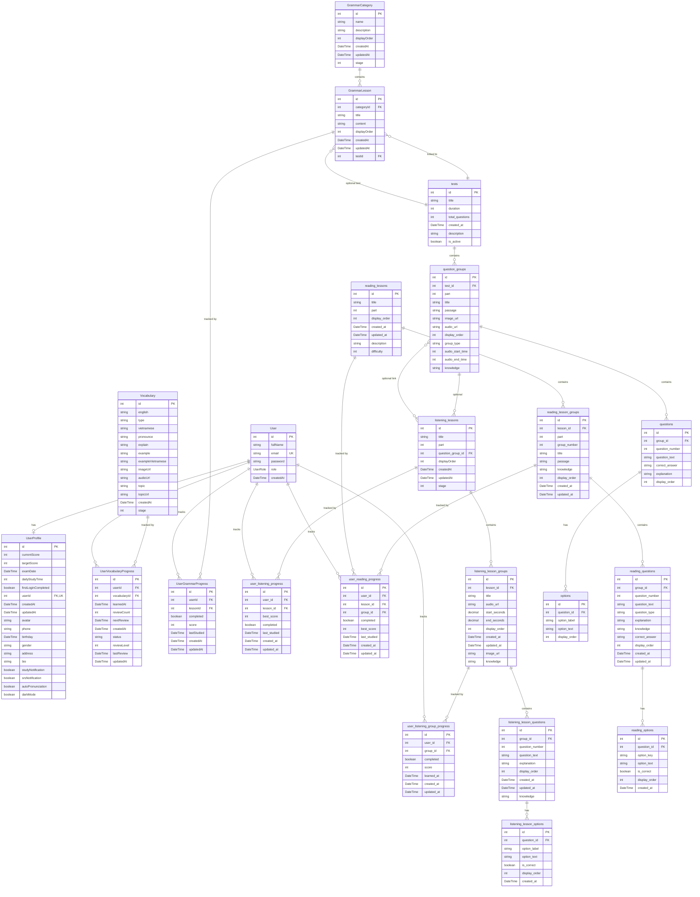
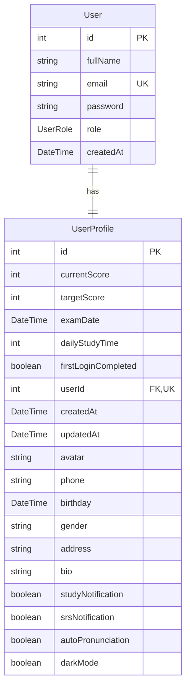
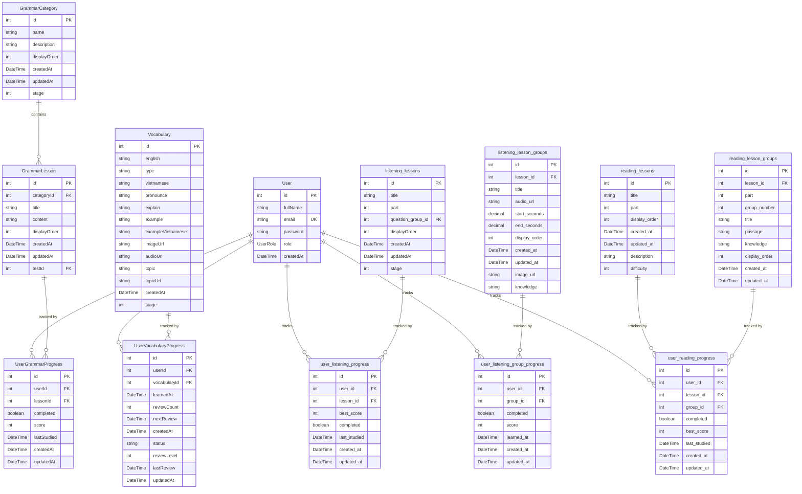

# 03 - DATABASE ERD (ENTITY RELATIONSHIP DIAGRAM)

## 1. THÔNG TIN DATABASE

### 1.1. Thông tin cơ bản
- **Tên Database:** `toeic_ai`
- **Schema:** `public`
- **Database Management System:** PostgreSQL
- **ORM:** Prisma
- **Tổng số bảng:** 22 tables
- **Nguồn dữ liệu:** Đã pull trực tiếp từ database PostgreSQL thực tế tại `localhost:5433`

### 1.2. Các nhóm bảng chính
1. **User & Profile:** User, UserProfile
2. **Vocabulary:** Vocabulary, UserVocabularyProgress
3. **Grammar:** GrammarCategory, GrammarLesson, UserGrammarProgress
4. **Listening:** listening_lessons, listening_lesson_groups, listening_lesson_questions, listening_lesson_options, user_listening_progress, user_listening_group_progress
5. **Reading:** reading_lessons, reading_lesson_groups, reading_questions, reading_options, user_reading_progress
6. **Tests:** tests, question_groups, questions, options

---

## 2. CHI TIẾT CÁC BẢNG

### 2.1. NHÓM USER & PROFILE

#### User
- **Tên bảng:** `User`
- **Mục đích:** Lưu thông tin tài khoản người dùng
- **Primary Key:** `id` (Int, autoincrement)
- **Các column:**
  - `id`: Int (PK, autoincrement)
  - `fullName`: String
  - `email`: String (Unique)
  - `password`: String (hashed)
  - `role`: UserRole (Enum: USER, CONTENT_ADMIN, SUPER_ADMIN)
  - `createdAt`: DateTime (default: now())
- **Foreign Key:** Không có
- **Unique:** `email`
- **Quan hệ:**
  - 1-to-1 với UserProfile (userId)
  - 1-to-N với UserVocabularyProgress (userId)
  - 1-to-N với UserGrammarProgress (userId)
  - 1-to-N với user_listening_group_progress (user_id)
  - 1-to-N với user_listening_progress (user_id)
  - 1-to-N với user_reading_progress (user_id)

#### UserProfile
- **Tên bảng:** `UserProfile`
- **Mục đích:** Lưu thông tin profile và mục tiêu học tập của user
- **Primary Key:** `id` (Int, autoincrement)
- **Các column:**
  - `id`: Int (PK, autoincrement)
  - `currentScore`: Int? (Điểm TOEIC hiện tại)
  - `targetScore`: Int? (Điểm mục tiêu)
  - `examDate`: DateTime? (Ngày thi dự kiến)
  - `dailyStudyTime`: Int? (Thời gian học mỗi ngày - phút)
  - `firstLoginCompleted`: Boolean (default: false)
  - `userId`: Int (Unique, FK)
  - `createdAt`: DateTime (default: now())
  - `updatedAt`: DateTime (auto-update)
  - `avatar`: String? (URL avatar)
  - `phone`: String?
  - `birthday`: DateTime? (Date)
  - `gender`: String?
  - `address`: String?
  - `bio`: String?
  - `studyNotification`: Boolean (default: true)
  - `srsNotification`: Boolean (default: true)
  - `autoPronunciation`: Boolean (default: false)
  - `darkMode`: Boolean (default: true)
- **Foreign Key:** `userId` → User.id
- **Unique:** `userId`
- **Quan hệ:**
  - N-to-1 với User (userId)

---

### 2.2. NHÓM VOCABULARY

#### Vocabulary
- **Tên bảng:** `vocabulary`
- **Mục đích:** Lưu trữ từ vựng TOEIC
- **Primary Key:** `id` (Int, autoincrement)
- **Các column:**
  - `id`: Int (PK, autoincrement)
  - `english`: String (VarChar(255))
  - `type`: String? (VarChar(50)) - Loại từ (noun, verb, adj, adv...)
  - `vietnamese`: String? - Nghĩa tiếng Việt
  - `pronounce`: String? (VarChar(255)) - Phiên âm IPA
  - `explain`: String? - Giải thích
  - `example`: String? - Ví dụ tiếng Anh
  - `exampleVietnamese`: String? - Ví dụ tiếng Việt
  - `imageUrl`: String? - URL hình ảnh minh họa
  - `audioUrl`: String? - URL file âm thanh
  - `topic`: String? (VarChar(255)) - Chủ đề (Business, Office, Travel...)
  - `topicUrl`: String? - URL topic
  - `createdAt`: DateTime? (Timestamp(6), default: now())
  - `stage`: Int (SmallInt, default: 1) - Chặng khó (1-5)
- **Foreign Key:** Không có
- **Unique:** Không có
- **Quan hệ:**
  - 1-to-N với UserVocabularyProgress (vocabularyId)

#### UserVocabularyProgress
- **Tên bảng:** `user_vocabulary_progress`
- **Mục đích:** Lưu tiến độ học từ vựng của từng user (theo thuật toán SRS)
- **Primary Key:** `id` (Int, autoincrement)
- **Các column:**
  - `id`: Int (PK, autoincrement)
  - `userId`: Int (FK)
  - `vocabularyId`: Int (FK)
  - `learnedAt`: DateTime? (Timestamp(6)) - Thời điểm học lần đầu
  - `reviewCount`: Int? (default: 0) - Số lần đã ôn tập
  - `nextReview`: DateTime? (Timestamp(6)) - Thời điểm cần ôn tập tiếp theo
  - `createdAt`: DateTime? (Timestamp(6), default: now())
  - `status`: String (VarChar(20), default: "NEW") - Trạng thái: NEW, LEARNING, REVIEW, MASTERED
  - `reviewLevel`: Int (SmallInt, default: 0) - Level trong thuật toán SRS (0-8)
  - `lastReview`: DateTime? (Timestamp(6)) - Thời điểm ôn tập gần nhất
  - `updatedAt`: DateTime? (Timestamp(6), auto-update)
- **Foreign Key:** 
  - `userId` → User.id (OnDelete: Cascade)
  - `vocabularyId` → Vocabulary.id (OnDelete: Cascade)
- **Unique:** `[userId, vocabularyId]` (uq_user_vocabulary)
- **Quan hệ:**
  - N-to-1 với User (userId)
  - N-to-1 với Vocabulary (vocabularyId)

---

### 2.3. NHÓM GRAMMAR

#### GrammarCategory
- **Tên bảng:** `grammar_categories`
- **Mục đích:** Lưu các chủ đề ngữ pháp (Present Tense, Past Tense, Articles...)
- **Primary Key:** `id` (Int, autoincrement)
- **Các column:**
  - `id`: Int (PK, autoincrement)
  - `name`: String (VarChar(100)) - Tên chủ đề
  - `description`: String? - Mô tả
  - `displayOrder`: Int? (default: 0) - Thứ tự hiển thị
  - `createdAt`: DateTime? (Timestamp(6), default: now())
  - `updatedAt`: DateTime? (Timestamp(6), auto-update)
  - `stage`: Int (default: 1) - Chặng khó (1-5)
- **Foreign Key:** Không có
- **Unique:** Không có
- **Quan hệ:**
  - 1-to-N với GrammarLesson (categoryId)

#### GrammarLesson
- **Tên bảng:** `grammar_lessons`
- **Mục đích:** Lưu các bài học ngữ pháp trong từng chủ đề
- **Primary Key:** `id` (Int, autoincrement)
- **Các column:**
  - `id`: Int (PK, autoincrement)
  - `categoryId`: Int (FK)
  - `title`: String (VarChar(255)) - Tiêu đề bài học
  - `content`: String? - Nội dung bài học (HTML/Markdown)
  - `displayOrder`: Int? (default: 0) - Thứ tự hiển thị
  - `createdAt`: DateTime? (Timestamp(6), default: now())
  - `updatedAt`: DateTime? (Timestamp(6), auto-update)
  - `testId`: Int? (FK, optional) - Đề thi liên quan
- **Foreign Key:**
  - `categoryId` → GrammarCategory.id (OnDelete: Cascade)
  - `testId` → tests.id (OnDelete: NoAction, optional)
- **Unique:** Không có
- **Quan hệ:**
  - N-to-1 với GrammarCategory (categoryId)
  - N-to-1 với tests (testId, optional)
  - 1-to-N với UserGrammarProgress (lessonId)

#### UserGrammarProgress
- **Tên bảng:** `user_grammar_progress`
- **Mục đích:** Lưu tiến độ học ngữ pháp của user
- **Primary Key:** `id` (Int, autoincrement)
- **Các column:**
  - `id`: Int (PK, autoincrement)
  - `userId`: Int (FK)
  - `lessonId`: Int (FK)
  - `completed`: Boolean? (default: false) - Đã hoàn thành chưa
  - `score`: Int? (default: 0) - Điểm số
  - `lastStudied`: DateTime? (Timestamp(6)) - Thời điểm học gần nhất
  - `createdAt`: DateTime? (Timestamp(6), default: now())
  - `updatedAt`: DateTime? (Timestamp(6), auto-update)
- **Foreign Key:**
  - `userId` → User.id (OnDelete: Cascade)
  - `lessonId` → GrammarLesson.id (OnDelete: Cascade)
- **Unique:** `[userId, lessonId]` (uq_user_grammar)
- **Quan hệ:**
  - N-to-1 với User (userId)
  - N-to-1 với GrammarLesson (lessonId)

---

### 2.4. NHÓM LISTENING

#### listening_lessons
- **Tên bảng:** `listening_lessons`
- **Mục đích:** Lưu các bài học Listening (theo Part 1-4)
- **Primary Key:** `id` (Int, autoincrement)
- **Các column:**
  - `id`: Int (PK, autoincrement)
  - `title`: String (VarChar(255)) - Tiêu đề bài học
  - `part`: Int (SmallInt) - Part TOEIC (1, 2, 3, 4)
  - `question_group_id`: Int? (FK, optional) - Group câu hỏi từ bảng tests
  - `displayOrder`: Int? (default: 0) - Thứ tự hiển thị
  - `createdAt`: DateTime? (Timestamp(6), default: now())
  - `updatedAt`: DateTime? (Timestamp(6), auto-update)
  - `stage`: Int (SmallInt, default: 1) - Chặng khó (1-5)
- **Foreign Key:**
  - `question_group_id` → question_groups.id (OnDelete: Cascade, optional)
- **Unique:** Không có
- **Check Constraints:**
  - `listening_lessons_part_check`: part IN (1, 2, 3, 4)
  - `listening_lessons_stage_check`: stage IN (1, 2, 3, 4, 5)
- **Quan hệ:**
  - N-to-1 với question_groups (question_group_id, optional)
  - 1-to-N với listening_lesson_groups (lesson_id)
  - 1-to-N với user_listening_progress (lesson_id)

#### listening_lesson_groups
- **Tên bảng:** `listening_lesson_groups`
- **Mục đích:** Lưu các nhóm câu hỏi trong bài học Listening
- **Primary Key:** `id` (Int, autoincrement)
- **Các column:**
  - `id`: Int (PK, autoincrement)
  - `lesson_id`: Int (FK)
  - `title`: String? (VarChar(255)) - Tiêu đề group
  - `audio_url`: String? - URL file audio
  - `start_seconds`: Decimal? (10,2) - Thời gian bắt đầu trong audio (giây)
  - `end_seconds`: Decimal? (10,2) - Thời gian kết thúc trong audio (giây)
  - `display_order`: Int? (default: 0) - Thứ tự hiển thị
  - `created_at`: DateTime? (Timestamp(6), default: now())
  - `updated_at`: DateTime? (Timestamp(6), auto-update)
  - `image_url`: String? - URL hình ảnh minh họa
  - `knowledge`: String? - Kiến thức liên quan
- **Foreign Key:**
  - `lesson_id` → listening_lessons.id (OnDelete: Cascade)
- **Unique:** Không có
- **Index:** `idx_listening_lesson_groups_lesson` trên `lesson_id`
- **Quan hệ:**
  - N-to-1 với listening_lessons (lesson_id)
  - 1-to-N với listening_lesson_questions (group_id)
  - 1-to-N với user_listening_group_progress (group_id)

#### listening_lesson_questions
- **Tên bảng:** `listening_lesson_questions`
- **Mục đích:** Lưu các câu hỏi trong group Listening
- **Primary Key:** `id` (Int, autoincrement)
- **Các column:**
  - `id`: Int (PK, autoincrement)
  - `group_id`: Int (FK)
  - `question_number`: Int - Số thứ tự câu hỏi
  - `question_text`: String - Nội dung câu hỏi
  - `explanation`: String? - Giải thích
  - `display_order`: Int? (default: 0) - Thứ tự hiển thị
  - `created_at`: DateTime? (Timestamp(6), default: now())
  - `updated_at`: DateTime? (Timestamp(6), auto-update)
  - `knowledge`: String? - Kiến thức liên quan
- **Foreign Key:**
  - `group_id` → listening_lesson_groups.id (OnDelete: Cascade)
- **Unique:** Không có
- **Index:** `idx_listening_lesson_questions_group` trên `group_id`
- **Quan hệ:**
  - N-to-1 với listening_lesson_groups (group_id)
  - 1-to-N với listening_lesson_options (question_id)

#### listening_lesson_options
- **Tên bảng:** `listening_lesson_options`
- **Mục đích:** Lưu các đáp án cho câu hỏi Listening
- **Primary Key:** `id` (Int, autoincrement)
- **Các column:**
  - `id`: Int (PK, autoincrement)
  - `question_id`: Int (FK)
  - `option_label`: String (VarChar(1)) - Nhãn đáp án (A, B, C, D)
  - `option_text`: String - Nội dung đáp án
  - `is_correct`: Boolean? (default: false) - Đáp án đúng
  - `display_order`: Int? (default: 0) - Thứ tự hiển thị
  - `created_at`: DateTime? (Timestamp(6), default: now())
- **Foreign Key:**
  - `question_id` → listening_lesson_questions.id (OnDelete: Cascade)
- **Unique:** Không có
- **Index:** `idx_listening_lesson_options_question` trên `question_id`
- **Quan hệ:**
  - N-to-1 với listening_lesson_questions (question_id)

#### user_listening_progress
- **Tên bảng:** `user_listening_progress`
- **Mục đích:** Lưu tiến độ học Listening của user (theo lesson)
- **Primary Key:** `id` (Int, autoincrement)
- **Các column:**
  - `id`: Int (PK, autoincrement)
  - `user_id`: Int (FK)
  - `lesson_id`: Int (FK)
  - `best_score`: Int? (default: 0) - Điểm cao nhất
  - `completed`: Boolean? (default: false) - Đã hoàn thành chưa
  - `last_studied`: DateTime? (Timestamp(6)) - Thời điểm học gần nhất
  - `created_at`: DateTime? (Timestamp(6), default: now())
  - `updated_at`: DateTime? (Timestamp(6), auto-update)
- **Foreign Key:**
  - `user_id` → User.id (OnDelete: Cascade)
  - `lesson_id` → listening_lessons.id (OnDelete: Cascade)
- **Unique:** `[user_id, lesson_id]` (uq_user_listening)
- **Quan hệ:**
  - N-to-1 với User (user_id)
  - N-to-1 với listening_lessons (lesson_id)

#### user_listening_group_progress
- **Tên bảng:** `user_listening_group_progress`
- **Mục đích:** Lưu tiến độ học Listening của user (theo group)
- **Primary Key:** `id` (Int, autoincrement)
- **Các column:**
  - `id`: Int (PK, autoincrement)
  - `user_id`: Int (FK)
  - `group_id`: Int (FK)
  - `completed`: Boolean? (default: false) - Đã hoàn thành chưa
  - `score`: Int? (default: 0) - Điểm số
  - `learned_at`: DateTime? (Timestamp(6)) - Thời điểm học
  - `created_at`: DateTime? (Timestamp(6), default: now())
  - `updated_at`: DateTime? (Timestamp(6), auto-update)
- **Foreign Key:**
  - `user_id` → User.id (OnDelete: Cascade)
  - `group_id` → listening_lesson_groups.id (OnDelete: Cascade)
- **Unique:** `[user_id, group_id]` (uq_user_listening_group)
- **Quan hệ:**
  - N-to-1 với User (user_id)
  - N-to-1 với listening_lesson_groups (group_id)

---

### 2.5. NHÓM READING

#### reading_lessons
- **Tên bảng:** `reading_lessons`
- **Mục đích:** Lưu các bài học Reading (theo Part 5-7)
- **Primary Key:** `id` (Int, autoincrement)
- **Các column:**
  - `id`: Int (PK, autoincrement)
  - `title`: String (VarChar(255)) - Tiêu đề bài học
  - `part`: Int (SmallInt) - Part TOEIC (5, 6, 7)
  - `display_order`: Int? (default: 0) - Thứ tự hiển thị
  - `created_at`: DateTime? (Timestamp(6), default: now())
  - `updated_at`: DateTime? (Timestamp(6), auto-update)
  - `description`: String? - Mô tả
  - `difficulty`: Int? (SmallInt, default: 1) - Độ khó
- **Foreign Key:** Không có
- **Unique:** Không có
- **Quan hệ:**
  - 1-to-N với reading_lesson_groups (lesson_id)
  - 1-to-N với user_reading_progress (lesson_id)

#### reading_lesson_groups
- **Tên bảng:** `reading_lesson_groups`
- **Mục đích:** Lưu các nhóm câu hỏi trong bài học Reading
- **Primary Key:** `id` (Int, autoincrement)
- **Các column:**
  - `id`: Int (PK, autoincrement)
  - `lesson_id`: Int (FK)
  - `part`: Int (SmallInt) - Part TOEIC (5, 6, 7)
  - `group_number`: Int - Số thứ tự group
  - `title`: String? (VarChar(255)) - Tiêu đề group
  - `passage`: String? - Đoạn văn
  - `knowledge`: String? - Kiến thức liên quan
  - `display_order`: Int? (default: 0) - Thứ tự hiển thị
  - `created_at`: DateTime? (Timestamp(6), default: now())
  - `updated_at`: DateTime? (Timestamp(6), auto-update)
- **Foreign Key:**
  - `lesson_id` → reading_lessons.id (OnDelete: Cascade)
- **Unique:** Không có
- **Index:**
  - `idx_reading_lesson_groups_lesson` trên `lesson_id`
  - `idx_reading_lesson_groups_order` trên `display_order`
  - `idx_reading_lesson_groups_part` trên `part`
- **Quan hệ:**
  - N-to-1 với reading_lessons (lesson_id)
  - 1-to-N với reading_questions (group_id)
  - 1-to-N với user_reading_progress (group_id)

#### reading_questions
- **Tên bảng:** `reading_questions`
- **Mục đích:** Lưu các câu hỏi trong group Reading
- **Primary Key:** `id` (Int, autoincrement)
- **Các column:**
  - `id`: Int (PK, autoincrement)
  - `group_id`: Int (FK)
  - `question_number`: Int - Số thứ tự câu hỏi
  - `question_text`: String - Nội dung câu hỏi
  - `question_type`: String? (VarChar(50)) - Loại câu hỏi
  - `explanation`: String? - Giải thích
  - `knowledge`: String? - Kiến thức liên quan
  - `correct_answer`: String? (VarChar(1)) - Đáp án đúng (A, B, C, D)
  - `display_order`: Int? (default: 0) - Thứ tự hiển thị
  - `created_at`: DateTime? (Timestamp(6), default: now())
  - `updated_at`: DateTime? (Timestamp(6), auto-update)
- **Foreign Key:**
  - `group_id` → reading_lesson_groups.id (OnDelete: Cascade)
- **Unique:** Không có
- **Index:**
  - `idx_reading_questions_group` trên `group_id`
  - `idx_reading_questions_order` trên `display_order`
- **Quan hệ:**
  - N-to-1 với reading_lesson_groups (group_id)
  - 1-to-N với reading_options (question_id)

#### reading_options
- **Tên bảng:** `reading_options`
- **Mục đích:** Lưu các đáp án cho câu hỏi Reading
- **Primary Key:** `id` (Int, autoincrement)
- **Các column:**
  - `id`: Int (PK, autoincrement)
  - `question_id`: Int (FK)
  - `option_key`: String (VarChar(1)) - Nhãn đáp án (A, B, C, D)
  - `option_text`: String - Nội dung đáp án
  - `is_correct`: Boolean? (default: false) - Đáp án đúng
  - `display_order`: Int? (default: 0) - Thứ tự hiển thị
  - `created_at`: DateTime? (Timestamp(6), default: now())
- **Foreign Key:**
  - `question_id` → reading_questions.id (OnDelete: Cascade)
- **Unique:** `[question_id, option_key]` (uq_reading_question_option)
- **Quan hệ:**
  - N-to-1 với reading_questions (question_id)

#### user_reading_progress
- **Tên bảng:** `user_reading_progress`
- **Mục đích:** Lưu tiến độ học Reading của user
- **Primary Key:** `id` (Int, autoincrement)
- **Các column:**
  - `id`: Int (PK, autoincrement)
  - `user_id`: Int (FK)
  - `lesson_id`: Int (FK)
  - `group_id`: Int (FK)
  - `completed`: Boolean? (default: false) - Đã hoàn thành chưa
  - `best_score`: Int? (default: 0) - Điểm cao nhất
  - `last_studied`: DateTime? (Timestamp(6)) - Thời điểm học gần nhất
  - `created_at`: DateTime? (Timestamp(6), default: now())
  - `updated_at`: DateTime? (Timestamp(6), auto-update)
- **Foreign Key:**
  - `user_id` → User.id (OnDelete: Cascade)
  - `lesson_id` → reading_lessons.id (OnDelete: Cascade)
  - `group_id` → reading_lesson_groups.id (OnDelete: Cascade)
- **Unique:** `[user_id, group_id]` (uq_user_reading_group)
- **Quan hệ:**
  - N-to-1 với User (user_id)
  - N-to-1 với reading_lessons (lesson_id)
  - N-to-1 với reading_lesson_groups (group_id)

---

### 2.6. NHÓM TESTS

#### tests
- **Tên bảng:** `tests`
- **Mục đích:** Lưu các đề thi TOEIC
- **Primary Key:** `id` (Int, autoincrement)
- **Các column:**
  - `id`: Int (PK, autoincrement)
  - `title`: String? (VarChar(100)) - Tiêu đề đề thi
  - `duration`: Int? - Thời lượng (phút)
  - `total_questions`: Int? - Tổng số câu hỏi
  - `created_at`: DateTime? (Timestamp(6), default: now())
  - `description`: String? - Mô tả
  - `is_active`: Boolean? (default: true) - Đang active không
- **Foreign Key:** Không có
- **Unique:** Không có
- **Quan hệ:**
  - 1-to-N với GrammarLesson (testId)
  - 1-to-N với question_groups (test_id)

#### question_groups
- **Tên bảng:** `question_groups`
- **Mục đích:** Lưu các nhóm câu hỏi trong đề thi
- **Primary Key:** `id` (Int, autoincrement)
- **Các column:**
  - `id`: Int (PK, autoincrement)
  - `test_id`: Int? (FK, optional)
  - `part`: Int? - Part TOEIC (1-7)
  - `title`: String? - Tiêu đề group
  - `passage`: String? - Đoạn văn/nội dung chung
  - `image_url`: String? - URL hình ảnh
  - `audio_url`: String? - URL audio
  - `display_order`: Int? - Thứ tự hiển thị
  - `group_type`: String? (VarChar(30)) - Loại group
  - `audio_start_time`: Int? - Thời gian bắt đầu audio (giây)
  - `audio_end_time`: Int? - Thời gian kết thúc audio (giây)
  - `knowledge`: String? - Kiến thức liên quan
- **Foreign Key:**
  - `test_id` → tests.id (OnDelete: NoAction, optional)
- **Unique:** Không có
- **Quan hệ:**
  - N-to-1 với tests (test_id, optional)
  - 1-to-N with listening_lessons (question_group_id)
  - 1-to-N với questions (group_id)

#### questions
- **Tên bảng:** `questions`
- **Mục đích:** Lưu các câu hỏi trong đề thi
- **Primary Key:** `id` (Int, autoincrement)
- **Các column:**
  - `id`: Int (PK, autoincrement)
  - `group_id`: Int? (FK, optional)
  - `question_number`: Int? - Số thứ tự câu hỏi
  - `question_text`: String? - Nội dung câu hỏi
  - `correct_answer`: String? (Char(1)) - Đáp án đúng (A, B, C, D)
  - `explanation`: String? - Giải thích
  - `display_order`: Int? - Thứ tự hiển thị
- **Foreign Key:**
  - `group_id` → question_groups.id (OnDelete: NoAction, optional)
- **Unique:** Không có
- **Quan hệ:**
  - N-to-1 với question_groups (group_id, optional)
  - 1-to-N với options (question_id)

#### options
- **Tên bảng:** `options`
- **Mục đích:** Lưu các đáp án cho câu hỏi trong đề thi
- **Primary Key:** `id` (Int, autoincrement)
- **Các column:**
  - `id`: Int (PK, autoincrement)
  - `question_id`: Int? (FK, optional)
  - `option_label`: String? (Char(1)) - Nhãn đáp án (A, B, C, D)
  - `option_text`: String? - Nội dung đáp án
  - `display_order`: Int? - Thứ tự hiển thị
- **Foreign Key:**
  - `question_id` → questions.id (OnDelete: NoAction, optional)
- **Unique:** Không có
- **Quan hệ:**
  - N-to-1 với questions (question_id, optional)

---

## 3. QUAN HỆ GIỮA CÁC BẢNG

### 3.1. Quan hệ One-to-One (1-1)

#### User - UserProfile
- **Cardinality:** User 1 ─── 1 UserProfile
- **Giải thích:** Mỗi User có đúng một UserProfile, mỗi UserProfile thuộc về một User
- **Foreign Key:** UserProfile.userId → User.id
- **Unique constraint:** UserProfile.userId
- **On Delete:** Cascade (nếu User bị xóa, UserProfile cũng bị xóa)

### 3.2. Quan hệ One-to-Many (1-N)

#### User - UserVocabularyProgress
- **Cardinality:** User 1 ─── N UserVocabularyProgress
- **Giải thích:** Một User có thể có nhiều UserVocabularyProgress (cho từng từ vựng), mỗi UserVocabularyProgress thuộc về một User
- **Foreign Key:** UserVocabularyProgress.userId → User.id
- **On Delete:** Cascade

#### User - UserGrammarProgress
- **Cardinality:** User 1 ─── N UserGrammarProgress
- **Giải thích:** Một User có thể có nhiều UserGrammarProgress (cho từng bài ngữ pháp), mỗi UserGrammarProgress thuộc về một User
- **Foreign Key:** UserGrammarProgress.userId → User.id
- **On Delete:** Cascade

#### User - user_listening_progress
- **Cardinality:** User 1 ─── N user_listening_progress
- **Giải thích:** Một User có thể có nhiều user_listening_progress (cho từng lesson listening), mỗi progress thuộc về một User
- **Foreign Key:** user_listening_progress.user_id → User.id
- **On Delete:** Cascade

#### User - user_listening_group_progress
- **Cardinality:** User 1 ─── N user_listening_group_progress
- **Giải thích:** Một User có thể có nhiều user_listening_group_progress (cho từng group listening), mỗi progress thuộc về một User
- **Foreign Key:** user_listening_group_progress.user_id → User.id
- **On Delete:** Cascade

#### User - user_reading_progress
- **Cardinality:** User 1 ─── N user_reading_progress
- **Giải thích:** Một User có thể có nhiều user_reading_progress (cho từng group reading), mỗi progress thuộc về một User
- **Foreign Key:** user_reading_progress.user_id → User.id
- **On Delete:** Cascade

#### Vocabulary - UserVocabularyProgress
- **Cardinality:** Vocabulary 1 ─── N UserVocabularyProgress
- **Giải thích:** Một từ vựng có thể có nhiều UserVocabularyProgress (cho từng user), mỗi progress thuộc về một từ vựng
- **Foreign Key:** UserVocabularyProgress.vocabularyId → Vocabulary.id
- **On Delete:** Cascade

#### GrammarCategory - GrammarLesson
- **Cardinality:** GrammarCategory 1 ─── N GrammarLesson
- **Giải thích:** Một chủ đề ngữ pháp có thể có nhiều bài học, mỗi bài học thuộc về một chủ đề
- **Foreign Key:** GrammarLesson.categoryId → GrammarCategory.id
- **On Delete:** Cascade

#### GrammarLesson - UserGrammarProgress
- **Cardinality:** GrammarLesson 1 ─── N UserGrammarProgress
- **Giải thích:** Một bài học ngữ pháp có thể có nhiều UserGrammarProgress (cho từng user), mỗi progress thuộc về một bài học
- **Foreign Key:** UserGrammarProgress.lessonId → GrammarLesson.id
- **On Delete:** Cascade

#### listening_lessons - listening_lesson_groups
- **Cardinality:** listening_lessons 1 ─── N listening_lesson_groups
- **Giải thích:** Một bài học listening có thể có nhiều group câu hỏi, mỗi group thuộc về một bài học
- **Foreign Key:** listening_lesson_groups.lesson_id → listening_lessons.id
- **On Delete:** Cascade

#### listening_lesson_groups - listening_lesson_questions
- **Cardinality:** listening_lesson_groups 1 ─── N listening_lesson_questions
- **Giải thích:** Một group có thể có nhiều câu hỏi, mỗi câu hỏi thuộc về một group
- **Foreign Key:** listening_lesson_questions.group_id → listening_lesson_groups.id
- **On Delete:** Cascade

#### listening_lesson_questions - listening_lesson_options
- **Cardinality:** listening_lesson_questions 1 ─── N listening_lesson_options
- **Giải thích:** Một câu hỏi có thể có nhiều đáp án, mỗi đáp án thuộc về một câu hỏi
- **Foreign Key:** listening_lesson_options.question_id → listening_lesson_questions.id
- **On Delete:** Cascade

#### listening_lessons - user_listening_progress
- **Cardinality:** listening_lessons 1 ─── N user_listening_progress
- **Giải thích:** Một bài học listening có thể có nhiều user_listening_progress (cho từng user), mỗi progress thuộc về một bài học
- **Foreign Key:** user_listening_progress.lesson_id → listening_lessons.id
- **On Delete:** Cascade

#### listening_lesson_groups - user_listening_group_progress
- **Cardinality:** listening_lesson_groups 1 ─── N user_listening_group_progress
- **Giải thích:** Một group listening có thể có nhiều user_listening_group_progress (cho từng user), mỗi progress thuộc về một group
- **Foreign Key:** user_listening_group_progress.group_id → listening_lesson_groups.id
- **On Delete:** Cascade

#### reading_lessons - reading_lesson_groups
- **Cardinality:** reading_lessons 1 ─── N reading_lesson_groups
- **Giải thích:** Một bài học reading có thể có nhiều group câu hỏi, mỗi group thuộc về một bài học
- **Foreign Key:** reading_lesson_groups.lesson_id → reading_lessons.id
- **On Delete:** Cascade

#### reading_lesson_groups - reading_questions
- **Cardinality:** reading_lesson_groups 1 ─── N reading_questions
- **Giải thích:** Một group có thể có nhiều câu hỏi, mỗi câu hỏi thuộc về một group
- **Foreign Key:** reading_questions.group_id → reading_lesson_groups.id
- **On Delete:** Cascade

#### reading_questions - reading_options
- **Cardinality:** reading_questions 1 ─── N reading_options
- **Giải thích:** Một câu hỏi có thể có nhiều đáp án, mỗi đáp án thuộc về một câu hỏi
- **Foreign Key:** reading_options.question_id → reading_questions.id
- **On Delete:** Cascade

#### reading_lessons - user_reading_progress
- **Cardinality:** reading_lessons 1 ─── N user_reading_progress
- **Giải thích:** Một bài học reading có thể có nhiều user_reading_progress (cho từng user), mỗi progress thuộc về một bài học
- **Foreign Key:** user_reading_progress.lesson_id → reading_lessons.id
- **On Delete:** Cascade

#### reading_lesson_groups - user_reading_progress
- **Cardinality:** reading_lesson_groups 1 ─── N user_reading_progress
- **Giải thích:** Một group reading có thể có nhiều user_reading_progress (cho từng user), mỗi progress thuộc về một group
- **Foreign Key:** user_reading_progress.group_id → reading_lesson_groups.id
- **On Delete:** Cascade

#### tests - GrammarLesson
- **Cardinality:** tests 1 ─── N GrammarLesson
- **Giải thích:** Một đề thi có thể được liên kết với nhiều bài học ngữ pháp, mỗi bài học có thể liên kết với một đề thi
- **Foreign Key:** GrammarLesson.testId → tests.id
- **On Delete:** NoAction

#### tests - question_groups
- **Cardinality:** tests 1 ─── N question_groups
- **Giải thích:** Một đề thi có thể có nhiều question_groups, mỗi group thuộc về một đề thi
- **Foreign Key:** question_groups.test_id → tests.id
- **On Delete:** NoAction

#### question_groups - questions
- **Cardinality:** question_groups 1 ─── N questions
- **Giải thích:** Một question_group có thể có nhiều câu hỏi, mỗi câu hỏi thuộc về một group
- **Foreign Key:** questions.group_id → question_groups.id
- **On Delete:** NoAction

#### questions - options
- **Cardinality:** questions 1 ─── N options
- **Giải thích:** Một câu hỏi có thể có nhiều đáp án, mỗi đáp án thuộc về một câu hỏi
- **Foreign Key:** options.question_id → questions.id
- **On Delete:** NoAction

### 3.3. Quan hệ Many-to-One (N-1)

Tất cả các quan hệ One-to-Many ở trên cũng có thể xem từ phía Many-to-One ngược lại.

### 3.4. Quan hệ Many-to-Many (N-M)

Không có quan hệ Many-to-Many trực tiếp trong database. Tất cả đều được implement thông qua bảng trung gian (junction table) hoặc foreign key.

### 3.5. Self-Referencing Relationships

Không có quan hệ self-referencing trong database này.

---

## 4. MÃ SƠ ĐỒ ERD (MERMAID)

Do số lượng bảng lớn (22 bảng), tôi sẽ chia thành 4 ERD con theo nhóm chức năng:

### 4.1. ERD Tổng thể (Tất cả các bảng)

### 4.2. ERD Nhóm User & Profile

### 4.3. ERD Nhóm Learning (Vocabulary, Grammar, Listening, Reading Progress)

### 4.4. ERD Nhóm Content (Lessons, Questions, Options)

```mermaid
erDiagram
    listening_lessons ||--o{ listening_lesson_groups : "contains"
    listening_lesson_groups ||--o{ listening_lesson_questions : "contains"
    listening_lesson_questions ||--o{ listening_lesson_options : "has"
    
    reading_lessons ||--o{ reading_lesson_groups : "contains"
    reading_lesson_groups ||--o{ reading_questions : "contains"
    reading_questions ||--o{ reading_options : "has"
    
    GrammarCategory ||--o{ GrammarLesson : "contains"
    
    tests ||--o{ question_groups : "contains"
    question_groups ||--o{ questions : "contains"
    questions ||--o{ options : "has"
    
    listening_lessons }o--|| question_groups : "optional"
    GrammarLesson }o--|| tests : "optional"
    
    listening_lessons {
        int id PK
        string title
        int part
        int question_group_id FK
        int displayOrder
        DateTime createdAt
        DateTime updatedAt
        int stage
    }
    
    listening_lesson_groups {
        int id PK
        int lesson_id FK
        string title
        string audio_url
        decimal start_seconds
        decimal end_seconds
        int display_order
        DateTime created_at
        DateTime updated_at
        string image_url
        string knowledge
    }
    
    listening_lesson_questions {
        int id PK
        int group_id FK
        int question_number
        string question_text
        string explanation
        int display_order
        DateTime created_at
        DateTime updated_at
        string knowledge
    }
    
    listening_lesson_options {
        int id PK
        int question_id FK
        string option_label
        string option_text
        boolean is_correct
        int display_order
        DateTime created_at
    }
    
    reading_lessons {
        int id PK
        string title
        int part
        int display_order
        DateTime created_at
        DateTime updated_at
        string description
        int difficulty
    }
    
    reading_lesson_groups {
        int id PK
        int lesson_id FK
        int part
        int group_number
        string title
        string passage
        string knowledge
        int display_order
        DateTime created_at
        DateTime updated_at
    }
    
    reading_questions {
        int id PK
        int group_id FK
        int question_number
        string question_text
        string question_type
        string explanation
        string knowledge
        string correct_answer
        int display_order
        DateTime created_at
        DateTime updated_at
    }
    
    reading_options {
        int id PK
        int question_id FK
        string option_key
        string option_text
        boolean is_correct
        int display_order
        DateTime created_at
    }
    
    GrammarCategory {
        int id PK
        string name
        string description
        int displayOrder
        DateTime createdAt
        DateTime updatedAt
        int stage
    }
    
    GrammarLesson {
        int id PK
        int categoryId FK
        string title
        string content
        int displayOrder
        DateTime createdAt
        DateTime updatedAt
        int testId FK
    }
    
    tests {
        int id PK
        string title
        int duration
        int total_questions
        DateTime created_at
        string description
        boolean is_active
    }
    
    question_groups {
        int id PK
        int test_id FK
        int part
        string title
        string passage
        string image_url
        string audio_url
        int display_order
        string group_type
        int audio_start_time
        int audio_end_time
        string knowledge
    }
    
    questions {
        int id PK
        int group_id FK
        int question_number
        string question_text
        string correct_answer
        string explanation
        int display_order
    }
    
    options {
        int id PK
        int question_id FK
        string option_label
        string option_text
        int display_order
    }
```

---

## 5. CÁCH SỬ DỤNG CÁC ERD CON TRONG BÁO CÁO

### 5.1. ERD Tổng thể (4.1)
- **Sử dụng khi:** Cần hiển thị toàn bộ kiến trúc database
- **Ưu điểm:** Cho thấy bức tranh toàn cảnh
- **Nhược điểm:** Có thể quá phức tạp và khó đọc
- **Khuyên nghị:** Đặt ở phần đầu của báo cáo như overview

### 5.2. ERD Nhóm User & Profile (4.2)
- **Sử dụng khi:** Cần giải thích chi tiết về quản lý user và profile
- **Ưu điểm:** Rõ ràng, dễ hiểu
- **Khuyên nghị:** Đặt ở phần mô tả hệ thống authentication

### 5.3. ERD Nhóm Learning (4.3)
- **Sử dụng khi:** Cần giải thích chi tiết về tracking tiến độ học tập
- **Ưu điểm:** Tập trung vào nghiệp vụ chính của hệ thống
- **Khuyên nghị:** Đặt ở phần mô tả tính năng học tập

### 5.4. ERD Nhóm Content (4.4)
- **Sử dụng khi:** Cần giải thích chi tiết về cấu trúc nội dung học tập
- **Ưu điểm:** Rõ ràng về cách tổ chức lessons, questions, options
- **Khuyên nghị:** Đặt ở phần mô tả quản lý nội dung

---

## 6. GHI CHÚ VÀ CÁC VẤN ĐỀ

### 6.1. Đã xác định từ database thực tế
- Tất cả thông tin về bảng, column, data type, foreign key, unique constraint đều được pull trực tiếp từ PostgreSQL database
- Database name: `toeic_ai`
- Schema: `public`
- Host: `localhost:5433`
- Tổng số bảng: 22 tables

### 6.2. Check Constraints
Database có các check constraints sau (Prisma không hỗ trợ đầy đủ):
- `listening_lessons_part_check`: part IN (1, 2, 3, 4)
- `listening_lessons_stage_check`: stage IN (1, 2, 3, 4, 5)
- `chk_reading_option_key`: option_key IN ('A', 'B', 'C', 'D')
- `vocabulary_stage_check`: stage IN (1, 2, 3, 4, 5)

### 6.3. Comments trong database
- Field `GrammarCategory.stage` có comment trong database (không được Prisma hỗ trợ đầy đủ)

### 6.4. Không có sự khác biệt giữa Prisma schema và database thực tế
- Prisma schema đã được sync với database thông qua `prisma db pull`
- Tất cả bảng, column, quan hệ đều khớp nhau
- Prisma schema có các @map và @@map để map với tên bảng thực tế

### 6.5. Indexes quan trọng
- `idx_listening_lesson_groups_lesson` trên listening_lesson_groups.lesson_id
- `idx_listening_lesson_options_question` trên listening_lesson_options.question_id
- `idx_listening_lesson_questions_group` trên listening_lesson_questions.group_id
- `idx_reading_lesson_groups_lesson` trên reading_lesson_groups.lesson_id
- `idx_reading_lesson_groups_order` trên reading_lesson_groups.display_order
- `idx_reading_lesson_groups_part` trên reading_lesson_groups.part
- `idx_reading_questions_group` trên reading_questions.group_id
- `idx_reading_questions_order` trên reading_questions.display_order

### 6.6. Cascade Delete Behavior
- User-related progress tables: Cascade delete khi User bị xóa
- Content-related tables (lessons, questions, options): Cascade delete khi parent bị xóa
- Test-related tables: NoAction delete (để bảo toàn dữ liệu đề thi)
