# 04 - SEQUENCE DIAGRAM

## 1. TỔNG QUAN

Sequence Diagram mô tả luồng xử lý theo thời gian giữa các thành phần trong hệ thống. Mỗi sequence diagram tập trung vào một nghiệp vụ cụ thể.

---

## 2. DANH SÁCH SEQUENCE DIAGRAM

### 2.1. Authentication
1. **SD-01: Đăng ký tài khoản**
2. **SD-02: Đăng nhập**

### 2.2. Profile & Onboarding
3. **SD-03: Hoàn thành thiết lập lần đầu (First Login Setup)**
4. **SD-04: Cập nhật hồ sơ cá nhân**

### 2.3. Vocabulary
5. **SD-05: Xem Dashboard Từ vựng**
6. **SD-06: Học từ mới (Today's Learning)**
7. **SD-07: Ôn tập từ vựng (SRS Review)**
8. **SD-08: Học từ vựng theo bài (Lessons)**

### 2.4. Listening
9. **SD-09: Xem trạng thái học Listening hàng ngày**
10. **SD-10: Học Listening (Daily Groups)**
11. **SD-11: Nộp bài Listening**

### 2.5. Reading
12. **SD-12: Xem trạng thái học Reading hàng ngày**
13. **SD-13: Học Reading (Daily Lessons)**
14. **SD-14: Nộp bài Reading**

### 2.6. Grammar
15. **SD-15: Xem danh sách chủ đề ngữ pháp**
16. **SD-16: Hoàn thành bài học ngữ pháp**

### 2.7. Admin
17. **SD-17: Quản lý từ vựng (Thêm mới)**
18. **SD-18: Xem thống kê hệ thống**

---

## 3. CHI TIẾT MỖI SEQUENCE DIAGRAM

### 3.1. SD-01: ĐĂNG KÝ TÀI KHOẢN

#### Tên
Đăng ký tài khoản

#### Mục đích
Tạo tài khoản mới cho người dùng

#### Actor
User (không đăng nhập)

#### Frontend
RegisterPage (`apps/web/app/register/page.tsx`)

#### API
POST `/auth/register`

#### Controller
AuthController (`apps/api/src/auth/auth.controller.ts`)

#### Service
AuthService (`apps/api/src/auth/auth.service.ts`)

#### Database
PostgreSQL (User, UserProfile tables)

#### Luồng xử lý từng bước

1. **User thao tác trên UI**
   - User truy cập trang `/register`
   - User nhập họ tên (`fullName`), email (`email`), mật khẩu (`password`)
   - User click button "Đăng ký"

2. **Frontend gửi request**
   - RegisterPage gọi hàm `register()`
   - Frontend gửi POST request đến `http://localhost:3001/auth/register`
   - Body: `{ fullName, email, password }`
   - Headers: `{ "Content-Type": "application/json" }`

3. **Controller nhận request**
   - AuthController.register() nhận request
   - Extract body: `{ fullName, email, password }`

4. **Service xử lý nghiệp vụ**
   - AuthService.register(fullName, email, password) được gọi
   - Service kiểm tra email đã tồn tại chưa:
     - PrismaService.user.findUnique({ where: { email } })
   - Nếu email đã tồn tại:
     - Return `{ message: "Email đã tồn tại" }`
   - Nếu email chưa tồn tại:
     - Hash password: `bcrypt.hash(password, 10)`
     - Tạo User mới với UserProfile:
       ```typescript
       prisma.user.create({
         data: {
           fullName,
           email,
           password: hashedPassword,
           profile: {
             create: {
               firstLoginCompleted: false,
             },
           },
         },
         include: {
           profile: true,
         },
       })
       ```

5. **Prisma/Repository truy vấn database**
   - PrismaClient thực hiện INSERT vào bảng `User`
   - PrismaClient thực hiện INSERT vào bảng `UserProfile`
   - Database trả về User đã tạo với profile

6. **Database trả dữ liệu**
   - Database trả về User object với profile
   - PrismaClient map kết quả sang TypeScript object

7. **Service xử lý**
   - AuthService trả về response:
     ```typescript
     {
       id: newUser.id,
       email: newUser.email,
       role: newUser.role,
       firstLoginCompleted: newUser.profile?.firstLoginCompleted,
     }
     ```

8. **API trả response**
   - AuthController trả về response cho Frontend
   - Status: 200 OK
   - Body: JSON object với user info

9. **Frontend cập nhật UI**
   - RegisterPage nhận response
   - Lưu user info vào localStorage: `localStorage.setItem("user", JSON.stringify(data))`
   - Redirect về trang `/login`

#### Mã sơ đồ (PlantUML)

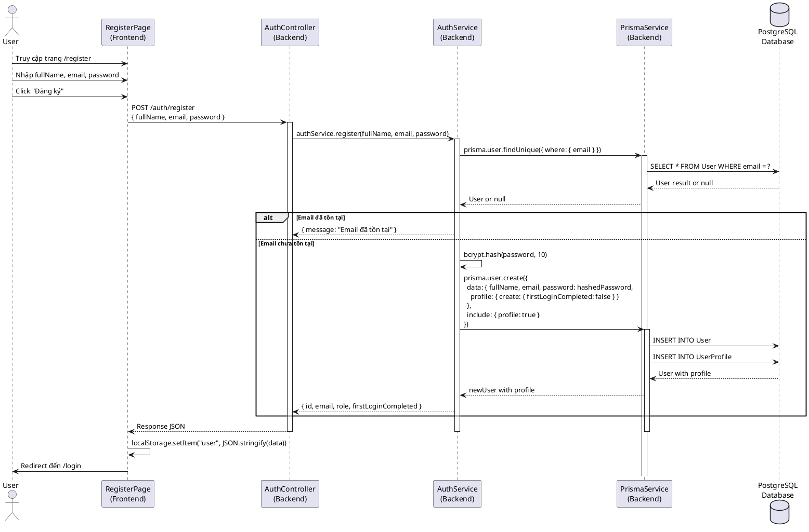
```plantuml
@startuml SD_01_REGISTER
actor User
participant "RegisterPage\n(Frontend)" as Frontend
participant "AuthController\n(Backend)" as Controller
participant "AuthService\n(Backend)" as Service
participant "PrismaService\n(Backend)" as Prisma
database "PostgreSQL\nDatabase" as DB

User -> Frontend: Truy cập trang /register
User -> Frontend: Nhập fullName, email, password
User -> Frontend: Click "Đăng ký"

Frontend -> Controller: POST /auth/register\n{ fullName, email, password }
activate Controller

Controller -> Service: authService.register(fullName, email, password)
activate Service

Service -> Prisma: prisma.user.findUnique({ where: { email } })
activate Prisma
Prisma -> DB: SELECT * FROM User WHERE email = ?
DB --> Prisma: User result or null
Prisma --> Service: User or null

alt Email đã tồn tại
    Service --> Controller: { message: "Email đã tồn tại" }
else Email chưa tồn tại
    Service -> Service: bcrypt.hash(password, 10)
    Service -> Prisma: prisma.user.create({\n  data: { fullName, email, password: hashedPassword,\n    profile: { create: { firstLoginCompleted: false } }\n  },\n  include: { profile: true }\n})
    activate Prisma
    Prisma -> DB: INSERT INTO User
    Prisma -> DB: INSERT INTO UserProfile
    DB --> Prisma: User with profile
    Prisma --> Service: newUser with profile
    Service --> Controller: { id, email, role, firstLoginCompleted }
end

Controller --> Frontend: Response JSON
deactivate Service
deactivate Prisma
deactivate Controller

Frontend -> Frontend: localStorage.setItem("user", JSON.stringify(data))
Frontend -> User: Redirect đến /login

@enduml
```

---

### 3.2. SD-02: ĐĂNG NHẬP

#### Tên
Đăng nhập

#### Mục đích
Xác thực user và cấp JWT token

#### Actor
User (không đăng nhập)

#### Frontend
LoginPage (`apps/web/app/login/page.tsx`)

#### API
POST `/auth/login`

#### Controller
AuthController (`apps/api/src/auth/auth.controller.ts`)

#### Service
AuthService (`apps/api/src/auth/auth.service.ts`)

#### Guard
JwtStrategy (`apps/api/src/auth/jwt.strategy.ts`)

#### Database
PostgreSQL (User, UserProfile tables)

#### Luồng xử lý từng bước

1. **User thao tác trên UI**
   - User truy cập trang `/login`
   - User nhập email (`email`), mật khẩu (`password`)
   - User click button "Đăng nhập"

2. **Frontend gửi request**
   - LoginPage gọi hàm `login()`
   - Frontend gửi POST request đến `http://localhost:3001/auth/login`
   - Body: `{ email, password }`
   - Headers: `{ "Content-Type": "application/json" }`

3. **Controller nhận request**
   - AuthController.login() nhận request
   - Extract body: `{ email, password }`

4. **Service xử lý nghiệp vụ**
   - AuthService.login(email, password) được gọi
   - Service tìm user theo email:
     - PrismaService.user.findUnique({ where: { email }, include: { profile: true } })
   - Nếu không tìm thấy user:
     - Return `{ message: "Không tìm thấy tài khoản" }`
   - Nếu tìm thấy user:
     - Kiểm tra mật khẩu: `bcrypt.compare(password, user.password)`
     - Nếu mật khẩu sai:
       - Return `{ message: "Sai mật khẩu" }`
     - Nếu mật khẩu đúng:
       - Tạo JWT payload: `{ sub: user.id, email: user.email, role: user.role }`
       - Sign token: `jwtService.sign(payload)`
       - Return response với accessToken và user info

5. **Prisma/Repository truy vấn database**
   - PrismaClient thực hiện SELECT từ bảng `User` với JOIN `UserProfile`
   - Database trả về User object với profile

6. **Database trả dữ liệu**
   - Database trả về User với profile
   - PrismaClient map kết quả sang TypeScript object

7. **Service xử lý**
   - AuthService trả về response:
     ```typescript
     {
       accessToken,
       user: {
         id: user.id,
         fullName: user.fullName,
         email: user.email,
         role: user.role,
         firstLoginCompleted: user.profile?.firstLoginCompleted,
       },
     }
     ```

8. **API trả response**
   - AuthController trả về response cho Frontend
   - Status: 200 OK
   - Body: JSON object với accessToken và user info

9. **Frontend cập nhật UI**
   - LoginPage nhận response
   - Kiểm tra `data.accessToken`
   - Lưu JWT token: `localStorage.setItem("accessToken", data.accessToken)`
   - Lưu user info: `localStorage.setItem("user", JSON.stringify(data.user))`
   - Kiểm tra role:
     - Nếu `SUPER_ADMIN` hoặc `CONTENT_ADMIN`: Redirect `/admin`
     - Nếu `!firstLoginCompleted`: Redirect `/onboarding`
     - Nếu thường: Redirect `/dashboard`

#### Mã sơ đồ (PlantUML)

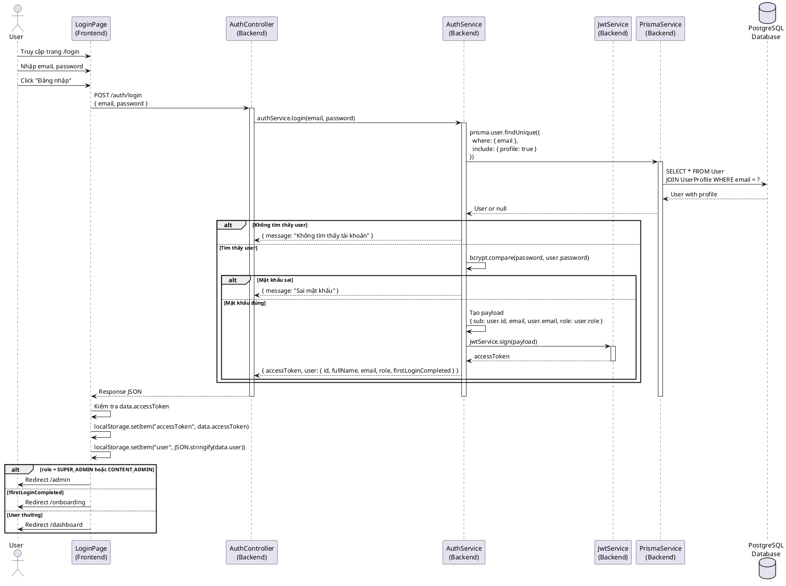
```plantuml
@startuml SD_02_LOGIN
actor User
participant "LoginPage\n(Frontend)" as Frontend
participant "AuthController\n(Backend)" as Controller
participant "AuthService\n(Backend)" as Service
participant "JwtService\n(Backend)" as JwtService
participant "PrismaService\n(Backend)" as Prisma
database "PostgreSQL\nDatabase" as DB

User -> Frontend: Truy cập trang /login
User -> Frontend: Nhập email, password
User -> Frontend: Click "Đăng nhập"

Frontend -> Controller: POST /auth/login\n{ email, password }
activate Controller

Controller -> Service: authService.login(email, password)
activate Service

Service -> Prisma: prisma.user.findUnique({\n  where: { email },\n  include: { profile: true }\n})
activate Prisma
Prisma -> DB: SELECT * FROM User\nJOIN UserProfile WHERE email = ?
DB --> Prisma: User with profile
Prisma --> Service: User or null

alt Không tìm thấy user
    Service --> Controller: { message: "Không tìm thấy tài khoản" }
else Tìm thấy user
    Service -> Service: bcrypt.compare(password, user.password)
    
    alt Mật khẩu sai
        Service --> Controller: { message: "Sai mật khẩu" }
    else Mật khẩu đúng
        Service -> Service: Tạo payload\n{ sub: user.id, email, user.email, role: user.role }
        Service -> JwtService: jwtService.sign(payload)
        activate JwtService
        JwtService --> Service: accessToken
        deactivate JwtService
        Service --> Controller: { accessToken, user: { id, fullName, email, role, firstLoginCompleted } }
    end
end

Controller --> Frontend: Response JSON
deactivate Service
deactivate Prisma
deactivate Controller

Frontend -> Frontend: Kiểm tra data.accessToken
Frontend -> Frontend: localStorage.setItem("accessToken", data.accessToken)
Frontend -> Frontend: localStorage.setItem("user", JSON.stringify(data.user))

alt role = SUPER_ADMIN hoặc CONTENT_ADMIN
    Frontend -> User: Redirect /admin
else !firstLoginCompleted
    Frontend -> User: Redirect /onboarding
else User thường
    Frontend -> User: Redirect /dashboard
end

@enduml
```

---

### 3.3. SD-03: HOÀN THÀNH THIẾT LẬP LẦN ĐẦU

#### Tên
Hoàn thành thiết lập lần đầu (First Login Setup)

#### Mục đích
Thiết lập mục tiêu học tập TOEIC cho user mới

#### Actor
User (đã đăng nhập, lần đầu)

#### Frontend
Onboarding Setup Page (`apps/web/app/onboarding/setup/page.tsx`)

#### API
POST `/profile/complete-first-login`

#### Controller
ProfileController (`apps/api/src/profile/profile.controller.ts`)

#### Service
ProfileService (`apps/api/src/profile/profile.service.ts`)

#### Database
PostgreSQL (UserProfile table)

#### Luồng xử lý từng bước

1. **User thao tác trên UI**
   - User được redirect đến trang `/onboarding/setup` sau khi đăng nhập lần đầu
   - User nhập điểm hiện tại (`currentScore`)
   - User nhập điểm mục tiêu (`targetScore`)
   - User chọn ngày thi dự kiến (`examDate`)
   - User nhập thời gian học mỗi ngày (`dailyStudyTime`)
   - User click button "Hoàn thành"

2. **Frontend gửi request**
   - OnboardingSetupPage gửi POST request đến `http://localhost:3001/profile/complete-first-login`
   - Body: `{ userId, currentScore, targetScore, examDate, dailyStudyTime }`
   - Headers: `{ "Content-Type": "application/json", "Authorization": "Bearer <token>" }`

3. **Controller nhận request**
   - ProfileController.completeFirstLogin() nhận request
   - Extract body: `{ userId, currentScore, targetScore, examDate, dailyStudyTime }`

4. **Guard kiểm tra authentication**
   - JwtAuthGuard kiểm tra JWT token từ header
   - JwtStrategy.validate() xác thực token
   - Trả về user info: `{ userId, email, role }`

5. **Service xử lý nghiệp vụ**
   - ProfileService.completeFirstLogin(userId, currentScore, targetScore, examDate, dailyStudyTime) được gọi
   - Service sử dụng PrismaService.userProfile.upsert():
     ```typescript
     prisma.userProfile.upsert({
       where: { userId },
       create: {
         userId,
         currentScore,
         targetScore,
         examDate: new Date(examDate),
         dailyStudyTime: dailyStudyTime || null,
         firstLoginCompleted: true,
       },
       update: {
         currentScore,
         targetScore,
         examDate: new Date(examDate),
         dailyStudyTime: dailyStudyTime || null,
         firstLoginCompleted: true,
       },
     })
     ```

6. **Prisma/Repository truy vấn database**
   - PrismaClient thực hiện UPSERT vào bảng `UserProfile`
   - Nếu chưa có record: INSERT
   - Nếu đã có record: UPDATE

7. **Database trả dữ liệu**
   - Database trả về UserProfile đã được cập nhật
   - PrismaClient map kết quả sang TypeScript object

8. **Service xử lý**
   - ProfileService trả về UserProfile object

9. **API trả response**
   - ProfileController trả về response cho Frontend
   - Status: 200 OK
   - Body: UserProfile object

10. **Frontend cập nhật UI**
    - OnboardingSetupPage nhận response
    - Cập nhật user info trong localStorage
    - Redirect về trang `/dashboard`

#### Mã sơ đồ (PlantUML)

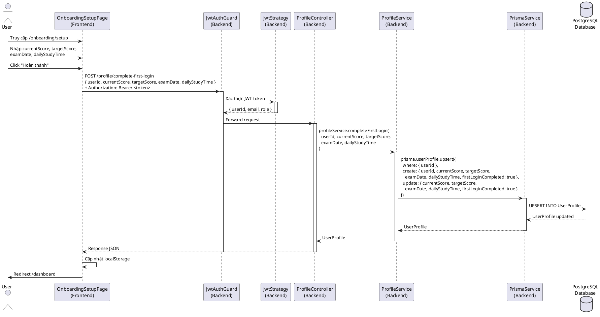
```plantuml
@startuml SD_03_FIRST_LOGIN_SETUP
actor User
participant "OnboardingSetupPage\n(Frontend)" as Frontend
participant "JwtAuthGuard\n(Backend)" as Guard
participant "JwtStrategy\n(Backend)" as Strategy
participant "ProfileController\n(Backend)" as Controller
participant "ProfileService\n(Backend)" as Service
participant "PrismaService\n(Backend)" as Prisma
database "PostgreSQL\nDatabase" as DB

User -> Frontend: Truy cập /onboarding/setup
User -> Frontend: Nhập currentScore, targetScore,\nexamDate, dailyStudyTime
User -> Frontend: Click "Hoàn thành"

Frontend -> Guard: POST /profile/complete-first-login\n{ userId, currentScore, targetScore, examDate, dailyStudyTime }\n+ Authorization: Bearer <token>
activate Guard

Guard -> Strategy: Xác thực JWT token
activate Strategy
Strategy --> Guard: { userId, email, role }
deactivate Strategy

Guard -> Controller: Forward request
activate Controller

Controller -> Service: profileService.completeFirstLogin(\n  userId, currentScore, targetScore,\n  examDate, dailyStudyTime\n)
activate Service

Service -> Prisma: prisma.userProfile.upsert({\n  where: { userId },\n  create: { userId, currentScore, targetScore,\n    examDate, dailyStudyTime, firstLoginCompleted: true },\n  update: { currentScore, targetScore,\n    examDate, dailyStudyTime, firstLoginCompleted: true }\n})
activate Prisma
Prisma -> DB: UPSERT INTO UserProfile
DB --> Prisma: UserProfile updated
Prisma --> Service: UserProfile
deactivate Prisma

Service --> Controller: UserProfile
deactivate Service

Controller --> Frontend: Response JSON
deactivate Controller
deactivate Guard

Frontend -> Frontend: Cập nhật localStorage
Frontend -> User: Redirect /dashboard

@enduml
```

---

### 3.4. SD-04: CẬP NHẬT HỒ SƠ CÁ NHÂN

#### Tên
Cập nhật hồ sơ cá nhân

#### Mục đích
Cập nhật thông tin cá nhân và mục tiêu học tập

#### Actor
User (đã đăng nhập)

#### Frontend
Profile Page (`apps/web/app/dashboard/profile/page.tsx`)

#### API
PUT `/profile/me`

#### Controller
ProfileController (`apps/api/src/profile/profile.controller.ts`)

#### Service
ProfileService (`apps/api/src/profile/profile.service.ts`)

#### Database
PostgreSQL (User, UserProfile tables)

#### Luồng xử lý từng bước

1. **User thao tác trên UI**
   - User truy cập trang `/dashboard/profile`
   - User chỉnh sửa thông tin (avatar, phone, birthday, gender, address, bio)
   - User chỉnh sửa mục tiêu (currentScore, targetScore, examDate, dailyStudyTime)
   - User chỉnh sửa settings (studyNotification, srsNotification, autoPronunciation, darkMode)
   - User click button "Lưu"

2. **Frontend gửi request**
   - ProfilePage gửi PUT request đến `http://localhost:3001/profile/me`
   - Body: `{ fullName, avatar, phone, birthday, gender, address, bio, currentScore, targetScore, examDate, dailyStudyTime, studyNotification, srsNotification, autoPronunciation, darkMode }`
   - Headers: `{ "Content-Type": "application/json", "Authorization": "Bearer <token>" }`

3. **Controller nhận request**
   - ProfileController.updateProfile() nhận request
   - Extract body: `{ fullName, avatar, phone, birthday, gender, address, bio, currentScore, targetScore, examDate, dailyStudyTime, studyNotification, srsNotification, autoPronunciation, darkMode }`
   - Extract userId từ request.user (được set bởi JwtAuthGuard)

4. **Guard kiểm tra authentication**
   - JwtAuthGuard kiểm tra JWT token
   - JwtStrategy.validate() xác thực token
   - Trả về user info: `{ userId, email, role }`

5. **Service xử lý nghiệp vụ**
   - ProfileService.updateProfile(userId, data) được gọi
   - Service kiểm tra user tồn tại:
     - PrismaService.user.findUnique({ where: { id: userId } })
   - Nếu không tìm thấy user:
     - Return `{ message: "Không tìm thấy người dùng" }`
   - Nếu tìm thấy user:
     - Cập nhật User.fullName:
       ```typescript
       prisma.user.update({
         where: { id: userId },
         data: { fullName: data.fullName },
       })
       ```
     - Upsert UserProfile:
       ```typescript
       prisma.userProfile.upsert({
         where: { userId },
         create: { userId, avatar, phone, birthday, gender, address, bio,
           currentScore, targetScore, examDate, dailyStudyTime,
           studyNotification, srsNotification, autoPronunciation, darkMode },
         update: { avatar, phone, birthday, gender, address, bio,
           currentScore, targetScore, examDate, dailyStudyTime,
           studyNotification, srsNotification, autoPronunciation, darkMode },
       })
       ```

6. **Prisma/Repository truy vấn database**
   - PrismaClient thực hiện UPDATE vào bảng `User`
   - PrismaClient thực hiện UPSERT vào bảng `UserProfile`

7. **Database trả dữ liệu**
   - Database trả về User và UserProfile đã được cập nhật

8. **Service xử lý**
   - ProfileService trả về `{ message: "Cập nhật hồ sơ thành công" }`

9. **API trả response**
   - ProfileController trả về response cho Frontend
   - Status: 200 OK
   - Body: `{ message: "Cập nhật hồ sơ thành công" }`

10. **Frontend cập nhật UI**
    - ProfilePage nhận response
    - Hiển thị thông báo thành công
    - Cập nhật user info trong localStorage

#### Mã sơ đồ (PlantUML)

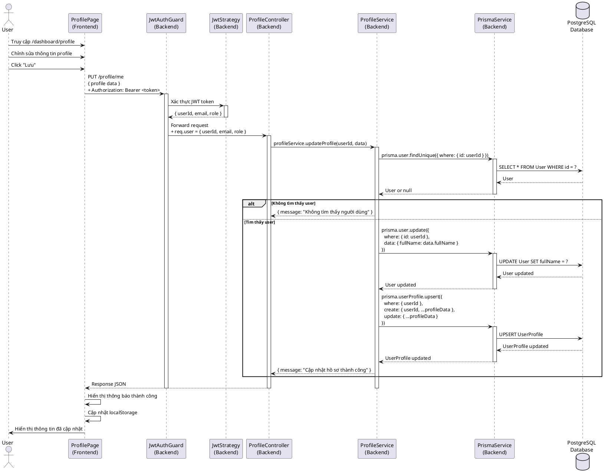
```plantuml
@startuml SD_04_UPDATE_PROFILE
actor User
participant "ProfilePage\n(Frontend)" as Frontend
participant "JwtAuthGuard\n(Backend)" as Guard
participant "JwtStrategy\n(Backend)" as Strategy
participant "ProfileController\n(Backend)" as Controller
participant "ProfileService\n(Backend)" as Service
participant "PrismaService\n(Backend)" as Prisma
database "PostgreSQL\nDatabase" as DB

User -> Frontend: Truy cập /dashboard/profile
User -> Frontend: Chỉnh sửa thông tin profile
User -> Frontend: Click "Lưu"

Frontend -> Guard: PUT /profile/me\n{ profile data }\n+ Authorization: Bearer <token>
activate Guard

Guard -> Strategy: Xác thực JWT token
activate Strategy
Strategy --> Guard: { userId, email, role }
deactivate Strategy

Guard -> Controller: Forward request\n+ req.user = { userId, email, role }
activate Controller

Controller -> Service: profileService.updateProfile(userId, data)
activate Service

Service -> Prisma: prisma.user.findUnique({ where: { id: userId } })
activate Prisma
Prisma -> DB: SELECT * FROM User WHERE id = ?
DB --> Prisma: User
Prisma --> Service: User or null
deactivate Prisma

alt Không tìm thấy user
    Service --> Controller: { message: "Không tìm thấy người dùng" }
else Tìm thấy user
    Service -> Prisma: prisma.user.update({\n  where: { id: userId },\n  data: { fullName: data.fullName }\n})
    activate Prisma
    Prisma -> DB: UPDATE User SET fullName = ?
    DB --> Prisma: User updated
    Prisma --> Service: User updated
    deactivate Prisma
    
    Service -> Prisma: prisma.userProfile.upsert({\n  where: { userId },\n  create: { userId, ...profileData },\n  update: { ...profileData }\n})
    activate Prisma
    Prisma -> DB: UPSERT UserProfile
    DB --> Prisma: UserProfile updated
    Prisma --> Service: UserProfile updated
    deactivate Prisma
    
    Service --> Controller: { message: "Cập nhật hồ sơ thành công" }
end

Controller --> Frontend: Response JSON
deactivate Service
deactivate Controller
deactivate Guard

Frontend -> Frontend: Hiển thị thông báo thành công
Frontend -> Frontend: Cập nhật localStorage
Frontend -> User: Hiển thị thông tin đã cập nhật

@enduml
```

---

### 3.5. SD-05: XEM DASHBOARD TỪ VỰNG

#### Tên
Xem Dashboard Từ vựng

#### Mục đích
Xem thống kê học từ vựng (total, learned, learning, review, mastered)

#### Actor
User (đã đăng nhập)

#### Frontend
Vocabulary Page (`apps/web/app/dashboard/vocabulary/page.tsx`)

#### API
GET `/vocabulary/dashboard`

#### Controller
VocabularyController (`apps/api/src/vocabulary/vocabulary.controller.ts`)

#### Service
VocabularyService (`apps/api/src/vocabulary/vocabulary.service.ts`)

#### Database
PostgreSQL (UserProfile, Vocabulary, UserVocabularyProgress tables)

#### Luồng xử lý từng bước

1. **User thao tác trên UI**
   - User truy cập trang `/dashboard/vocabulary`
   - VocabularyPage được render

2. **Frontend gửi request**
   - VocabularyPage gọi `getDashboard()` từ VocabularyService (frontend)
   - Frontend gửi GET request đến `http://localhost:3001/vocabulary/dashboard`
   - Headers: `{ "Authorization": "Bearer <token>" }`

3. **Controller nhận request**
   - VocabularyController.dashboard() nhận request
   - Extract userId từ request.user (được set bởi JwtAuthGuard)

4. **Guard kiểm tra authentication**
   - JwtAuthGuard kiểm tra JWT token
   - JwtStrategy.validate() xác thực token
   - Trả về user info: `{ userId, email, role }`

5. **Service xử lý nghiệp vụ**
   - VocabularyService.getDashboard(userId) được gọi
   - Service gọi helper `getProfile(userId)`:
     - PrismaService.userProfile.findUnique({ where: { userId } })
   - Service tính stage từ currentScore:
     ```typescript
     if (score >= 800) return 5;
     if (score >= 650) return 4;
     if (score >= 500) return 3;
     if (score >= 300) return 2;
     return 1;
     ```
   - Service tính toán các thống kê:
     - `totalWords`: PrismaService.vocabulary.count()
     - `learnedToday`: PrismaService.userVocabularyProgress.count({ where: { userId, learnedAt: { gte: today } } })
     - `learning`: PrismaService.userVocabularyProgress.count({ where: { userId, status: 'LEARNING' } })
     - `review`: PrismaService.userVocabularyProgress.count({ where: { userId, status: 'REVIEW' } })
     - `mastered`: PrismaService.userVocabularyProgress.count({ where: { userId, status: 'MASTERED' } })
     - `totalLearned`: PrismaService.userVocabularyProgress.count({ where: { userId } })
     - `totalStageWords`: PrismaService.vocabulary.count({ where: { stage } })
   - Service tính progress: `(totalLearned / totalStageWords) * 100`

6. **Prisma/Repository truy vấn database**
   - PrismaClient thực hiện COUNT từ các bảng `Vocabulary`, `UserVocabularyProgress`
   - PrismaClient thực hiện SELECT từ bảng `UserProfile`

7. **Database trả dữ liệu**
   - Database trả về các count và UserProfile
   - PrismaClient map kết quả sang TypeScript objects

8. **Service xử lý**
   - VocabularyService trả về response:
     ```typescript
     {
       success: true,
       stage,
       currentScore,
       targetScore,
       totalWords,
       totalLearned,
       totalStageWords,
       learnedToday,
       dailyGoal: 20,
       remainToday: Math.max(20 - learnedToday, 0),
       learning,
       review,
       mastered,
       progress,
     }
     ```

9. **API trả response**
   - VocabularyController trả về response cho Frontend
   - Status: 200 OK
   - Body: JSON object với dashboard data

10. **Frontend cập nhật UI**
    - VocabularyPage nhận response
    - Hiển thị các thống kê trên UI (VocabularyStats component)

#### Mã sơ đồ (PlantUML)

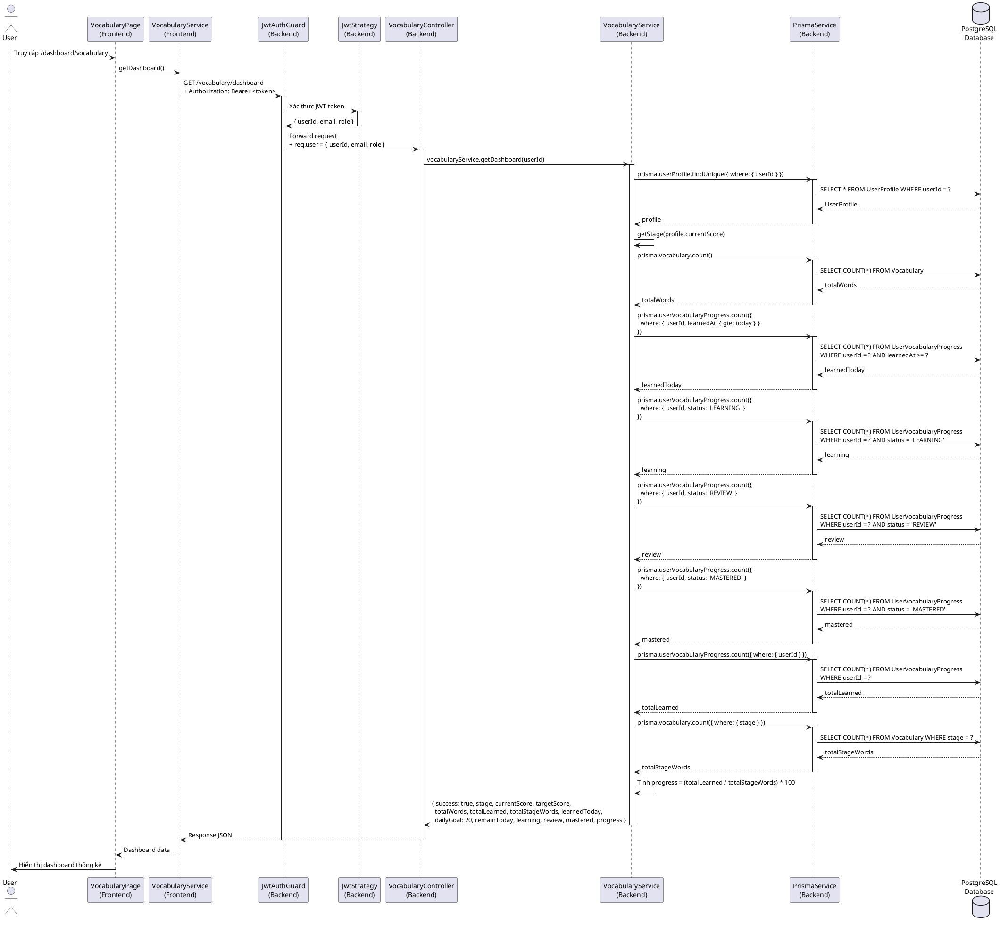
```plantuml
@startuml SD_05_VOCABULARY_DASHBOARD
actor User
participant "VocabularyPage\n(Frontend)" as Frontend
participant "VocabularyService\n(Frontend)" as FrontendService
participant "JwtAuthGuard\n(Backend)" as Guard
participant "JwtStrategy\n(Backend)" as Strategy
participant "VocabularyController\n(Backend)" as Controller
participant "VocabularyService\n(Backend)" as Service
participant "PrismaService\n(Backend)" as Prisma
database "PostgreSQL\nDatabase" as DB

User -> Frontend: Truy cập /dashboard/vocabulary
Frontend -> FrontendService: getDashboard()
FrontendService -> Guard: GET /vocabulary/dashboard\n+ Authorization: Bearer <token>
activate Guard

Guard -> Strategy: Xác thực JWT token
activate Strategy
Strategy --> Guard: { userId, email, role }
deactivate Strategy

Guard -> Controller: Forward request\n+ req.user = { userId, email, role }
activate Controller

Controller -> Service: vocabularyService.getDashboard(userId)
activate Service

Service -> Prisma: prisma.userProfile.findUnique({ where: { userId } })
activate Prisma
Prisma -> DB: SELECT * FROM UserProfile WHERE userId = ?
DB --> Prisma: UserProfile
Prisma --> Service: profile
deactivate Prisma

Service -> Service: getStage(profile.currentScore)

Service -> Prisma: prisma.vocabulary.count()
activate Prisma
Prisma -> DB: SELECT COUNT(*) FROM Vocabulary
DB --> Prisma: totalWords
Prisma --> Service: totalWords
deactivate Prisma

Service -> Prisma: prisma.userVocabularyProgress.count({\n  where: { userId, learnedAt: { gte: today } }\n})
activate Prisma
Prisma -> DB: SELECT COUNT(*) FROM UserVocabularyProgress\nWHERE userId = ? AND learnedAt >= ?
DB --> Prisma: learnedToday
Prisma --> Service: learnedToday
deactivate Prisma

Service -> Prisma: prisma.userVocabularyProgress.count({\n  where: { userId, status: 'LEARNING' }\n})
activate Prisma
Prisma -> DB: SELECT COUNT(*) FROM UserVocabularyProgress\nWHERE userId = ? AND status = 'LEARNING'
DB --> Prisma: learning
Prisma --> Service: learning
deactivate Prisma

Service -> Prisma: prisma.userVocabularyProgress.count({\n  where: { userId, status: 'REVIEW' }\n})
activate Prisma
Prisma -> DB: SELECT COUNT(*) FROM UserVocabularyProgress\nWHERE userId = ? AND status = 'REVIEW'
DB --> Prisma: review
Prisma --> Service: review
deactivate Prisma

Service -> Prisma: prisma.userVocabularyProgress.count({\n  where: { userId, status: 'MASTERED' }\n})
activate Prisma
Prisma -> DB: SELECT COUNT(*) FROM UserVocabularyProgress\nWHERE userId = ? AND status = 'MASTERED'
DB --> Prisma: mastered
Prisma --> Service: mastered
deactivate Prisma

Service -> Prisma: prisma.userVocabularyProgress.count({ where: { userId } })
activate Prisma
Prisma -> DB: SELECT COUNT(*) FROM UserVocabularyProgress\nWHERE userId = ?
DB --> Prisma: totalLearned
Prisma --> Service: totalLearned
deactivate Prisma

Service -> Prisma: prisma.vocabulary.count({ where: { stage } })
activate Prisma
Prisma -> DB: SELECT COUNT(*) FROM Vocabulary WHERE stage = ?
DB --> Prisma: totalStageWords
Prisma --> Service: totalStageWords
deactivate Prisma

Service -> Service: Tính progress = (totalLearned / totalStageWords) * 100
Service --> Controller: { success: true, stage, currentScore, targetScore,\n  totalWords, totalLearned, totalStageWords, learnedToday,\n  dailyGoal: 20, remainToday, learning, review, mastered, progress }
deactivate Service

Controller --> FrontendService: Response JSON
deactivate Controller
deactivate Guard

FrontendService --> Frontend: Dashboard data
Frontend -> User: Hiển thị dashboard thống kê

@enduml
```

---

### 3.6. SD-06: HỌC TỪ MỚI (TODAY'S LEARNING)

#### Tên
Học từ mới (Today's Learning)

#### Mục đích
Lấy và học từ vựng mới theo stage và daily goal

#### Actor
User (đã đăng nhập)

#### Frontend
Vocabulary Page / LessonLearning Component (`apps/web/app/dashboard/vocabulary/page.tsx`, `apps/web/components/vocabulary/LessonLearning.tsx`)

#### API
GET `/vocabulary/today`, POST `/vocabulary/learn`

#### Controller
VocabularyController (`apps/api/src/vocabulary/vocabulary.controller.ts`)

#### Service
VocabularyService (`apps/api/src/vocabulary/vocabulary.service.ts`)

#### Database
PostgreSQL (UserProfile, Vocabulary, UserVocabularyProgress tables)

#### Luồng xử lý từng bước

1. **User thao tác trên UI**
   - User truy cập trang `/dashboard/vocabulary`
   - User click "Học từ mới" hoặc mở một bài học
   - LessonLearning component hiển thị từ vựng

2. **Frontend gửi request (Lấy từ vựng)**
   - Frontend gọi `getToday()` từ VocabularyService (frontend)
   - Frontend gửi GET request đến `http://localhost:3001/vocabulary/today`
   - Headers: `{ "Authorization": "Bearer <token>" }`

3. **Controller nhận request**
   - VocabularyController.today() nhận request
   - Extract userId từ request.user

4. **Guard kiểm tra authentication**
   - JwtAuthGuard kiểm tra JWT token
   - JwtStrategy.validate() xác thực token
   - Trả về user info: `{ userId, email, role }`

5. **Service xử lý nghiệp vụ (Lấy từ vựng)**
   - VocabularyService.today(userId) được gọi
   - Service gọi helper `getProfile(userId)` để lấy currentScore
   - Service tính stage từ currentScore
   - Service ưu tiên lấy từ cần ôn tập:
     - PrismaService.userVocabularyProgress.findMany({
         where: { userId, nextReview: { lte: new Date() } },
         include: { vocabulary: true },
         orderBy: { nextReview: 'asc' },
         take: 10,
       })
   - Nếu có từ cần ôn:
     - Return `{ success: true, mode: 'REVIEW', words: reviewWords }`
   - Nếu không có từ cần ôn:
     - Kiểm tra learnedToday:
       - PrismaService.userVocabularyProgress.count({ where: { userId, learnedAt: { gte: today } } })
     - Tính remain = Math.max(20 - learnedToday, 0)
     - Nếu remain === 0:
       - Return `{ success: true, mode: 'DONE_TODAY', words: [] }`
     - Lấy danh sách từ đã học:
       - PrismaService.userVocabularyProgress.findMany({ where: { userId }, select: { vocabularyId: true } })
     - Lấy từ mới chưa học theo stage:
       - PrismaService.vocabulary.findMany({
           where: { stage, id: { notIn: learnedIds } },
           orderBy: { id: 'asc' },
           take: remain,
         })
     - Return `{ success: true, mode: 'NEW', words: newWords }`

6. **Prisma/Repository truy vấn database**
   - PrismaClient thực hiện SELECT/JOIN từ các bảng `UserVocabularyProgress`, `Vocabulary`

7. **Database trả dữ liệu**
   - Database trả về từ vựng cần học
   - PrismaClient map kết quả sang TypeScript objects

8. **Service xử lý**
   - VocabularyService trả về response với từ vựng và mode

9. **API trả response**
   - VocabularyController trả về response cho Frontend
   - Status: 200 OK
   - Body: JSON object với words và mode

10. **Frontend cập nhật UI**
    - Frontend nhận response
    - LessonLearning component hiển thị từ vựng

11. **User học từ vựng**
    - User xem nghĩa, nghe phát âm, xem ví dụ
    - User click "Đã học" hoặc "Quên/Nhớ"

12. **Frontend gửi request (Lưu tiến độ)**
    - Frontend gọi `learnWord(vocabularyId)` từ VocabularyService (frontend)
    - Frontend gửi POST request đến `http://localhost:3001/vocabulary/learn`
    - Body: `{ vocabularyId }`
    - Headers: `{ "Content-Type": "application/json", "Authorization": "Bearer <token>" }`

13. **Controller nhận request**
    - VocabularyController.learn() nhận request
    - Extract userId từ request.user và vocabularyId từ body

14. **Service xử lý nghiệp vụ (Lưu tiến độ)**
    - VocabularyService.learn(dto) được gọi
    - Service kiểm tra progress đã tồn tại:
      - PrismaService.userVocabularyProgress.findUnique({
          where: { userId_vocabularyId: { userId, vocabularyId } },
        })
    - Nếu đã tồn tại:
      - Nếu status !== 'NEW': Return success
      - Nếu status === 'NEW':
        - Update progress:
          ```typescript
          prisma.userVocabularyProgress.update({
            where: { id: exist.id },
            data: {
              status: 'LEARNING',
              reviewLevel: 1,
              reviewCount: 1,
              learnedAt: now,
              lastReview: now,
              nextReview: now + 30 minutes,
            },
          })
          ```
    - Nếu chưa tồn tại:
      - Create progress:
        ```typescript
        prisma.userVocabularyProgress.create({
          data: {
            userId,
            vocabularyId,
            status: 'LEARNING',
            reviewLevel: 1,
            reviewCount: 1,
            learnedAt: now,
            lastReview: now,
            nextReview: now + 30 minutes,
          },
        })
        ```

15. **Prisma/Repository truy vấn database**
   - PrismaClient thực hiện UPDATE hoặc INSERT vào bảng `UserVocabularyProgress`

16. **Database trả dữ liệu**
   - Database trả về progress đã được cập nhật

17. **Service xử lý**
   - VocabularyService trả về `{ success: true, message, reviewLevel, nextReview }`

18. **API trả response**
   - VocabularyController trả về response cho Frontend
   - Status: 200 OK
   - Body: JSON object với progress info

19. **Frontend cập nhật UI**
    - Frontend nhận response
    - LessonLearning component cập nhật trạng thái từ vựng (đã học)
    - Load từ tiếp theo

#### Mã sơ đồ (PlantUML)

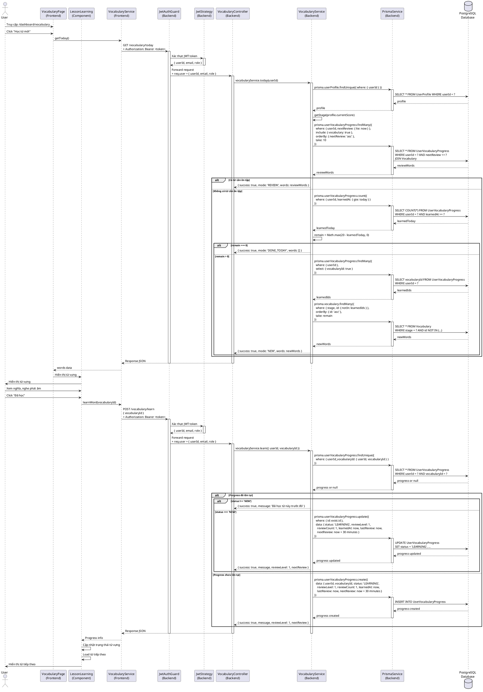
```plantuml
@startuml SD_06_VOCABULARY_LEARN
actor User
participant "VocabularyPage\n(Frontend)" as Frontend
participant "LessonLearning\n(Component)" as Component
participant "VocabularyService\n(Frontend)" as FrontendService
participant "JwtAuthGuard\n(Backend)" as Guard
participant "JwtStrategy\n(Backend)" as Strategy
participant "VocabularyController\n(Backend)" as Controller
participant "VocabularyService\n(Backend)" as Service
participant "PrismaService\n(Backend)" as Prisma
database "PostgreSQL\nDatabase" as DB

User -> Frontend: Truy cập /dashboard/vocabulary
User -> Frontend: Click "Học từ mới"
Frontend -> FrontendService: getToday()
FrontendService -> Guard: GET /vocabulary/today\n+ Authorization: Bearer <token>
activate Guard

Guard -> Strategy: Xác thực JWT token
activate Strategy
Strategy --> Guard: { userId, email, role }
deactivate Strategy

Guard -> Controller: Forward request\n+ req.user = { userId, email, role }
activate Controller

Controller -> Service: vocabularyService.today(userId)
activate Service

Service -> Prisma: prisma.userProfile.findUnique({ where: { userId } })
activate Prisma
Prisma -> DB: SELECT * FROM UserProfile WHERE userId = ?
DB --> Prisma: profile
Prisma --> Service: profile
deactivate Prisma

Service -> Service: getStage(profile.currentScore)

Service -> Prisma: prisma.userVocabularyProgress.findMany({\n  where: { userId, nextReview: { lte: now } },\n  include: { vocabulary: true },\n  orderBy: { nextReview: 'asc' },\n  take: 10\n})
activate Prisma
Prisma -> DB: SELECT * FROM UserVocabularyProgress\nWHERE userId = ? AND nextReview <= ?\nJOIN Vocabulary
DB --> Prisma: reviewWords
Prisma --> Service: reviewWords
deactivate Prisma

alt Có từ cần ôn tập
    Service --> Controller: { success: true, mode: 'REVIEW', words: reviewWords }
else Không có từ cần ôn tập
    Service -> Prisma: prisma.userVocabularyProgress.count({\n  where: { userId, learnedAt: { gte: today } }\n})
    activate Prisma
    Prisma -> DB: SELECT COUNT(*) FROM UserVocabularyProgress\nWHERE userId = ? AND learnedAt >= ?
    DB --> Prisma: learnedToday
    Prisma --> Service: learnedToday
    deactivate Prisma
    
    Service -> Service: remain = Math.max(20 - learnedToday, 0)
    
    alt remain === 0
        Service --> Controller: { success: true, mode: 'DONE_TODAY', words: [] }
    else remain > 0
        Service -> Prisma: prisma.userVocabularyProgress.findMany({\n  where: { userId },\n  select: { vocabularyId: true }\n})
        activate Prisma
        Prisma -> DB: SELECT vocabularyId FROM UserVocabularyProgress\nWHERE userId = ?
        DB --> Prisma: learnedIds
        Prisma --> Service: learnedIds
        deactivate Prisma
        
        Service -> Prisma: prisma.vocabulary.findMany({\n  where: { stage, id: { notIn: learnedIds } },\n  orderBy: { id: 'asc' },\n  take: remain\n})
        activate Prisma
        Prisma -> DB: SELECT * FROM Vocabulary\nWHERE stage = ? AND id NOT IN (...)
        DB --> Prisma: newWords
        Prisma --> Service: newWords
        deactivate Prisma
        
        Service --> Controller: { success: true, mode: 'NEW', words: newWords }
    end
end

Controller --> FrontendService: Response JSON
deactivate Service
deactivate Controller
deactivate Guard

FrontendService --> Frontend: words data
Frontend -> Component: Hiển thị từ vựng
Component -> User: Hiển thị từ vựng

User -> Component: Xem nghĩa, nghe phát âm
User -> Component: Click "Đã học"
Component -> FrontendService: learnWord(vocabularyId)
FrontendService -> Guard: POST /vocabulary/learn\n{ vocabularyId }\n+ Authorization: Bearer <token>
activate Guard

Guard -> Strategy: Xác thực JWT token
activate Strategy
Strategy --> Guard: { userId, email, role }
deactivate Strategy

Guard -> Controller: Forward request\n+ req.user = { userId, email, role }
activate Controller

Controller -> Service: vocabularyService.learn({ userId, vocabularyId })
activate Service

Service -> Prisma: prisma.userVocabularyProgress.findUnique({\n  where: { userId_vocabularyId: { userId, vocabularyId } }\n})
activate Prisma
Prisma -> DB: SELECT * FROM UserVocabularyProgress\nWHERE userId = ? AND vocabularyId = ?
DB --> Prisma: progress or null
Prisma --> Service: progress or null
deactivate Prisma

alt Progress đã tồn tại
    alt status !== 'NEW'
        Service --> Controller: { success: true, message: 'Đã học từ này trước đó' }
    else status === 'NEW'
        Service -> Prisma: prisma.userVocabularyProgress.update({\n  where: { id: exist.id },\n  data: { status: 'LEARNING', reviewLevel: 1,\n    reviewCount: 1, learnedAt: now, lastReview: now,\n    nextReview: now + 30 minutes }\n})
        activate Prisma
        Prisma -> DB: UPDATE UserVocabularyProgress\nSET status = 'LEARNING', ...
        DB --> Prisma: progress updated
        Prisma --> Service: progress updated
        deactivate Prisma
        Service --> Controller: { success: true, message, reviewLevel: 1, nextReview }
    end
else Progress chưa tồn tại
    Service -> Prisma: prisma.userVocabularyProgress.create({\n  data: { userId, vocabularyId, status: 'LEARNING',\n    reviewLevel: 1, reviewCount: 1, learnedAt: now,\n    lastReview: now, nextReview: now + 30 minutes }\n})
    activate Prisma
    Prisma -> DB: INSERT INTO UserVocabularyProgress
    DB --> Prisma: progress created
    Prisma --> Service: progress created
    deactivate Prisma
    Service --> Controller: { success: true, message, reviewLevel: 1, nextReview }
end

Controller --> FrontendService: Response JSON
deactivate Service
deactivate Controller
deactivate Guard

FrontendService --> Component: Progress info
Component -> Component: Cập nhật trạng thái từ vựng
Component -> Component: Load từ tiếp theo
Component -> User: Hiển thị từ tiếp theo

@enduml
```

---

### 3.7. SD-07: ÔN TẬP TỪ VỰNG (SRS REVIEW)

#### Tên
Ôn tập từ vựng (SRS Review)

#### Mục đích
Ôn tập từ vựng theo thuật toán Spaced Repetition

#### Actor
User (đã đăng nhập)

#### Frontend
Review Page / ReviewSession Component (`apps/web/app/dashboard/review/page.tsx`, `apps/web/components/vocabulary/ReviewSession.tsx`)

#### API
GET `/vocabulary/srs`, POST `/vocabulary/review`

#### Controller
VocabularyController (`apps/api/src/vocabulary/vocabulary.controller.ts`)

#### Service
VocabularyService (`apps/api/src/vocabulary/vocabulary.service.ts`)

#### Database
PostgreSQL (UserProfile, Vocabulary, UserVocabularyProgress tables)

#### Luồng xử lý từng bước

1. **User thao tác trên UI**
   - User truy cập trang `/dashboard/review`
   - ReviewSession component hiển thị các level ôn tập

2. **Frontend gửi request (Lấy trạng thái SRS)**
   - Frontend gọi `getSrs()` từ VocabularyService (frontend)
   - Frontend gửi GET request đến `http://localhost:3001/vocabulary/srs`
   - Headers: `{ "Authorization": "Bearer <token>" }`

3. **Controller nhận request**
   - VocabularyController.srs() nhận request
   - Extract userId từ request.user

4. **Guard kiểm tra authentication**
   - JwtAuthGuard kiểm tra JWT token
   - JwtStrategy.validate() xác thực token
   - Trả về user info: `{ userId, email, role }`

5. **Service xử lý nghiệp vụ (Lấy trạng thái SRS)**
   - VocabularyService.getSrsStatus(userId) được gọi
   - Service gọi helper `getProfile(userId)` để lấy currentScore
   - Service tính stage từ currentScore
   - Service tính toán các thống kê SRS:
     - `learnedToday`: PrismaService.userVocabularyProgress.count({ where: { userId, learnedAt: { gte: today } } })
     - `totalLearned`: PrismaService.userVocabularyProgress.count({ where: { userId } })
     - `reviewNow`: PrismaService.userVocabularyProgress.count({ where: { userId, status: { not: 'MASTERED' }, nextReview: { lte: now } } })
     - `masteredCount`: PrismaService.userVocabularyProgress.count({ where: { userId, status: 'MASTERED' } })
     - `learningCount`: PrismaService.userVocabularyProgress.count({ where: { userId, status: { in: ['LEARNING', 'REVIEW'] } } })
     - `totalStageWords`: PrismaService.vocabulary.count({ where: { stage } })
     - `learnedStage`: PrismaService.userVocabularyProgress.count({ where: { userId, vocabulary: { stage } } })
     - `nextReviewRecord`: PrismaService.userVocabularyProgress.findFirst({ where: { userId, status: { not: 'MASTERED' }, nextReview: { gt: now } }, orderBy: { nextReview: 'asc' } })
     - `levelStats`: PrismaService.userVocabularyProgress.groupBy({ by: ['reviewLevel'], where: { userId, status: { not: 'MASTERED' } }, _count: { id: true } })
     - `streak`: Helper method tính chuỗi ngày học liên tiếp

6. **Prisma/Repository truy vấn database**
   - PrismaClient thực hiện COUNT, GROUP BY, SELECT từ các bảng `UserProfile`, `Vocabulary`, `UserVocabularyProgress`

7. **Database trả dữ liệu**
   - Database trả về các thống kê
   - PrismaClient map kết quả sang TypeScript objects

8. **Service xử lý**
   - VocabularyService trả về response với SRS status

9. **API trả response**
   - VocabularyController trả về response cho Frontend
   - Status: 200 OK
   - Body: JSON object với SRS status

10. **Frontend cập nhật UI**
    - Frontend nhận response
    - ReviewSession component hiển thị các level ôn tập

11. **User chọn level và ôn tập**
    - User chọn một level (ví dụ: level 1)
    - User click "Ôn tập level 1"

12. **Frontend gửi request (Lấy từ cần ôn)**
    - Frontend gọi `getReviewWords(level)` từ VocabularyService (frontend)
    - Frontend gửi GET request đến `http://localhost:3001/vocabulary/review-words/1`
    - Headers: `{ "Authorization": "Bearer <token>" }`

13. **Controller nhận request**
    - VocabularyController.getReviewWords() nhận request
    - Extract userId từ request.user và level từ params

14. **Service xử lý nghiệp vụ (Lấy từ cần ôn)**
    - VocabularyService.getReviewWords(userId, level) được gọi
    - Service lấy từ cần ôn theo level:
      - PrismaService.userVocabularyProgress.findMany({
          where: { userId, status: { not: 'MASTERED' }, nextReview: { lte: now }, reviewLevel: level },
          include: { vocabulary: true },
        })

15. **Prisma/Repository truy vấn database**
   - PrismaClient thực hiện SELECT/JOIN từ bảng `UserVocabularyProgress`

16. **Database trả dữ liệu**
   - Database trả về từ cần ôn
   - PrismaClient map kết quả sang TypeScript objects

17. **Service xử lý**
    - VocabularyService trả về response với từ cần ôn

18. **API trả response**
    - VocabularyController trả về response cho Frontend
    - Status: 200 OK
    - Body: JSON object với từ cần ôn

19. **Frontend cập nhật UI**
    - Frontend nhận response
    - ReviewSession component hiển thị từ cần ôn

20. **User ôn tập từ vựng**
    - User xem từ, đánh giá nhớ/quên
    - User click "Nhớ" hoặc "Quên"

21. **Frontend gửi request (Lưu kết quả ôn tập)**
    - Frontend gọi `reviewWord(vocabularyId)` từ VocabularyService (frontend)
    - Frontend gửi POST request đến `http://localhost:3001/vocabulary/review`
    - Body: `{ vocabularyId }`
    - Headers: `{ "Content-Type": "application/json", "Authorization": "Bearer <token>" }`

22. **Controller nhận request**
    - VocabularyController.review() nhận request
    - Extract userId từ request.user và vocabularyId từ body

23. **Service xử lý nghiệp vụ (Lưu kết quả ôn tập)**
    - VocabularyService.review(dto) được gọi
    - Service kiểm tra progress tồn tại:
      - PrismaService.userVocabularyProgress.findUnique({
          where: { userId_vocabularyId: { userId, vocabularyId } },
          include: { vocabulary: true },
        })
    - Nếu không tồn tại:
      - Return `{ success: false, message: 'Từ này chưa được học' }`
    - Nếu tồn tại:
      - Kiểm tra chưa đến thời gian ôn:
        - Nếu progress.status !== 'MASTERED' && progress.nextReview > now:
          - Return `{ success: false, message: 'Chưa đến thời gian ôn tập' }`
      - Tính nextLevel: Math.min(progress.reviewLevel + 1, 8)
      - Tính nextReview theo thuật toán SRS:
        - Level 1 → 2: +3 giờ
        - Level 2 → 3: +10 giờ
        - Level 3 → 4: +24 giờ
        - Level 4 → 5: +3 ngày
        - Level 5 → 6: +5 ngày
        - Level 6 → 7: +20 ngày
        - Level 7 → 8: +20 ngày
      - Tính status: nextLevel >= 8 ? 'MASTERED' : 'REVIEW'
      - Update progress:
        ```typescript
        prisma.userVocabularyProgress.update({
          where: { userId_vocabularyId: { userId, vocabularyId } },
          data: {
            reviewLevel: nextLevel,
            reviewCount: { increment: 1 },
            lastReview: new Date(),
            nextReview,
            status,
          },
        })
        ```

24. **Prisma/Repository truy vấn database**
    - PrismaClient thực hiện UPDATE vào bảng `UserVocabularyProgress`

25. **Database trả dữ liệu**
    - Database trả về progress đã được cập nhật

26. **Service xử lý**
    - VocabularyService trả về `{ success: true, reviewLevel, status, nextReview }`

27. **API trả response**
    - VocabularyController trả về response cho Frontend
    - Status: 200 OK
    - Body: JSON object với progress info

28. **Frontend cập nhật UI**
    - Frontend nhận response
    - ReviewSession component cập nhật trạng thái từ vựng
    - Load từ tiếp theo

#### Mã sơ đồ (PlantUML)

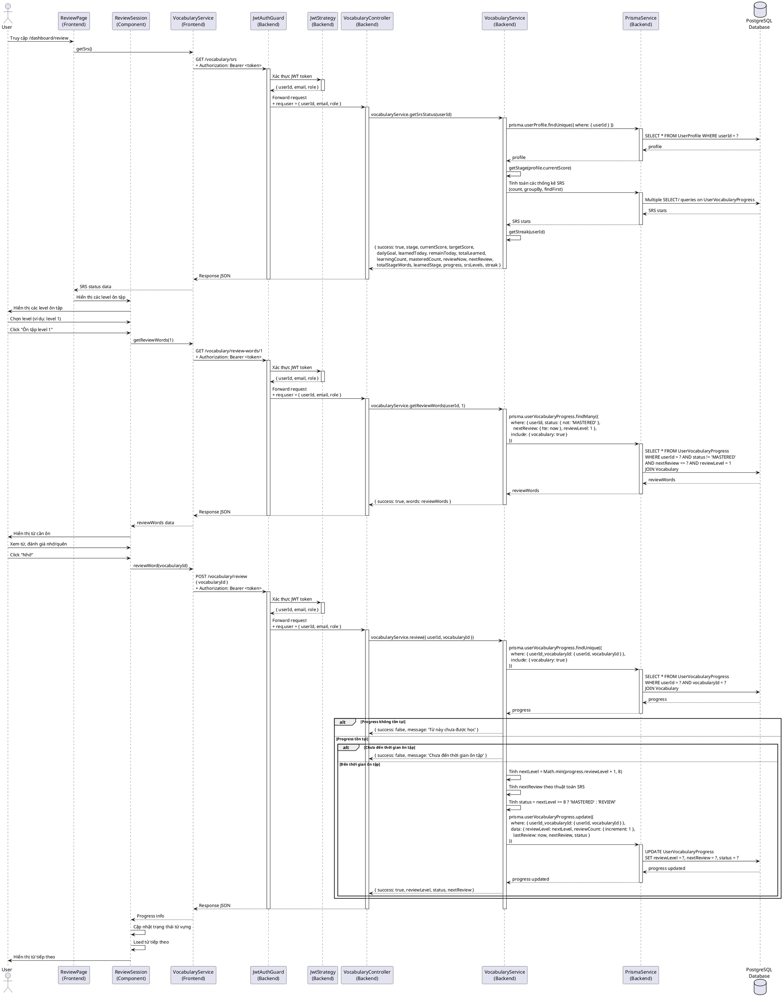
```plantuml
@startuml SD_07_VOCABULARY_REVIEW
actor User
participant "ReviewPage\n(Frontend)" as Frontend
participant "ReviewSession\n(Component)" as Component
participant "VocabularyService\n(Frontend)" as FrontendService
participant "JwtAuthGuard\n(Backend)" as Guard
participant "JwtStrategy\n(Backend)" as Strategy
participant "VocabularyController\n(Backend)" as Controller
participant "VocabularyService\n(Backend)" as Service
participant "PrismaService\n(Backend)" as Prisma
database "PostgreSQL\nDatabase" as DB

User -> Frontend: Truy cập /dashboard/review
Frontend -> FrontendService: getSrs()
FrontendService -> Guard: GET /vocabulary/srs\n+ Authorization: Bearer <token>
activate Guard

Guard -> Strategy: Xác thực JWT token
activate Strategy
Strategy --> Guard: { userId, email, role }
deactivate Strategy

Guard -> Controller: Forward request\n+ req.user = { userId, email, role }
activate Controller

Controller -> Service: vocabularyService.getSrsStatus(userId)
activate Service

Service -> Prisma: prisma.userProfile.findUnique({ where: { userId } })
activate Prisma
Prisma -> DB: SELECT * FROM UserProfile WHERE userId = ?
DB --> Prisma: profile
Prisma --> Service: profile
deactivate Prisma

Service -> Service: getStage(profile.currentScore)
Service -> Prisma: Tính toán các thống kê SRS\n(count, groupBy, findFirst)
activate Prisma
Prisma -> DB: Multiple SELECT/ queries on UserVocabularyProgress
DB --> Prisma: SRS stats
Prisma --> Service: SRS stats
deactivate Prisma

Service -> Service: getStreak(userId)
Service --> Controller: { success: true, stage, currentScore, targetScore,\n  dailyGoal, learnedToday, remainToday, totalLearned,\n  learningCount, masteredCount, reviewNow, nextReview,\n  totalStageWords, learnedStage, progress, srsLevels, streak }
deactivate Service

Controller --> FrontendService: Response JSON
deactivate Controller
deactivate Guard

FrontendService --> Frontend: SRS status data
Frontend -> Component: Hiển thị các level ôn tập
Component -> User: Hiển thị các level ôn tập

User -> Component: Chọn level (ví dụ: level 1)
User -> Component: Click "Ôn tập level 1"
Component -> FrontendService: getReviewWords(1)
FrontendService -> Guard: GET /vocabulary/review-words/1\n+ Authorization: Bearer <token>
activate Guard

Guard -> Strategy: Xác thực JWT token
activate Strategy
Strategy --> Guard: { userId, email, role }
deactivate Strategy

Guard -> Controller: Forward request\n+ req.user = { userId, email, role }
activate Controller

Controller -> Service: vocabularyService.getReviewWords(userId, 1)
activate Service

Service -> Prisma: prisma.userVocabularyProgress.findMany({\n  where: { userId, status: { not: 'MASTERED' },\n    nextReview: { lte: now }, reviewLevel: 1 },\n  include: { vocabulary: true }\n})
activate Prisma
Prisma -> DB: SELECT * FROM UserVocabularyProgress\nWHERE userId = ? AND status != 'MASTERED'\nAND nextReview <= ? AND reviewLevel = 1\nJOIN Vocabulary
DB --> Prisma: reviewWords
Prisma --> Service: reviewWords
deactivate Prisma

Service --> Controller: { success: true, words: reviewWords }
deactivate Service

Controller --> FrontendService: Response JSON
deactivate Controller
deactivate Guard

FrontendService --> Component: reviewWords data
Component -> User: Hiển thị từ cần ôn

User -> Component: Xem từ, đánh giá nhớ/quên
User -> Component: Click "Nhớ"
Component -> FrontendService: reviewWord(vocabularyId)
FrontendService -> Guard: POST /vocabulary/review\n{ vocabularyId }\n+ Authorization: Bearer <token>
activate Guard

Guard -> Strategy: Xác thực JWT token
activate Strategy
Strategy --> Guard: { userId, email, role }
deactivate Strategy

Guard -> Controller: Forward request\n+ req.user = { userId, email, role }
activate Controller

Controller -> Service: vocabularyService.review({ userId, vocabularyId })
activate Service

Service -> Prisma: prisma.userVocabularyProgress.findUnique({\n  where: { userId_vocabularyId: { userId, vocabularyId } },\n  include: { vocabulary: true }\n})
activate Prisma
Prisma -> DB: SELECT * FROM UserVocabularyProgress\nWHERE userId = ? AND vocabularyId = ?\nJOIN Vocabulary
DB --> Prisma: progress
Prisma --> Service: progress
deactivate Prisma

alt Progress không tồn tại
    Service --> Controller: { success: false, message: 'Từ này chưa được học' }
else Progress tồn tại
    alt Chưa đến thời gian ôn tập
        Service --> Controller: { success: false, message: 'Chưa đến thời gian ôn tập' }
    else Đến thời gian ôn tập
        Service -> Service: Tính nextLevel = Math.min(progress.reviewLevel + 1, 8)
        Service -> Service: Tính nextReview theo thuật toán SRS
        Service -> Service: Tính status = nextLevel >= 8 ? 'MASTERED' : 'REVIEW'
        
        Service -> Prisma: prisma.userVocabularyProgress.update({\n  where: { userId_vocabularyId: { userId, vocabularyId } },\n  data: { reviewLevel: nextLevel, reviewCount: { increment: 1 },\n    lastReview: now, nextReview, status }\n})
        activate Prisma
        Prisma -> DB: UPDATE UserVocabularyProgress\nSET reviewLevel = ?, nextReview = ?, status = ?
        DB --> Prisma: progress updated
        Prisma --> Service: progress updated
        deactivate Prisma
        
        Service --> Controller: { success: true, reviewLevel, status, nextReview }
    end
end

Controller --> FrontendService: Response JSON
deactivate Service
deactivate Controller
deactivate Guard

FrontendService --> Component: Progress info
Component -> Component: Cập nhật trạng thái từ vựng
Component -> Component: Load từ tiếp theo
Component -> User: Hiển thị từ tiếp theo

@enduml
```

---

### 3.8. SD-08: HỌC TỪ VỰNG THEO BÀI (LESSONS)

#### Tên
Học từ vựng theo bài (Lessons)

#### Mục đích
Học từ vựng theo bài học có cấu trúc (mỗi bài 20 từ)

#### Actor
User (đã đăng nhập)

#### Frontend
Vocabulary Page / LessonLearning Component (`apps/web/app/dashboard/vocabulary/page.tsx`, `apps/web/components/vocabulary/LessonLearning.tsx`)

#### API
GET `/vocabulary/lessons`, GET `/vocabulary/lessons/:lesson`, POST `/vocabulary/learn`

#### Controller
VocabularyController (`apps/api/src/vocabulary/vocabulary.controller.ts`)

#### Service
VocabularyService (`apps/api/src/vocabulary/vocabulary.service.ts`)

#### Database
PostgreSQL (UserProfile, Vocabulary, UserVocabularyProgress tables)

#### Luồng xử lý từng bước

1. **User thao tác trên UI**
   - User truy cập trang `/dashboard/vocabulary`
   - VocabularyPage hiển thị LessonGrid

2. **Frontend gửi request (Lấy danh sách bài học)**
   - VocabularyPage gọi `getLessons()` từ VocabularyService (frontend)
   - Frontend gửi GET request đến `http://localhost:3001/vocabulary/lessons`
   - Headers: `{ "Authorization": "Bearer <token>" }`

3. **Controller nhận request**
   - VocabularyController.getLessons() nhận request
   - Extract userId từ request.user

4. **Guard kiểm tra authentication**
   - JwtAuthGuard kiểm tra JWT token
   - JwtStrategy.validate() xác thực token
   - Trả về user info: `{ userId, email, role }`

5. **Service xử lý nghiệp vụ (Lấy danh sách bài học)**
   - VocabularyService.getLessons(userId) được gọi
   - Service gọi helper `getProfile(userId)` để lấy currentScore
   - Service tính stage từ currentScore
   - Service lấy tất cả từ vựng trong stage:
     - PrismaService.vocabulary.findMany({ where: { stage }, orderBy: { id: 'asc' }, select: { id: true } })
   - Service lấy progress của user:
     - PrismaService.userVocabularyProgress.findMany({
         where: { userId, vocabulary: { stage }, status: { not: 'NEW' } },
         select: { vocabularyId: true },
       })
   - Service tính toán số bài học: lessonsCount = Math.ceil(totalWords / 20)
   - Service tính toán trạng thái từng bài:
     - Với mỗi bài: totalInLesson, learnedInLesson, isCompleted, status
   - Service trả về response với danh sách bài học

6. **Prisma/Repository truy vấn database**
   - PrismaClient thực hiện SELECT từ các bảng `Vocabulary`, `UserVocabularyProgress`

7. **Database trả dữ liệu**
   - Database trả về từ vựng và progress
   - PrismaClient map kết quả sang TypeScript objects

8. **Service xử lý**
   - VocabularyService trả về response với lessons data

9. **API trả response**
   - VocabularyController trả về response cho Frontend
   - Status: 200 OK
   - Body: JSON object với lessons data

10. **Frontend cập nhật UI**
    - VocabularyPage nhận response
    - LessonGrid component hiển thị danh sách bài học

11. **User chọn bài học**
    - User click vào một bài học (ví dụ: bài 1)
    - VocabularyPage gọi `handleSelectLesson(1)`

12. **Frontend gửi request (Lấy từ trong bài học)**
    - VocabularyPage gọi `getLessonWords(1)` từ VocabularyService (frontend)
    - Frontend gửi GET request đến `http://localhost:3001/vocabulary/lessons/1`
    - Headers: `{ "Authorization": "Bearer <token>" }`

13. **Controller nhận request**
    - VocabularyController.getLessonWords() nhận request
    - Extract userId từ request.user và lessonNumber từ params

14. **Service xử lý nghiệp vụ (Lấy từ trong bài học)**
    - VocabularyService.getLessonWords(userId, lessonNumber) được gọi
    - Service gọi helper `getProfile(userId)` để lấy currentScore
    - Service tính stage từ currentScore
    - Service lấy tất cả từ vựng trong stage:
     - PrismaService.vocabulary.findMany({ where: { stage }, orderBy: { id: 'asc' } })
    - Service tính lessonWords = words.slice((lessonNumber - 1) * 20, lessonNumber * 20)
    - Service lấy progress của user cho các từ này:
     - PrismaService.userVocabularyProgress.findMany({
         where: { userId, vocabularyId: { in: wordIds } },
       })
    - Service map progress vào words
    - Service trả về response với words và progress

15. **Prisma/Repository truy vấn database**
   - PrismaClient thực hiện SELECT từ các bảng `Vocabulary`, `UserVocabularyProgress`

16. **Database trả dữ liệu**
   - Database trả về từ vựng và progress
   - PrismaClient map kết quả sang TypeScript objects

17. **Service xử lý**
    - VocabularyService trả về response với words data

18. **API trả response**
    - VocabularyController trả về response cho Frontend
    - Status: 200 OK
    - Body: JSON object với words data

19. **Frontend cập nhật UI**
    - VocabularyPage nhận response
    - LessonLearning component hiển thị từ vựng trong bài học

20. **User học từ vựng**
    - User học từng từ (tương tự như SD-06)

#### Mã sơ đồ (PlantUML)

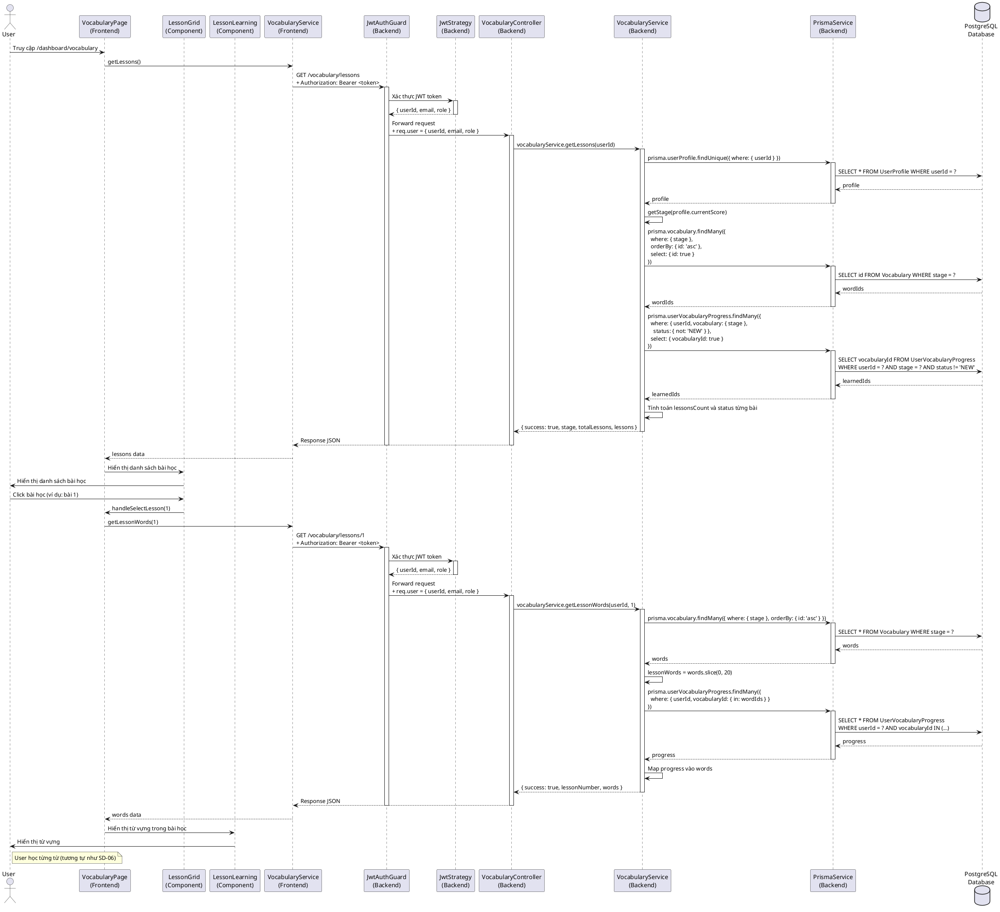
```plantuml
@startuml SD_08_VOCABULARY_LESSONS
actor User
participant "VocabularyPage\n(Frontend)" as Frontend
participant "LessonGrid\n(Component)" as Grid
participant "LessonLearning\n(Component)" as Learning
participant "VocabularyService\n(Frontend)" as FrontendService
participant "JwtAuthGuard\n(Backend)" as Guard
participant "JwtStrategy\n(Backend)" as Strategy
participant "VocabularyController\n(Backend)" as Controller
participant "VocabularyService\n(Backend)" as Service
participant "PrismaService\n(Backend)" as Prisma
database "PostgreSQL\nDatabase" as DB

User -> Frontend: Truy cập /dashboard/vocabulary
Frontend -> FrontendService: getLessons()
FrontendService -> Guard: GET /vocabulary/lessons\n+ Authorization: Bearer <token>
activate Guard

Guard -> Strategy: Xác thực JWT token
activate Strategy
Strategy --> Guard: { userId, email, role }
deactivate Strategy

Guard -> Controller: Forward request\n+ req.user = { userId, email, role }
activate Controller

Controller -> Service: vocabularyService.getLessons(userId)
activate Service

Service -> Prisma: prisma.userProfile.findUnique({ where: { userId } })
activate Prisma
Prisma -> DB: SELECT * FROM UserProfile WHERE userId = ?
DB --> Prisma: profile
Prisma --> Service: profile
deactivate Prisma

Service -> Service: getStage(profile.currentScore)

Service -> Prisma: prisma.vocabulary.findMany({\n  where: { stage },\n  orderBy: { id: 'asc' },\n  select: { id: true }\n})
activate Prisma
Prisma -> DB: SELECT id FROM Vocabulary WHERE stage = ?
DB --> Prisma: wordIds
Prisma --> Service: wordIds
deactivate Prisma

Service -> Prisma: prisma.userVocabularyProgress.findMany({\n  where: { userId, vocabulary: { stage },\n    status: { not: 'NEW' } },\n  select: { vocabularyId: true }\n})
activate Prisma
Prisma -> DB: SELECT vocabularyId FROM UserVocabularyProgress\nWHERE userId = ? AND stage = ? AND status != 'NEW'
DB --> Prisma: learnedIds
Prisma --> Service: learnedIds
deactivate Prisma

Service -> Service: Tính toán lessonsCount và status từng bài
Service --> Controller: { success: true, stage, totalLessons, lessons }
deactivate Service

Controller --> FrontendService: Response JSON
deactivate Controller
deactivate Guard

FrontendService --> Frontend: lessons data
Frontend -> Grid: Hiển thị danh sách bài học
Grid -> User: Hiển thị danh sách bài học

User -> Grid: Click bài học (ví dụ: bài 1)
Grid -> Frontend: handleSelectLesson(1)
Frontend -> FrontendService: getLessonWords(1)
FrontendService -> Guard: GET /vocabulary/lessons/1\n+ Authorization: Bearer <token>
activate Guard

Guard -> Strategy: Xác thực JWT token
activate Strategy
Strategy --> Guard: { userId, email, role }
deactivate Strategy

Guard -> Controller: Forward request\n+ req.user = { userId, email, role }
activate Controller

Controller -> Service: vocabularyService.getLessonWords(userId, 1)
activate Service

Service -> Prisma: prisma.vocabulary.findMany({ where: { stage }, orderBy: { id: 'asc' } })
activate Prisma
Prisma -> DB: SELECT * FROM Vocabulary WHERE stage = ?
DB --> Prisma: words
Prisma --> Service: words
deactivate Prisma

Service -> Service: lessonWords = words.slice(0, 20)

Service -> Prisma: prisma.userVocabularyProgress.findMany({\n  where: { userId, vocabularyId: { in: wordIds } }\n})
activate Prisma
Prisma -> DB: SELECT * FROM UserVocabularyProgress\nWHERE userId = ? AND vocabularyId IN (...)
DB --> Prisma: progress
Prisma --> Service: progress
deactivate Prisma

Service -> Service: Map progress vào words
Service --> Controller: { success: true, lessonNumber, words }
deactivate Service

Controller --> FrontendService: Response JSON
deactivate Controller
deactivate Guard

FrontendService --> Frontend: words data
Frontend -> Learning: Hiển thị từ vựng trong bài học
Learning -> User: Hiển thị từ vựng

note right of User
  User học từng từ (tương tự như SD-06)
end note

@enduml
```

---

### 3.9. SD-09: XEM TRẠNG THÁI HỌC LISTENING HÀNG NGÀY

#### Tên
Xem trạng thái học Listening hàng ngày

#### Mục đích
Xem phần nào cần học hôm nay (ngày lẻ: Part 1,2; ngày chẵn: Part 3,4)

#### Actor
User (đã đăng nhập)

#### Frontend
Listening Page (`apps/web/app/dashboard/courses/listening/page.tsx`)

#### API
GET `/listening/daily-status`

#### Controller
ListeningController (`apps/api/src/listening/listening.controller.ts`)

#### Service
ListeningService (`apps/api/src/listening/listening.service.ts`)

#### Database
PostgreSQL (UserProfile, listening_lessons, user_listening_progress tables)

#### Luồng xử lý từng bước

1. **User thao tác trên UI**
   - User truy cập trang `/dashboard/courses/listening`
   - Listening Page được render

2. **Frontend gửi request**
   - Listening Page gọi `getListeningDailyStatus()` từ ListeningService (frontend)
   - Frontend gửi GET request đến `http://localhost:3001/listening/daily-status`
   - Headers: `{ "Authorization": "Bearer <token>" }`

3. **Controller nhận request**
   - ListeningController.getDailyStatus() nhận request
   - Extract userId từ request.user

4. **Guard kiểm tra authentication**
   - JwtAuthGuard kiểm tra JWT token
   - JwtStrategy.validate() xác thực token
   - Trả về user info: `{ userId, email, role }`

5. **Service xử lý nghiệp vụ**
   - ListeningService.getDailyStatus(userId) được gọi
   - Service gọi helper `getUserStage(userId)`:
     - PrismaService.userProfile.findUnique({ where: { userId } })
     - Tính stage từ currentScore
   - Service xác định ngày lẻ/chẵn:
     - `const today = new Date()`
     - `const isOddDay = today.getDate() % 2 !== 0`
   - Service xác định parts cần học:
     - Ngày lẻ: `[1, 2]`
     - Ngày chẵn: `[3, 4]`
   - Service đếm số bài đã hoàn thành hôm nay:
     - PrismaService.user_listening_progress.count({
         where: {
           user_id: userId,
           completed: true,
           last_studied: { gte: startOfDay },
         },
       })
   - Service trả về response với status

6. **Prisma/Repository truy vấn database**
   - PrismaClient thực hiện COUNT từ bảng `user_listening_progress`
   - PrismaClient thực hiện SELECT từ bảng `UserProfile`

7. **Database trả dữ liệu**
   - Database trả về count và profile
   - PrismaClient map kết quả sang TypeScript objects

8. **Service xử lý**
   - ListeningService trả về response:
     ```typescript
     {
       success: true,
       stage,
       isOddDay,
       partsForToday,
       completedToday,
       dailyGoal: 2,
     }
     ```

9. **API trả response**
   - ListeningController trả về response cho Frontend
   - Status: 200 OK
   - Body: JSON object với daily status

10. **Frontend cập nhật UI**
    - Listening Page nhận response
    - Hiển thị thông tin về parts cần học và số bài đã hoàn thành

#### Mã sơ đồ (PlantUML)

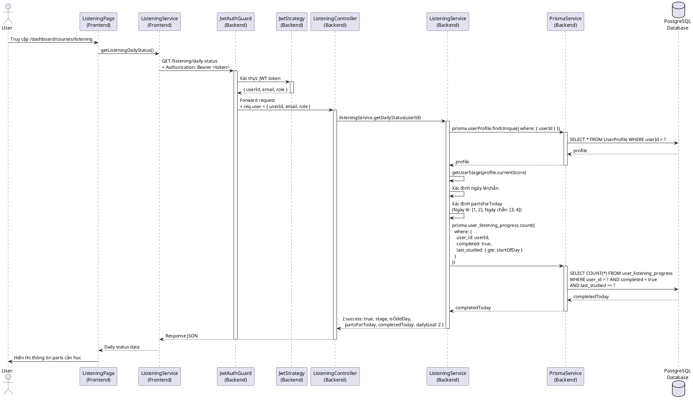
```plantuml
@startuml SD_09_LISTENING_DAILY_STATUS
actor User
participant "ListeningPage\n(Frontend)" as Frontend
participant "ListeningService\n(Frontend)" as FrontendService
participant "JwtAuthGuard\n(Backend)" as Guard
participant "JwtStrategy\n(Backend)" as Strategy
participant "ListeningController\n(Backend)" as Controller
participant "ListeningService\n(Backend)" as Service
participant "PrismaService\n(Backend)" as Prisma
database "PostgreSQL\nDatabase" as DB

User -> Frontend: Truy cập /dashboard/courses/listening
Frontend -> FrontendService: getListeningDailyStatus()
FrontendService -> Guard: GET /listening/daily-status\n+ Authorization: Bearer <token>
activate Guard

Guard -> Strategy: Xác thực JWT token
activate Strategy
Strategy --> Guard: { userId, email, role }
deactivate Strategy

Guard -> Controller: Forward request\n+ req.user = { userId, email, role }
activate Controller

Controller -> Service: listeningService.getDailyStatus(userId)
activate Service

Service -> Prisma: prisma.userProfile.findUnique({ where: { userId } })
activate Prisma
Prisma -> DB: SELECT * FROM UserProfile WHERE userId = ?
DB --> Prisma: profile
Prisma --> Service: profile
deactivate Prisma

Service -> Service: getUserStage(profile.currentScore)
Service -> Service: Xác định ngày lẻ/chẵn
Service -> Service: Xác định partsForToday\n(Ngày lẻ: [1, 2], Ngày chẵn: [3, 4])

Service -> Prisma: prisma.user_listening_progress.count({\n  where: {\n    user_id: userId,\n    completed: true,\n    last_studied: { gte: startOfDay }\n  }\n})
activate Prisma
Prisma -> DB: SELECT COUNT(*) FROM user_listening_progress\nWHERE user_id = ? AND completed = true\nAND last_studied >= ?
DB --> Prisma: completedToday
Prisma --> Service: completedToday
deactivate Prisma

Service --> Controller: { success: true, stage, isOddDay,\n  partsForToday, completedToday, dailyGoal: 2 }
deactivate Service

Controller --> FrontendService: Response JSON
deactivate Controller
deactivate Guard

FrontendService --> Frontend: Daily status data
Frontend -> User: Hiển thị thông tin parts cần học

@enduml
```

---

### 3.10. SD-10: HỌC LISTENING (DAILY GROUPS)

#### Tên
Học Listening (Daily Groups)

#### Mục đích
Lấy và học listening group theo part được phân bổ hàng ngày

#### Actor
User (đã đăng nhập)

#### Frontend
Listening Learn Page (`apps/web/app/dashboard/courses/listening/learn/page.tsx`)

#### API
GET `/listening/daily-groups`, POST `/listening/submit-group`

#### Controller
ListeningController (`apps/api/src/listening/listening.controller.ts`)

#### Service
ListeningService (`apps/api/src/listening/listening.service.ts`)

#### Database
PostgreSQL (listening_lessons, listening_lesson_groups, listening_lesson_questions, listening_lesson_options, user_listening_progress, user_listening_group_progress tables)

#### Luồng xử lý từng bước

1. **User thao tác trên UI**
   - User truy cập trang `/dashboard/courses/listening/learn`
   - Listening Learn Page được render

2. **Frontend gửi request (Lấy groups cần học)**
   - Listening Learn Page gọi `getListeningDailyGroups()` từ ListeningService (frontend)
   - Frontend gửi GET request đến `http://localhost:3001/listening/daily-groups`
   - Headers: `{ "Authorization": "Bearer <token>" }`

3. **Controller nhận request**
   - ListeningController.getDailyGroups() nhận request
   - Extract userId từ request.user

4. **Guard kiểm tra authentication**
   - JwtAuthGuard kiểm tra JWT token
   - JwtStrategy.validate() xác thực token
   - Trả về user info: `{ userId, email, role }`

5. **Service xử lý nghiệp vụ (Lấy groups cần học)**
   - ListeningService.getDailyGroups(userId) được gọi
   - Service gọi `getDailyStatus(userId)` để lấy status
   - Nếu completedToday >= dailyGoal:
     - Return `{ success: true, groups: [] }`
   - Nếu chưa đạt goal:
     - Với mỗi part trong partsForToday:
       - Tìm lesson theo stage và part:
         - PrismaService.listening_lessons.findFirst({
             where: { stage: status.stage, part },
           })
       - Kiểm tra lesson đã hoàn thành chưa:
         - PrismaService.user_listening_progress.findFirst({
             where: { user_id: userId, lesson_id: lesson.id, completed: true },
           })
       - Nếu chưa hoàn thành:
         - Lấy first group của lesson:
           - PrismaService.listening_lesson_groups.findFirst({
               where: { lesson_id: lesson.id },
               orderBy: { display_order: 'asc' },
               include: {
                 listening_lesson_questions: {
                   orderBy: { display_order: 'asc' },
                   include: {
                     listening_lesson_options: {
                       orderBy: { option_label: 'asc' },
                     },
                   },
                 },
               },
             },
           })
         - Thêm group vào danh sách với part info
   - Service trả về response với groups

6. **Prisma/Repository truy vấn database**
   - PrismaClient thực hiện SELECT/JOIN từ các bảng `listening_lessons`, `listening_lesson_groups`, `listening_lesson_questions`, `listening_lesson_options`, `user_listening_progress`

7. **Database trả dữ liệu**
   - Database trả về groups với questions và options
   - PrismaClient map kết quả sang TypeScript objects

8. **Service xử lý**
   - ListeningService trả về response với groups data

9. **API trả response**
   - ListeningController trả về response cho Frontend
   - Status: 200 OK
   - Body: JSON object với groups data

10. **Frontend cập nhật UI**
    - Listening Learn Page nhận response
    - Hiển thị listening groups với audio, questions, options

11. **User học listening**
    - User nghe audio
    - User trả lời câu hỏi
    - User click "Nộp bài"

12. **Frontend gửi request (Nộp bài)**
    - Listening Learn Page gọi `submitListeningGroup(groupId, score)` từ ListeningService (frontend)
    - Frontend gửi POST request đến `http://localhost:3001/listening/submit-group`
    - Body: `{ groupId, score }`
    - Headers: `{ "Content-Type": "application/json", "Authorization": "Bearer <token>" }`

13. **Controller nhận request**
    - ListeningController.submitGroup() nhận request
    - Extract userId từ request.user, groupId và score từ body

14. **Service xử lý nghiệp vụ (Nộp bài)**
    - ListeningService.submitGroup(userId, groupId, score) được gọi
    - Service lấy group info:
      - PrismaService.listening_lesson_groups.findUnique({ where: { id: groupId } })
    - Service lấy lessonId từ group
    - Service upsert user_listening_progress:
      - PrismaService.user_listening_progress.upsert({
          where: { user_id_lesson_id: { user_id: userId, lesson_id: lessonId } },
          update: { completed: true, best_score: Math.max(score, existingLessonProgress?.best_score || 0), last_studied: today },
          create: { user_id: userId, lesson_id: lessonId, completed: true, best_score: score, last_studied: today },
        })
    - Service upsert user_listening_group_progress:
      - Nếu đã tồn tại:
        - PrismaService.user_listening_group_progress.update({
            where: { id: existingProgress.id },
            data: { completed: true, score: Math.max(score, existingProgress.score || 0), learned_at: today },
          })
      - Nếu chưa tồn tại:
        - PrismaService.user_listening_group_progress.create({
            data: { user_id: userId, group_id: groupId, completed: true, score, learned_at: today },
          })

15. **Prisma/Repository truy vấn database**
   - PrismaClient thực hiện UPSERT vào các bảng `user_listening_progress`, `user_listening_group_progress`

16. **Database trả dữ liệu**
   - Database trả về progress đã được cập nhật

17. **Service xử lý**
   - ListeningService trả về `{ success: true, message: 'Group submitted successfully' }`

18. **API trả response**
   - ListeningController trả về response cho Frontend
   - Status: 200 OK
   - Body: JSON object với success message

19. **Frontend cập nhật UI**
    - Listening Learn Page nhận response
    - Hiển thị thông báo thành công
    - Load group tiếp theo

#### Mã sơ đồ (PlantUML)

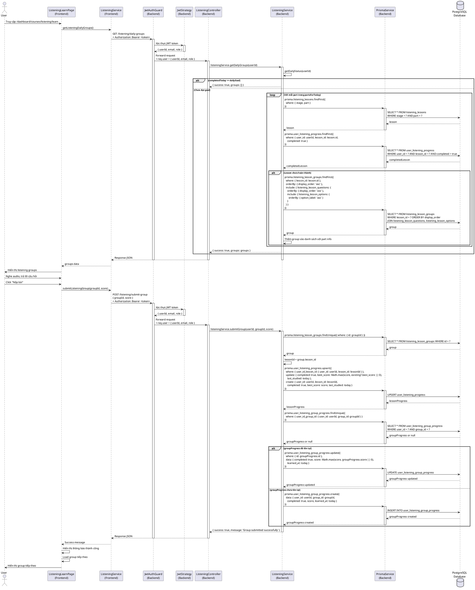
```plantuml
@startuml SD_10_LISTENING_LEARN
actor User
participant "ListeningLearnPage\n(Frontend)" as Frontend
participant "ListeningService\n(Frontend)" as FrontendService
participant "JwtAuthGuard\n(Backend)" as Guard
participant "JwtStrategy\n(Backend)" as Strategy
participant "ListeningController\n(Backend)" as Controller
participant "ListeningService\n(Backend)" as Service
participant "PrismaService\n(Backend)" as Prisma
database "PostgreSQL\nDatabase" as DB

User -> Frontend: Truy cập /dashboard/courses/listening/learn
Frontend -> FrontendService: getListeningDailyGroups()
FrontendService -> Guard: GET /listening/daily-groups\n+ Authorization: Bearer <token>
activate Guard

Guard -> Strategy: Xác thực JWT token
activate Strategy
Strategy --> Guard: { userId, email, role }
deactivate Strategy

Guard -> Controller: Forward request\n+ req.user = { userId, email, role }
activate Controller

Controller -> Service: listeningService.getDailyGroups(userId)
activate Service

Service -> Service: getDailyStatus(userId)

alt completedToday >= dailyGoal
    Service --> Controller: { success: true, groups: [] }
else Chưa đạt goal
    loop Với mỗi part trong partsForToday
        Service -> Prisma: prisma.listening_lessons.findFirst({\n  where: { stage, part }\n})
        activate Prisma
        Prisma -> DB: SELECT * FROM listening_lessons\nWHERE stage = ? AND part = ?
        DB --> Prisma: lesson
        Prisma --> Service: lesson
        deactivate Prisma
        
        Service -> Prisma: prisma.user_listening_progress.findFirst({\n  where: { user_id: userId, lesson_id: lesson.id,\n    completed: true }\n})
        activate Prisma
        Prisma -> DB: SELECT * FROM user_listening_progress\nWHERE user_id = ? AND lesson_id = ? AND completed = true
        DB --> Prisma: completedLesson
        Prisma --> Service: completedLesson
        deactivate Prisma
        
        alt Lesson chưa hoàn thành
            Service -> Prisma: prisma.listening_lesson_groups.findFirst({\n  where: { lesson_id: lesson.id },\n  orderBy: { display_order: 'asc' },\n  include: { listening_lesson_questions: {\n    orderBy: { display_order: 'asc' },\n    include: { listening_lesson_options: {\n      orderBy: { option_label: 'asc' }\n    }\n  } }\n})
            activate Prisma
            Prisma -> DB: SELECT * FROM listening_lesson_groups\nWHERE lesson_id = ? ORDER BY display_order\nJOIN listening_lesson_questions, listening_lesson_options
            DB --> Prisma: group
            Prisma --> Service: group
            deactivate Prisma
            
            Service -> Service: Thêm group vào danh sách với part info
        end
    end
    
    Service --> Controller: { success: true, groups: groups }
end

Controller --> FrontendService: Response JSON
deactivate Service
deactivate Controller
deactivate Guard

FrontendService --> Frontend: groups data
Frontend -> User: Hiển thị listening groups

User -> Frontend: Nghe audio, trả lời câu hỏi
User -> Frontend: Click "Nộp bài"
Frontend -> FrontendService: submitListeningGroup(groupId, score)
FrontendService -> Guard: POST /listening/submit-group\n{ groupId, score }\n+ Authorization: Bearer <token>
activate Guard

Guard -> Strategy: Xác thực JWT token
activate Strategy
Strategy --> Guard: { userId, email, role }
deactivate Strategy

Guard -> Controller: Forward request\n+ req.user = { userId, email, role }
activate Controller

Controller -> Service: listeningService.submitGroup(userId, groupId, score)
activate Service

Service -> Prisma: prisma.listening_lesson_groups.findUnique({ where: { id: groupId } })
activate Prisma
Prisma -> DB: SELECT * FROM listening_lesson_groups WHERE id = ?
DB --> Prisma: group
Prisma --> Service: group
deactivate Prisma

Service -> Service: lessonId = group.lesson_id

Service -> Prisma: prisma.user_listening_progress.upsert({\n  where: { user_id_lesson_id: { user_id: userId, lesson_id: lessonId } },\n  update: { completed: true, best_score: Math.max(score, existing?.best_score || 0),\n    last_studied: today },\n  create: { user_id: userId, lesson_id: lessonId,\n    completed: true, best_score: score, last_studied: today }\n})
activate Prisma
Prisma -> DB: UPSERT user_listening_progress
DB --> Prisma: lessonProgress
Prisma --> Service: lessonProgress
deactivate Prisma

Service -> Prisma: prisma.user_listening_group_progress.findUnique({\n  where: { user_id_group_id: { user_id: userId, group_id: groupId } }\n})
activate Prisma
Prisma -> DB: SELECT * FROM user_listening_group_progress\nWHERE user_id = ? AND group_id = ?
DB --> Prisma: groupProgress or null
Prisma --> Service: groupProgress or null
deactivate Prisma

alt groupProgress đã tồn tại
    Service -> Prisma: prisma.user_listening_group_progress.update({\n  where: { id: groupProgress.id },\n  data: { completed: true, score: Math.max(score, groupProgress.score || 0),\n    learned_at: today }\n})
    activate Prisma
    Prisma -> DB: UPDATE user_listening_group_progress
    DB --> Prisma: groupProgress updated
    Prisma --> Service: groupProgress updated
    deactivate Prisma
else groupProgress chưa tồn tại
    Service -> Prisma: prisma.user_listening_group_progress.create({\n  data: { user_id: userId, group_id: groupId,\n    completed: true, score, learned_at: today }\n})
    activate Prisma
    Prisma -> DB: INSERT INTO user_listening_group_progress
    DB --> Prisma: groupProgress created
    Prisma --> Service: groupProgress created
    deactivate Prisma
end

Service --> Controller: { success: true, message: 'Group submitted successfully' }
deactivate Service

Controller --> FrontendService: Response JSON
deactivate Controller
deactivate Guard

FrontendService --> Frontend: Success message
Frontend -> Frontend: Hiển thị thông báo thành công
Frontend -> Frontend: Load group tiếp theo
Frontend -> User: Hiển thị group tiếp theo

@enduml
```

---

### 3.11. SD-11: NỘP BÀI LISTENING

#### Tên
Nộp bài Listening

#### Mục đích
Lưu kết quả và tiến độ sau khi user hoàn thành listening group

#### Actor
User (đã đăng nhập)

#### Frontend
Listening Learn Page (`apps/web/app/dashboard/courses/listening/learn/page.tsx`)

#### API
POST `/listening/submit-group`

#### Controller
ListeningController (`apps/api/src/listening/listening.controller.ts`)

#### Service
ListeningService (`apps/api/src/listening/listening.service.ts`)

#### Database
PostgreSQL (listening_lesson_groups, user_listening_progress, user_listening_group_progress tables)

#### Luồng xử lý từng bước

*(Đã được mô tả chi tiết trong SD-10, bước 12-19)*

#### Mã sơ đồ

*(Đã được mô tả chi tiết trong SD-10)*

---

### 3.12. SD-12: XEM TRẠNG THÁI HỌC READING HÀNG NGÀY

#### Tên
Xem trạng thái học Reading hàng ngày

#### Mục đích
Xem phần nào cần học hôm nay (ngày lẻ: Part 5,6; ngày chẵn: Part 7)

#### Actor
User (đã đăng nhập)

#### Frontend
Reading Page (`apps/web/app/dashboard/courses/reading/page.tsx`)

#### API
GET `/reading/daily-status`

#### Controller
ReadingController (`apps/api/src/reading/reading.controller.ts`)

#### Service
ReadingService (`apps/api/src/reading/reading.service.ts`)

#### Database
PostgreSQL (UserProfile, reading_lessons, user_reading_progress tables)

#### Luồng xử lý từng bước

1. **User thao tác trên UI**
   - User truy cập trang `/dashboard/courses/reading`
   - Reading Page được render

2. **Frontend gửi request**
   - Reading Page gọi `getReadingDailyStatus()` từ ReadingService (frontend)
   - Frontend gửi GET request đến `http://localhost:3001/reading/daily-status`
   - Headers: `{ "Authorization": "Bearer <token>" }`

3. **Controller nhận request**
   - ReadingController.getDailyStatus() nhận request
   - Extract userId từ request.user

4. **Guard kiểm tra authentication**
   - JwtAuthGuard kiểm tra JWT token
   - JwtStrategy.validate() xác thực token
   - Trả về user info: `{ userId, email, role }`

5. **Service xử lý nghiệp vụ**
   - ReadingService.getDailyStatus() được gọi
   - Service gọi helper `getUserStage(userId)`:
     - PrismaService.userProfile.findUnique({ where: { userId } })
     - Tính stage từ currentScore
   - Service xác định ngày lẻ/chẵn:
     - `const today = new Date()`
     - `const isOddDay = today.getDate() % 2 !== 0`
   - Service xác định parts cần học:
     - Ngày lẻ: `[5, 6]`
     - Ngày chẵn: `[7]`
   - Service đếm số bài đã hoàn thành hôm nay:
     - PrismaService.user_reading_progress.count({
         where: {
           user_id: userId,
           completed: true,
           last_studied: { gte: startOfDay },
         },
       })
   - Service trả về response với status

6. **Prisma/Repository truy vấn database**
   - PrismaClient thực hiện COUNT từ bảng `user_reading_progress`
   - PrismaClient thực hiện SELECT từ bảng `UserProfile`

7. **Database trả dữ liệu**
   - Database trả về count và profile
   - PrismaClient map kết quả sang TypeScript objects

8. **Service xử lý**
   - ReadingService trả về response:
     ```typescript
     {
       success: true,
       stage,
       isOddDay,
       partsForToday,
       completedToday,
       dailyGoal: partsForToday.length,
     }
     ```

9. **API trả response**
   - ReadingController trả về response cho Frontend
   - Status: 200 OK
   - Body: JSON object với daily status

10. **Frontend cập nhật UI**
    - Reading Page nhận response
    - Hiển thị thông tin về parts cần học và số bài đã hoàn thành

#### Mã sơ đồ (PlantUML)

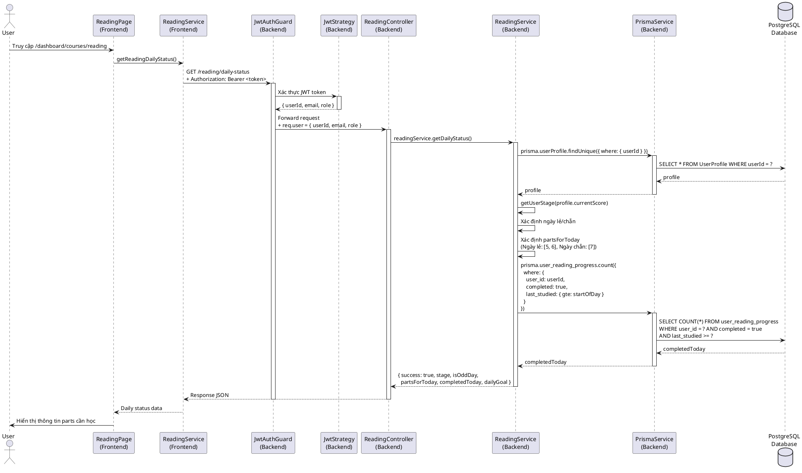
```plantuml
@startuml SD_12_READING_DAILY_STATUS
actor User
participant "ReadingPage\n(Frontend)" as Frontend
participant "ReadingService\n(Frontend)" as FrontendService
participant "JwtAuthGuard\n(Backend)" as Guard
participant "JwtStrategy\n(Backend)" as Strategy
participant "ReadingController\n(Backend)" as Controller
participant "ReadingService\n(Backend)" as Service
participant "PrismaService\n(Backend)" as Prisma
database "PostgreSQL\nDatabase" as DB

User -> Frontend: Truy cập /dashboard/courses/reading
Frontend -> FrontendService: getReadingDailyStatus()
FrontendService -> Guard: GET /reading/daily-status\n+ Authorization: Bearer <token>
activate Guard

Guard -> Strategy: Xác thực JWT token
activate Strategy
Strategy --> Guard: { userId, email, role }
deactivate Strategy

Guard -> Controller: Forward request\n+ req.user = { userId, email, role }
activate Controller

Controller -> Service: readingService.getDailyStatus()
activate Service

Service -> Prisma: prisma.userProfile.findUnique({ where: { userId } })
activate Prisma
Prisma -> DB: SELECT * FROM UserProfile WHERE userId = ?
DB --> Prisma: profile
Prisma --> Service: profile
deactivate Prisma

Service -> Service: getUserStage(profile.currentScore)
Service -> Service: Xác định ngày lẻ/chẵn
Service -> Service: Xác định partsForToday\n(Ngày lẻ: [5, 6], Ngày chẵn: [7])

Service -> Prisma: prisma.user_reading_progress.count({\n  where: {\n    user_id: userId,\n    completed: true,\n    last_studied: { gte: startOfDay }\n  }\n})
activate Prisma
Prisma -> DB: SELECT COUNT(*) FROM user_reading_progress\nWHERE user_id = ? AND completed = true\nAND last_studied >= ?
DB --> Prisma: completedToday
Prisma --> Service: completedToday
deactivate Prisma

Service --> Controller: { success: true, stage, isOddDay,\n  partsForToday, completedToday, dailyGoal }
deactivate Service

Controller --> FrontendService: Response JSON
deactivate Controller
deactivate Guard

FrontendService --> Frontend: Daily status data
Frontend -> User: Hiển thị thông tin parts cần học

@enduml
```

---

### 3.13. SD-13: HỌC READING (DAILY LESSONS)

#### Tên
Học Reading (Daily Lessons)

#### Mục đích
Lấy và học reading group theo part được phân bổ hàng ngày

#### Actor
User (đã đăng nhập)

#### Frontend
Reading Learn Page (`apps/web/app/dashboard/courses/reading/learn/page.tsx`)

#### API
GET `/reading/daily-lessons`, POST `/reading/submit-lesson`

#### Controller
ReadingController (`apps/api/src/reading/reading.controller.ts`)

#### Service
ReadingService (`apps/api/src/reading/reading.service.ts`)

#### Database
PostgreSQL (reading_lessons, reading_lesson_groups, reading_questions, reading_options, user_reading_progress tables)

#### Luồng xử lý từng bước

1. **User thao tác trên UI**
   - User truy cập trang `/dashboard/courses/reading/learn`
   - Reading Learn Page được render

2. **Frontend gửi request (Lấy lessons cần học)**
   - Reading Learn Page gọi `getReadingDailyLessons()` từ ReadingService (frontend)
   - Frontend gửi GET request đến `http://localhost:3001/reading/daily-lessons`
   - Headers: `{ "Authorization": "Bearer <token>" }`

3. **Controller nhận request**
   - ReadingController.getDailyLessons() nhận request
   - Extract userId từ request.user

4. **Guard kiểm tra authentication**
   - JwtAuthGuard kiểm tra JWT token
   - JwtStrategy.validate() xác thực token
   - Trả về user info: `{ userId, email, role }`

5. **Service xử lý nghiệp vụ (Lấy lessons cần học)**
   - ReadingService.getDailyLessons() được gọi
   - Service gọi `getDailyStatus()` để lấy status
   - Nếu completedToday >= dailyGoal:
     - Return `{ success: true, lessons: [] }`
   - Nếu chưa đạt goal:
     - Xác định part: isOddDay ? 5 : 7
     - Lấy các group đã hoàn thành:
       - PrismaService.user_reading_progress.findMany({
           where: { user_id: userId, completed: true },
           select: { group_id: true },
         })
     - Lấy group đầu tiên theo part chưa hoàn thành:
       - PrismaService.reading_lesson_groups.findFirst({
           where: { part, id: { notIn: completedGroupIds } },
           orderBy: [ { group_number: "asc" }, { display_order: "asc" }, { id: "asc" } ],
           include: {
             reading_lessons: true,
             reading_questions: {
               orderBy: { display_order: "asc" },
               include: {
                 reading_options: {
                   orderBy: { option_key: "asc" },
                 },
               },
             },
           },
         })
     - Return response với lesson data

6. **Prisma/Repository truy vấn database**
   - PrismaClient thực hiện SELECT/JOIN từ các bảng `reading_lessons`, `reading_lesson_groups`, `reading_questions`, `reading_options`, `user_reading_progress`

7. **Database trả dữ liệu**
   - Database trả về lesson với questions và options
   - PrismaClient map kết quả sang TypeScript objects

8. **Service xử lý**
   - ReadingService trả về response với lesson data

9. **API trả response**
   - ReadingController trả về response cho Frontend
   - Status: 200 OK
   - Body: JSON object với lesson data

10. **Frontend cập nhật UI**
    - Reading Learn Page nhận response
    - Hiển thị reading lesson với passage, questions, options

11. **User học reading**
    - User đọc passage
    - User trả lời câu hỏi
    - User click "Nộp bài"

12. **Frontend gửi request (Nộp bài)**
    - Reading Learn Page gọi `submitReadingLesson(lessonId, groupId, score)` từ ReadingService (frontend)
    - Frontend gửi POST request đến `http://localhost:3001/reading/submit-lesson`
    - Body: `{ lessonId, groupId, score }`
    - Headers: `{ "Content-Type": "application/json", "Authorization": "Bearer <token>" }`

13. **Controller nhận request**
    - ReadingController.submitLesson() nhận request
    - Extract userId từ request.user, lessonId, groupId, score từ body

14. **Service xử lý nghiệp vụ (Nộp bài)**
   - ReadingService.submitLesson(userId, lessonId, groupId, score) được gọi
   - Service kiểm tra group tồn tại:
     - PrismaService.reading_lesson_groups.findUnique({
         where: { id: groupId },
         select: { id: true, lesson_id: true },
       })
   - Nếu không tìm thấy:
     - Return `{ success: false, message: "Không tìm thấy Reading group" }`
   - Nếu group không thuộc lesson:
     - Return `{ success: false, message: "Reading group không thuộc Reading lesson đã chọn" }`
   - Service tìm existing progress:
     - PrismaService.user_reading_progress.findUnique({
         where: { user_id_group_id: { user_id: userId, group_id: groupId } },
       })
   - Nếu đã tồn tại:
     - Update progress:
       - PrismaService.user_reading_progress.update({
           where: { id: existingProgress.id },
           data: {
             completed: true,
             best_score: Math.max(score, existingProgress.best_score || 0),
             last_studied: today,
           },
         })
   - Nếu chưa tồn tại:
     - Create progress:
       - PrismaService.user_reading_progress.create({
           data: {
             user_id: userId,
             lesson_id: group.lesson_id,
             group_id: group.id,
             completed: true,
             best_score: score,
             last_studied: today,
             created_at: today,
             updated_at: today,
           },
         })

15. **Prisma/Repository truy vấn database**
   - PrismaClient thực hiện UPDATE hoặc INSERT vào bảng `user_reading_progress`

16. **Database trả dữ liệu**
   - Database trả về progress đã được cập nhật

17. **Service xử lý**
   - ReadingService trả về `{ success: true, message: "Reading group submitted successfully" }`

18. **API trả response**
   - ReadingController trả về response cho Frontend
   - Status: 200 OK
   - Body: JSON object với success message

19. **Frontend cập nhật UI**
    - Reading Learn Page nhận response
    - Hiển thị thông báo thành công
    - Load lesson tiếp theo

#### Mã sơ đồ (PlantUML)

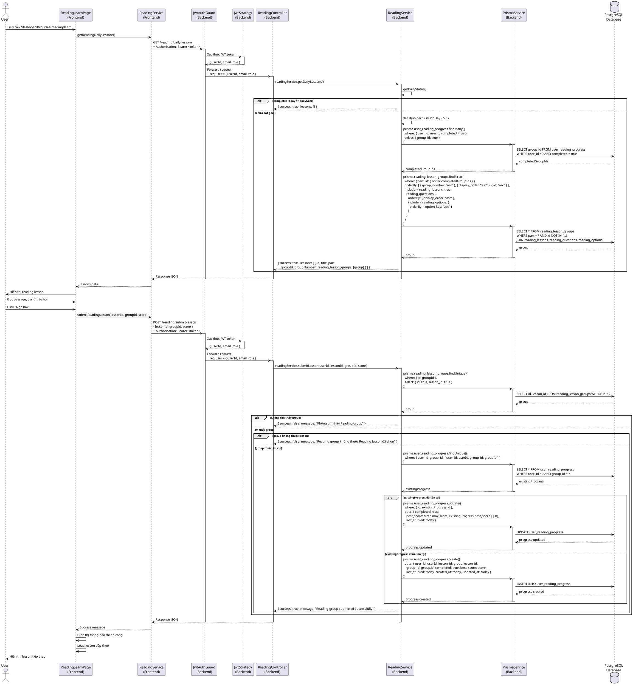
```plantuml
@startuml SD_13_READING_LEARN
actor User
participant "ReadingLearnPage\n(Frontend)" as Frontend
participant "ReadingService\n(Frontend)" as FrontendService
participant "JwtAuthGuard\n(Backend)" as Guard
participant "JwtStrategy\n(Backend)" as Strategy
participant "ReadingController\n(Backend)" as Controller
participant "ReadingService\n(Backend)" as Service
participant "PrismaService\n(Backend)" as Prisma
database "PostgreSQL\nDatabase" as DB

User -> Frontend: Truy cập /dashboard/courses/reading/learn
Frontend -> FrontendService: getReadingDailyLessons()
FrontendService -> Guard: GET /reading/daily-lessons\n+ Authorization: Bearer <token>
activate Guard

Guard -> Strategy: Xác thực JWT token
activate Strategy
Strategy --> Guard: { userId, email, role }
deactivate Strategy

Guard -> Controller: Forward request\n+ req.user = { userId, email, role }
activate Controller

Controller -> Service: readingService.getDailyLessons()
activate Service

Service -> Service: getDailyStatus()

alt completedToday >= dailyGoal
    Service --> Controller: { success: true, lessons: [] }
else Chưa đạt goal
    Service -> Service: Xác định part = isOddDay ? 5 : 7
    
    Service -> Prisma: prisma.user_reading_progress.findMany({\n  where: { user_id: userId, completed: true },\n  select: { group_id: true }\n})
    activate Prisma
    Prisma -> DB: SELECT group_id FROM user_reading_progress\nWHERE user_id = ? AND completed = true
    DB --> Prisma: completedGroupIds
    Prisma --> Service: completedGroupIds
    deactivate Prisma
    
    Service -> Prisma: prisma.reading_lesson_groups.findFirst({\n  where: { part, id: { notIn: completedGroupIds } },\n  orderBy: [ { group_number: "asc" }, { display_order: "asc" }, { id: "asc" } ],\n  include: { reading_lessons: true,\n    reading_questions: {\n      orderBy: { display_order: "asc" },\n      include: { reading_options: {\n        orderBy: { option_key: "asc" }\n      }\n    }\n  }\n})
    activate Prisma
    Prisma -> DB: SELECT * FROM reading_lesson_groups\nWHERE part = ? AND id NOT IN (...)\nJOIN reading_lessons, reading_questions, reading_options
    DB --> Prisma: group
    Prisma --> Service: group
    deactivate Prisma
    
    Service --> Controller: { success: true, lessons: [ { id, title, part,\n    groupId, groupNumber, reading_lesson_groups: [group] } ] }
end

Controller --> FrontendService: Response JSON
deactivate Service
deactivate Controller
deactivate Guard

FrontendService --> Frontend: lessons data
Frontend -> User: Hiển thị reading lesson

User -> Frontend: Đọc passage, trả lời câu hỏi
User -> Frontend: Click "Nộp bài"
Frontend -> FrontendService: submitReadingLesson(lessonId, groupId, score)
FrontendService -> Guard: POST /reading/submit-lesson\n{ lessonId, groupId, score }\n+ Authorization: Bearer <token>
activate Guard

Guard -> Strategy: Xác thực JWT token
activate Strategy
Strategy --> Guard: { userId, email, role }
deactivate Strategy

Guard -> Controller: Forward request\n+ req.user = { userId, email, role }
activate Controller

Controller -> Service: readingService.submitLesson(userId, lessonId, groupId, score)
activate Service

Service -> Prisma: prisma.reading_lesson_groups.findUnique({\n  where: { id: groupId },\n  select: { id: true, lesson_id: true }\n})
activate Prisma
Prisma -> DB: SELECT id, lesson_id FROM reading_lesson_groups WHERE id = ?
DB --> Prisma: group
Prisma --> Service: group
deactivate Prisma

alt Không tìm thấy group
    Service --> Controller: { success: false, message: "Không tìm thấy Reading group" }
else Tìm thấy group
    alt group không thuộc lesson
        Service --> Controller: { success: false, message: "Reading group không thuộc Reading lesson đã chọn" }
    else group thuộc lesson
        Service -> Prisma: prisma.user_reading_progress.findUnique({\n  where: { user_id_group_id: { user_id: userId, group_id: groupId } }\n})
        activate Prisma
        Prisma -> DB: SELECT * FROM user_reading_progress\nWHERE user_id = ? AND group_id = ?
        DB --> Prisma: existingProgress
        Prisma --> Service: existingProgress
        deactivate Prisma
        
        alt existingProgress đã tồn tại
            Service -> Prisma: prisma.user_reading_progress.update({\n  where: { id: existingProgress.id },\n  data: { completed: true,\n    best_score: Math.max(score, existingProgress.best_score || 0),\n    last_studied: today }\n})
            activate Prisma
            Prisma -> DB: UPDATE user_reading_progress
            DB --> Prisma: progress updated
            Prisma --> Service: progress updated
            deactivate Prisma
        else existingProgress chưa tồn tại
            Service -> Prisma: prisma.user_reading_progress.create({\n  data: { user_id: userId, lesson_id: group.lesson_id,\n    group_id: group.id, completed: true, best_score: score,\n    last_studied: today, created_at: today, updated_at: today }\n})
            activate Prisma
            Prisma -> DB: INSERT INTO user_reading_progress
            DB --> Prisma: progress created
            Prisma --> Service: progress created
            deactivate Prisma
        end
        
        Service --> Controller: { success: true, message: "Reading group submitted successfully" }
    end
end

Controller --> FrontendService: Response JSON
deactivate Service
deactivate Controller
deactivate Guard

FrontendService --> Frontend: Success message
Frontend -> Frontend: Hiển thị thông báo thành công
Frontend -> Frontend: Load lesson tiếp theo
Frontend -> User: Hiển thị lesson tiếp theo

@enduml
```

---

### 3.14. SD-14: NỘP BÀI READING

#### Tên
Nộp bài Reading

#### Mục đích
Lưu kết quả và tiến độ sau khi user hoàn thành reading group

#### Actor
User (đã đăng nhập)

#### Frontend
Reading Learn Page (`apps/web/app/dashboard/courses/reading/learn/page.tsx`)

#### API
POST `/reading/submit-lesson`

#### Controller
ReadingController (`apps/api/src/reading/reading.controller.ts`)

#### Service
ReadingService (`apps/api/src/reading/reading.service.ts`)

#### Database
PostgreSQL (reading_lesson_groups, user_reading_progress tables)

#### Luồng xử lý từng bước

*(Đã được mô tả chi tiết trong SD-13, bước 12-19)*

#### Mã sơ đồ

*(Đã được mô tả chi tiết trong SD-13)*

---

### 3.15. SD-15: XEM DANH SÁCH CHỦ ĐỀ NGỮ PHÁP

#### Tên
Xem danh sách chủ đề ngữ pháp

#### Mục đích
Xem các chủ đề ngữ pháp theo stage

#### Actor
User (đã đăng nhập)

#### Frontend
Grammar Page (`apps/web/app/dashboard/courses/grammar/[id]/page.tsx`)

#### API
GET `/grammar/categories`

#### Controller
GrammarController (`apps/api/src/grammar/grammar.controller.ts`)

#### Service
GrammarService (`apps/api/src/grammar/grammar.service.ts`)

#### Database
PostgreSQL (GrammarCategory, GrammarLesson, UserGrammarProgress tables)

#### Luồng xử lý từng bước

1. **User thao tác trên UI**
   - User truy cập trang `/dashboard/courses/grammar/[id]`
   - Grammar Page được render

2. **Frontend gửi request**
   - Grammar Page gọi `getGrammarCategories()` từ GrammarService (frontend) [CHƯA TÌM THẤY - giả định]
   - Frontend gửi GET request đến `http://localhost:3001/grammar/categories`
   - Headers: `{ "Authorization": "Bearer <token>" }`

3. **Controller nhận request**
   - GrammarController.getCategories() nhận request
   - Extract userId từ request.user

4. **Guard kiểm tra authentication**
   - JwtAuthGuard kiểm tra JWT token
   - JwtStrategy.validate() xác thực token
   - Trả về user info: `{ userId, email, role }`

5. **Service xử lý nghiệp vụ**
   - GrammarService.getCategories(userId) được gọi
   - Service lấy danh sách categories:
     - PrismaService.grammarCategory.findMany({
         orderBy: [ { stage: "asc" }, { displayOrder: "asc" }, { id: "asc" } ],
         include: {
           lessons: {
             orderBy: [ { displayOrder: "asc" }, { id: "asc" } ],
             include: {
               progresses: {
                 where: { userId },
               },
             },
           },
         },
       })
   - Service tính toán progress cho mỗi category:
     - totalLessons = category.lessons.length
     - completedLessons = category.lessons.filter(lesson => lesson.progresses[0]?.completed === true).length
     - progress = Math.round((completedLessons / totalLessons) * 100)
   - Service trả về response với categories data

6. **Prisma/Repository truy vấn database**
   - PrismaClient thực hiện SELECT/JOIN từ các bảng `GrammarCategory`, `GrammarLesson`, `UserGrammarProgress`

7. **Database trả dữ liệu**
   - Database trả về categories với lessons và progress
   - PrismaClient map kết quả sang TypeScript objects

8. **Service xử lý**
   - GrammarService trả về response với categories data

9. **API trả response**
   - GrammarController trả về response cho Frontend
   - Status: 200 OK
   - Body: JSON array với categories data

10. **Frontend cập nhật UI**
    - Grammar Page nhận response
    - Hiển thị danh sách chủ đề ngữ pháp với progress

#### Mã sơ đồ (PlantUML)

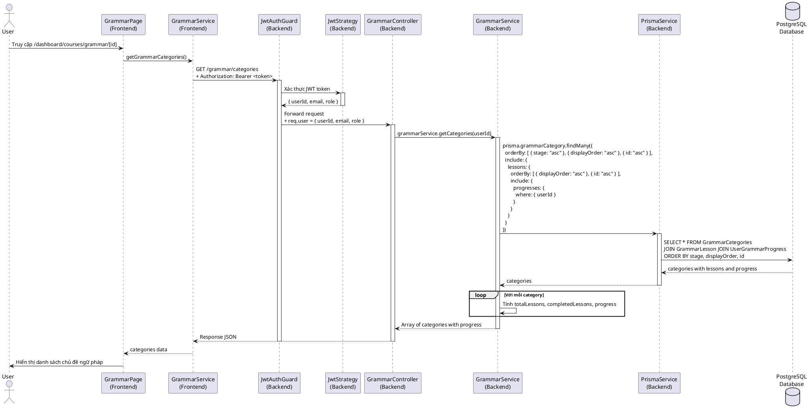
```plantuml
@startuml SD_15_GRAMMAR_CATEGORIES
actor User
participant "GrammarPage\n(Frontend)" as Frontend
participant "GrammarService\n(Frontend)" as FrontendService
participant "JwtAuthGuard\n(Backend)" as Guard
participant "JwtStrategy\n(Backend)" as Strategy
participant "GrammarController\n(Backend)" as Controller
participant "GrammarService\n(Backend)" as Service
participant "PrismaService\n(Backend)" as Prisma
database "PostgreSQL\nDatabase" as DB

User -> Frontend: Truy cập /dashboard/courses/grammar/[id]
Frontend -> FrontendService: getGrammarCategories()
FrontendService -> Guard: GET /grammar/categories\n+ Authorization: Bearer <token>
activate Guard

Guard -> Strategy: Xác thực JWT token
activate Strategy
Strategy --> Guard: { userId, email, role }
deactivate Strategy

Guard -> Controller: Forward request\n+ req.user = { userId, email, role }
activate Controller

Controller -> Service: grammarService.getCategories(userId)
activate Service

Service -> Prisma: prisma.grammarCategory.findMany({\n  orderBy: [ { stage: "asc" }, { displayOrder: "asc" }, { id: "asc" } ],\n  include: {\n    lessons: {\n      orderBy: [ { displayOrder: "asc" }, { id: "asc" } ],\n      include: {\n        progresses: {\n          where: { userId }\n        }\n      }\n    }\n  }\n})
activate Prisma
Prisma -> DB: SELECT * FROM GrammarCategories\nJOIN GrammarLesson JOIN UserGrammarProgress\nORDER BY stage, displayOrder, id
DB --> Prisma: categories with lessons and progress
Prisma --> Service: categories
deactivate Prisma

loop Với mỗi category
    Service -> Service: Tính totalLessons, completedLessons, progress
end

Service --> Controller: Array of categories with progress
deactivate Service

Controller --> FrontendService: Response JSON
deactivate Controller
deactivate Guard

FrontendService --> Frontend: categories data
Frontend -> User: Hiển thị danh sách chủ đề ngữ pháp

@enduml
```

---

### 3.16. SD-16: HOÀN THÀNH BÀI HỌC NGỮ PHÁP

#### Tên
Hoàn thành bài học ngữ pháp

#### Mục đích
Lưu tiến độ và điểm số sau khi user hoàn thành bài học ngữ pháp

#### Actor
User (đã đăng nhập)

#### Frontend
Grammar Lesson Page (`apps/web/app/dashboard/courses/grammar/[id]/lessons/[lessonId]/page.tsx`)

#### API
POST `/grammar/lessons/:id/complete`

#### Controller
GrammarController (`apps/api/src/grammar/grammar.controller.ts`)

#### Service
GrammarService (`apps/api/src/grammar/grammar.service.ts`)

#### Database
PostgreSQL (GrammarLesson, UserGrammarProgress tables)

#### Luồng xử lý từng bước

1. **User thao tác trên UI**
   - User truy cập trang bài học ngữ pháp
   - User đọc nội dung bài học
   - User làm bài tập ngữ pháp liên quan
   - User click "Hoàn thành"

2. **Frontend gửi request**
   - Grammar Lesson Page gửi POST request đến `http://localhost:3001/grammar/lessons/:id/complete`
   - Body: `{ score }` (điểm số 0-100)
   - Headers: `{ "Content-Type": "application/json", "Authorization": "Bearer <token>" }`

3. **Controller nhận request**
   - GrammarController.completeLesson() nhận request
   - Extract userId từ request.user, lessonId từ params, score từ body

4. **Guard kiểm tra authentication**
   - JwtAuthGuard kiểm tra JWT token
   - JwtStrategy.validate() xác thực token
   - Trả về user info: `{ userId, email, role }`

5. **Service xử lý nghiệp vụ**
   - GrammarService.completeLesson(lessonId, userId, dto) được gọi
   - Service kiểm tra lesson tồn tại:
     - PrismaService.grammarLesson.findUnique({ where: { id: lessonId } })
   - Nếu không tìm thấy:
     - Throw NotFoundException("Không tìm thấy bài học")
   - Service upsert progress:
     - PrismaService.userGrammarProgress.upsert({
         where: { userId_lessonId: { userId, lessonId } },
         create: {
           userId,
           lessonId,
           completed: true,
           score: dto.score,
           lastStudied: new Date(),
         },
         update: {
           completed: true,
           score: dto.score,
           lastStudied: new Date(),
         },
       })

6. **Prisma/Repository truy vấn database**
   - PrismaClient thực hiện UPSERT vào bảng `UserGrammarProgress`

7. **Database trả dữ liệu**
   - Database trả về progress đã được cập nhật

8. **Service xử lý**
   - GrammarService trả về response với progress info

9. **API trả response**
   - GrammarController trả về response cho Frontend
   - Status: 200 OK
   - Body: JSON object với progress info

10. **Frontend cập nhật UI**
    - Grammar Lesson Page nhận response
    - Hiển thị thông báo thành công
    - Cập nhật trạng thái bài học (completed)

#### Mã sơ đồ (PlantUML)

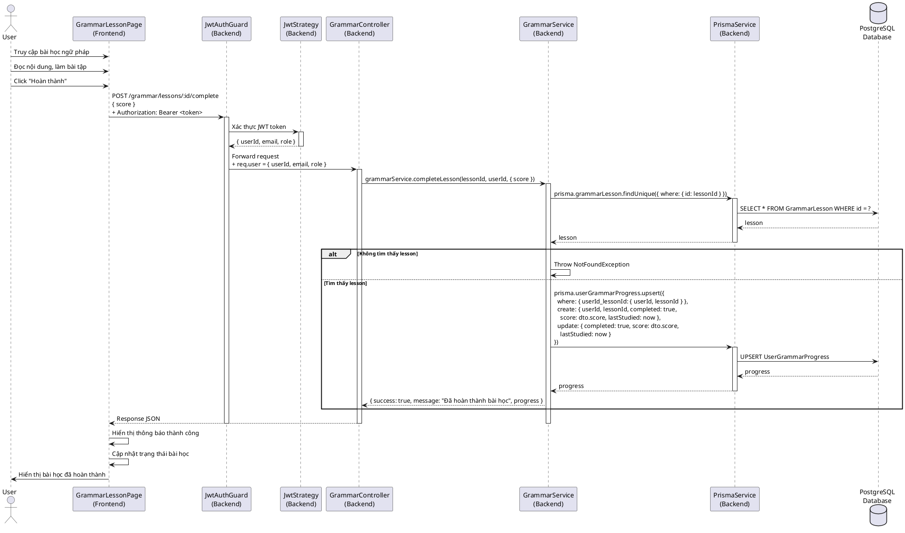
```plantuml
@startuml SD_16_GRAMMAR_COMPLETE_LESSON
actor User
participant "GrammarLessonPage\n(Frontend)" as Frontend
participant "JwtAuthGuard\n(Backend)" as Guard
participant "JwtStrategy\n(Backend)" as Strategy
participant "GrammarController\n(Backend)" as Controller
participant "GrammarService\n(Backend)" as Service
participant "PrismaService\n(Backend)" as Prisma
database "PostgreSQL\nDatabase" as DB

User -> Frontend: Truy cập bài học ngữ pháp
User -> Frontend: Đọc nội dung, làm bài tập
User -> Frontend: Click "Hoàn thành"
Frontend -> Guard: POST /grammar/lessons/:id/complete\n{ score }\n+ Authorization: Bearer <token>
activate Guard

Guard -> Strategy: Xác thực JWT token
activate Strategy
Strategy --> Guard: { userId, email, role }
deactivate Strategy

Guard -> Controller: Forward request\n+ req.user = { userId, email, role }
activate Controller

Controller -> Service: grammarService.completeLesson(lessonId, userId, { score })
activate Service

Service -> Prisma: prisma.grammarLesson.findUnique({ where: { id: lessonId } })
activate Prisma
Prisma -> DB: SELECT * FROM GrammarLesson WHERE id = ?
DB --> Prisma: lesson
Prisma --> Service: lesson
deactivate Prisma

alt Không tìm thấy lesson
    Service -> Service: Throw NotFoundException
else Tìm thấy lesson
    Service -> Prisma: prisma.userGrammarProgress.upsert({\n  where: { userId_lessonId: { userId, lessonId } },\n  create: { userId, lessonId, completed: true,\n    score: dto.score, lastStudied: now },\n  update: { completed: true, score: dto.score,\n    lastStudied: now }\n})
    activate Prisma
    Prisma -> DB: UPSERT UserGrammarProgress
    DB --> Prisma: progress
    Prisma --> Service: progress
    deactivate Prisma
    
    Service --> Controller: { success: true, message: "Đã hoàn thành bài học", progress }
end

Controller --> Frontend: Response JSON
deactivate Service
deactivate Controller
deactivate Guard

Frontend -> Frontend: Hiển thị thông báo thành công
Frontend -> Frontend: Cập nhật trạng thái bài học
Frontend -> User: Hiển thị bài học đã hoàn thành

@enduml
```

---

### 3.17. SD-17: QUẢN LÝ TỪ VỰNG (THÊM MỚI)

#### Tên
Quản lý từ vựng (Thêm mới)

#### Mục đích
Thêm từ vựng mới vào hệ thống

#### Actor
Content Admin / Super Admin

#### Frontend
Admin Vocabulary Page (`apps/web/app/content-admin/vocabulary/page.tsx`)

#### API
POST `/admin/vocabulary`

#### Controller
AdminController (`apps/api/src/admin/admin.controller.ts`)

#### Database
PostgreSQL (Vocabulary table)

#### Luồng xử lý từng bước

1. **Admin thao tác trên UI**
   - Admin truy cập trang `/content-admin/vocabulary`
   - Admin click "Thêm từ vựng mới"
   - Admin nhập thông tin từ vựng (english, type, vietnamese, pronounce, explain, example, exampleVietnamese, imageUrl, audioUrl, topic, stage)
   - Admin click "Lưu"

2. **Frontend gửi request**
   - Admin Vocabulary Page gửi POST request đến `http://localhost:3001/admin/vocabulary`
   - Body: `{ english, type, vietnamese, pronounce, explain, example, exampleVietnamese, imageUrl, audioUrl, topic, stage }`
   - Headers: `{ "Content-Type": "application/json", "Authorization": "Bearer <token>" }`

3. **Controller nhận request**
   - AdminController.createVocabulary() nhận request
   - Extract body data

4. **Guard kiểm tra authentication**
   - JwtAuthGuard kiểm tra JWT token
   - JwtStrategy.validate() xác thực token
   - Trả về user info: `{ userId, email, role }`

5. **Guard kiểm tra authorization**
   - RolesGuard kiểm tra role
   - Kiểm tra user có role CONTENT_ADMIN hoặc SUPER_ADMIN
   - Nếu không có quyền: Throw ForbiddenException

6. **Service xử lý nghiệp vụ**
   - AdminController gọi trực tiếp PrismaService (không có service riêng)
   - Trim các string input
   - PrismaService.vocabulary.create({
       data: {
         english: body.english.trim(),
         type: body.type?.trim() || null,
         vietnamese: body.vietnamese?.trim() || null,
         pronounce: body.pronounce?.trim() || null,
         explain: body.explain?.trim() || null,
         example: body.example?.trim() || null,
         exampleVietnamese: body.exampleVietnamese?.trim() || null,
         imageUrl: body.imageUrl?.trim() || null,
         audioUrl: body.audioUrl?.trim() || null,
         topic: body.topic?.trim() || null,
         stage: Number(body.stage),
       },
     })

7. **Prisma/Repository truy vấn database**
   - PrismaClient thực hiện INSERT vào bảng `vocabulary`

8. **Database trả dữ liệu**
   - Database trả về vocabulary đã được tạo
   - PrismaClient map kết quả sang TypeScript object

9. **Service xử lý**
   - AdminController trả về response với vocabulary data

10. **API trả response**
    - AdminController trả về response cho Frontend
    - Status: 200 OK
    - Body: JSON object với success message và vocabulary data

11. **Frontend cập nhật UI**
    - Admin Vocabulary Page nhận response
    - Hiển thị thông báo thành công
    - Refresh danh sách từ vựng

#### Mã sơ đồ (PlantUML)

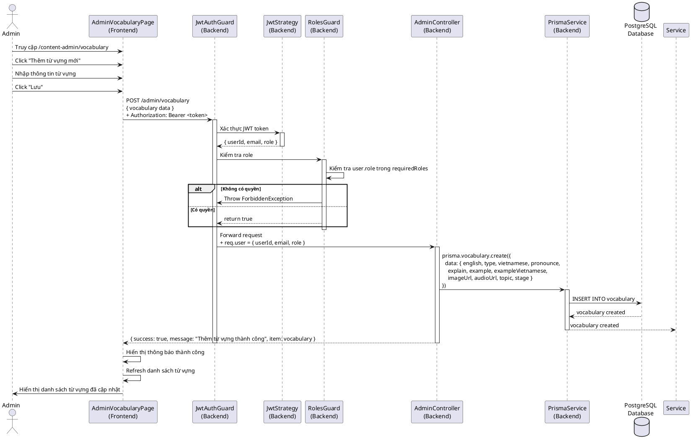
```plantuml
@startuml SD_17_ADMIN_CREATE_VOCABULARY
actor Admin
participant "AdminVocabularyPage\n(Frontend)" as Frontend
participant "JwtAuthGuard\n(Backend)" as Guard
participant "JwtStrategy\n(Backend)" as Strategy
participant "RolesGuard\n(Backend)" as RolesGuard
participant "AdminController\n(Backend)" as Controller
participant "PrismaService\n(Backend)" as Prisma
database "PostgreSQL\nDatabase" as DB

Admin -> Frontend: Truy cập /content-admin/vocabulary
Admin -> Frontend: Click "Thêm từ vựng mới"
Admin -> Frontend: Nhập thông tin từ vựng
Admin -> Frontend: Click "Lưu"
Frontend -> Guard: POST /admin/vocabulary\n{ vocabulary data }\n+ Authorization: Bearer <token>
activate Guard

Guard -> Strategy: Xác thực JWT token
activate Strategy
Strategy --> Guard: { userId, email, role }
deactivate Strategy

Guard -> RolesGuard: Kiểm tra role
activate RolesGuard
RolesGuard -> RolesGuard: Kiểm tra user.role trong requiredRoles
alt Không có quyền
    RolesGuard -> Guard: Throw ForbiddenException
else Có quyền
    RolesGuard --> Guard: return true
end
deactivate RolesGuard

Guard -> Controller: Forward request\n+ req.user = { userId, email, role }
activate Controller

Controller -> Prisma: prisma.vocabulary.create({\n  data: { english, type, vietnamese, pronounce,\n    explain, example, exampleVietnamese,\n    imageUrl, audioUrl, topic, stage }\n})
activate Prisma
Prisma -> DB: INSERT INTO vocabulary
DB --> Prisma: vocabulary created
Prisma --> Service: vocabulary created
deactivate Prisma

Controller --> Frontend: { success: true, message: "Thêm từ vựng thành công", item: vocabulary }
deactivate Controller
deactivate Guard

Frontend -> Frontend: Hiển thị thông báo thành công
Frontend -> Frontend: Refresh danh sách từ vựng
Frontend -> Admin: Hiển thị danh sách từ vựng đã cập nhật

@enduml
```

---

### 3.18. SD-18: XEM THỐNG KÊ HỆ THỐNG

#### Tên
Xem thống kê hệ thống

#### Mục đích
Xem số lượng users, từ vựng, bài học ngữ pháp, đề thi

#### Actor
Content Admin / Super Admin

#### Frontend
Admin Page (`apps/web/app/admin/page.tsx`)

#### API
GET `/admin/stats`

#### Controller
AdminController (`apps/api/src/admin/admin.controller.ts`)

#### Database
PostgreSQL (User, Vocabulary, GrammarLesson, tests tables)

#### Luồng xử lý từng bước

1. **Admin thao tác trên UI**
   - Admin truy cập trang `/admin`
   - Admin Page được render

2. **Frontend gửi request**
   - Admin Page gọi API để lấy thống kê [CHƯA TÌM THẤY - giả định]
   - Frontend gửi GET request đến `http://localhost:3001/admin/stats`
   - Headers: `{ "Authorization": "Bearer <token>" }`

3. **Controller nhận request**
   - AdminController.getStats() nhận request

4. **Guard kiểm tra authentication**
   - JwtAuthGuard kiểm tra JWT token
   - JwtStrategy.validate() xác thực token
   - Trả về user info: `{ userId, email, role }`

5. **Guard kiểm tra authorization**
   - RolesGuard kiểm tra role
   - Kiểm tra user có role CONTENT_ADMIN hoặc SUPER_ADMIN
   - Nếu không có quyền: Throw ForbiddenException

6. **Service xử lý nghiệp vụ**
   - AdminController gọi trực tiếp PrismaService (không có service riêng)
   - Service thực hiện các count song song:
     - PrismaService.user.count()
     - PrismaService.vocabulary.count()
     - PrismaService.grammarLesson.count()
     - PrismaService.tests.count()

7. **Prisma/Repository truy vấn database**
   - PrismaClient thực hiện COUNT từ các bảng `User`, `Vocabulary`, `GrammarLesson`, `tests`

8. **Database trả dữ liệu**
   - Database trả về các count
   - PrismaClient map kết quả sang TypeScript objects

9. **Service xử lý**
   - AdminController trả về response với stats data

10. **API trả response**
    - AdminController trả về response cho Frontend
    - Status: 200 OK
    - Body: JSON object với stats data

11. **Frontend cập nhật UI**
    - Admin Page nhận response
    - Hiển thị thống kê hệ thống

#### Mã sơ đồ (PlantUML)

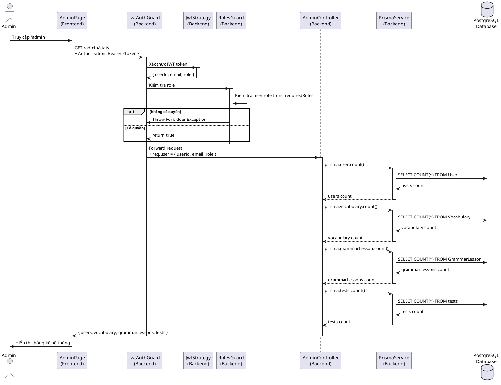
```plantuml
@startuml SD_18_ADMIN_STATS
actor Admin
participant "AdminPage\n(Frontend)" as Frontend
participant "JwtAuthGuard\n(Backend)" as Guard
participant "JwtStrategy\n(Backend)" as Strategy
participant "RolesGuard\n(Backend)" as RolesGuard
participant "AdminController\n(Backend)" as Controller
participant "PrismaService\n(Backend)" as Prisma
database "PostgreSQL\nDatabase" as DB

Admin -> Frontend: Truy cập /admin
Frontend -> Guard: GET /admin/stats\n+ Authorization: Bearer <token>
activate Guard

Guard -> Strategy: Xác thực JWT token
activate Strategy
Strategy --> Guard: { userId, email, role }
deactivate Strategy

Guard -> RolesGuard: Kiểm tra role
activate RolesGuard
RolesGuard -> RolesGuard: Kiểm tra user.role trong requiredRoles
alt Không có quyền
    RolesGuard -> Guard: Throw ForbiddenException
else Có quyền
    RolesGuard --> Guard: return true
end
deactivate RolesGuard

Guard -> Controller: Forward request\n+ req.user = { userId, email, role }
activate Controller

Controller -> Prisma: prisma.user.count()
activate Prisma
Prisma -> DB: SELECT COUNT(*) FROM User
DB --> Prisma: users count
Prisma --> Controller: users count
deactivate Prisma

Controller -> Prisma: prisma.vocabulary.count()
activate Prisma
Prisma -> DB: SELECT COUNT(*) FROM Vocabulary
DB --> Prisma: vocabulary count
Prisma --> Controller: vocabulary count
deactivate Prisma

Controller -> Prisma: prisma.grammarLesson.count()
activate Prisma
Prisma -> DB: SELECT COUNT(*) FROM GrammarLesson
DB --> Prisma: grammarLessons count
Prisma --> Controller: grammarLessons count
deactivate Prisma

Controller -> Prisma: prisma.tests.count()
activate Prisma
Prisma -> DB: SELECT COUNT(*) FROM tests
DB --> Prisma: tests count
Prisma --> Controller: tests count
deactivate Prisma

Controller --> Frontend: { users, vocabulary, grammarLessons, tests }
deactivate Controller
deactivate Guard

Frontend -> Admin: Hiển thị thống kê hệ thống

@enduml
```

---

## 4. GHI CHÚ VÀ CÁC VẤN ĐỀ CHƯA XÁC ĐỊNH

### 4.1. Chưa tìm thấy API endpoints
- **Mock Test:** Không tìm thấy API endpoint cho mock test (lấy đề thi, nộp bài, chấm điểm, lưu kết quả)
- **Roadmap:** Không tìm thấy API endpoint cho roadmap
- **Grammar Service (Frontend):** Không tìm thấy file service grammar trong frontend
- **Admin Listening/Reading:** Frontend có pages nhưng không tìm thấy API endpoint admin cho listening và reading

### 4.2. Cần kiểm tra thêm
- Kiểm tra xem có file service grammar trong frontend không
- Kiểm tra xem có API endpoints cho mock test không
- Kiểm tra xem có API endpoints cho admin listening và reading không
- Kiểm tra xem có API endpoints cho roadmap không

### 4.3. Lưu ý
- Sequence Diagrams được tạo dựa trên flow thực tế từ source code đã phân tích
- Các diagram chưa xác định được sẽ được cập nhật khi có thêm thông tin
- Frontend services cho grammar, admin listening/reading có thể được implement khác cách hoặc chưa hoàn thiện

---

## 5. TỔNG KẾT

Tôi đã tạo xong 4 file tài liệu thiết kế trong thư mục `DOCUMENTATION_DIAGRAMS/`:

1. **01_USE_CASE.md** - Use Case Diagram với 36 use cases chi tiết
2. **02_CLASS_DIAGRAM.md** - Class Diagram với kiến trúc backend, frontend, và database models
3. **03_DATABASE_ERD.md** - Database ERD với 22 bảng và quan hệ chi tiết
4. **04_SEQUENCE_DIAGRAM.md** - Sequence Diagram cho 18 nghiệp vụ quan trọng

Mỗi file đều chứa:
- Phân tích chi tiết dựa trên source code thực tế
- Giải thích rõ ràng từng thành phần
- Mã PlantUML/Mermaid có thể copy trực tiếp để render
- Ghi chú các vấn đề chưa xác định để kiểm tra thêm

Các sơ đồ này phù hợp với mức chi tiết cho báo cáo đồ án tốt nghiệp ngành Công nghệ thông tin, thể hiện được kiến trúc và nghiệp vụ thực tế của hệ thống TOEIC AI.
